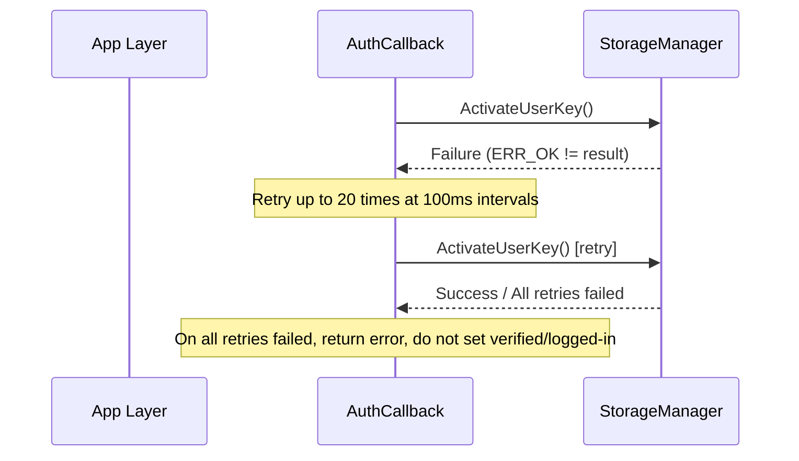

# Architecture Design

## Design Metadata

| Field | Content |
|-------|---------|
| Design ID | DESIGN-20260528-001 |
| Related Requirement | proposal.md |
| Related Epic | None |
| Target Feature | FEAT-20260528-001 |
| Complexity | Standard |
| Target Release | OpenHarmony-6.0-Release |
| Owner | Account Team |
| Status | Approved |

## Requirements Baseline

| Item | Supplementary Notes |
|------|---------------------|
| CUSTOM auth security level equals PIN | Design decision ADR-1: CUSTOM has full decryption privilege |
| Remove COMPANION_DEVICE skip logic in UnlockUserScreen | Design decision ADR-2: COMPANION_DEVICE has EL3/EL4 decryption privilege (excluding EL2) |
| HandleAuthResult() does not need new code for CUSTOM | Source confirmation: only DOMAIN type does early return |

## Context and Current State

### Affected Repos and Modules

| Repo | Supplementary Architecture Notes |
|------|----------------------------------|
| os_account | NAPI layer dynamic/static parallel, IPC serialization, auth callback processing three-layer architecture; HandleAuthResult() only does early return for DOMAIN, other types naturally enter UnlockAccount flow |

### Applicable Architecture Rules

| Rule ID | Applicability Reason | Design Conclusion | Verification Method |
|---------|---------------------|-------------------|---------------------|
| OH-ARCH-LAYERING | Involves cross-layer calling App → NAPI → Service → UserIam | Call direction: App → NAPI → AccountIAMClient → AccountIAMService → InnerAccountIAMManager → UserIam, reverse calling prohibited | Code review |
| OH-ARCH-SUBSYSTEM | All changes within account subsystem | No cross-subsystem calls, only depends on UserIam (external subsystem) via IPC proxy | Integration test |
| OH-ARCH-IPC-SAF | Involves AccountIAMService SA cross-process calling | AuthParam serialization needs to extend additionalInfo field | Unit test |
| OH-ARCH-API-LEVEL | Involves Public API enum value addition | AuthType.CUSTOM = 128 is a new Public API enum value, AuthOptions.additionalInfo is a new optional field | API review / XTS |
| OH-ARCH-COMPONENT-BUILD | No new components | No BUILD.gn/bundle.json changes | Build verification |
| OH-ARCH-ERROR-LOG | Involves auth failure retry and error handling | Reuse existing error codes and logging mechanism, no new error codes | Unit test / hilog |

## Out-of-Scope Items Handover

| Dimension | Design Conclusion |
|-----------|-------------------|
| Performance | N/A — No new time-consuming paths |
| Security & Permissions | CUSTOM has same privilege level as PIN, with full EL2-EL5 decryption privilege; COMPANION_DEVICE has EL3/EL4 decryption privilege (excluding EL2) |
| Compatibility | All new fields are optional, backward compatible |
| API/SDK | AuthType.CUSTOM = 128 new enum value, AuthOptions.additionalInfo new optional string field |
| IPC/Cross-process | AuthParam Marshalling/Unmarshalling needs to extend additionalInfo |
| Build & Components | N/A — No new source files or components |
| Internationalization/Accessibility | N/A — No UI changes |
| Data Migration | N/A — No storage format changes |

## Key Design Decisions

| Decision ID | Problem | Recommended Solution | Explored Alternatives | Trade-off Reasoning | Impact |
|-------------|---------|---------------------|-----------------------|--------------------|--------|
| ADR-1 | How to execute user space decryption after CUSTOM auth success? | Rely on existing HandleAuthResult() logic, no new code needed (only DOMAIN early return, CUSTOM naturally enters) | Add explicit branch handling code for CUSTOM | Zero new code, full reuse of existing flow, consistent with PIN/FACE behavior | No code change, only confirm existing logic covers this |
| ADR-2 | How to support EL3/EL4 decryption after COMPANION_DEVICE auth success? | Remove COMPANION_DEVICE skip condition in UnlockUserScreen(); COMPANION_DEVICE is not in CheckAllowUnlockUserStorage allowlist, does not trigger ActivateUserKey | Add separate decryption path for COMPANION_DEVICE or add to allowlist | Removing skip condition is minimal change, RECOVERY_KEY skip logic remains unaffected; COMPANION_DEVICE not in allowlist means EL2 not decrypted | Modify one conditional in account_iam_callback.cpp; UnlockAccount allowlist only includes PIN and CUSTOM_AUTH |
| ADR-3 | AuthType.CUSTOM enum value selection? | CUSTOM = 128 (power of 2) | Other values (e.g., 256) | 128 is the next power of 2, consistent with existing style, no conflict with DOMAIN=1024 | AuthTypeIndex mapping is 7 |
| ADR-4 | AuthOptions.additionalInfo data type? | Optional<string> (optional string) | JSON object / Map<string, string> | string type is simplest, can pass JSON-formatted structured data; optional ensures backward compatibility | NAPI layer uses GetOptionalStringPropertyByKey for parsing |

## Design Skeleton

### Skeleton Scope

| Skeleton Item | Target | Not Included | Verification Method |
|---------------|--------|--------------|---------------------|
| Type definition skeleton | AuthType.CUSTOM, AuthOptions.additionalInfo data structures | Full business logic | Compile pass |
| NAPI parsing skeleton | ParseContextForAuthOptions extended with additionalInfo | Full scenario testing | Minimal test case pass |
| Decryption flow confirmation | HandleAuthResult() coverage confirmation for CUSTOM | New branch code | Source confirmation |

### Skeleton Spec Split

| Task ID | Target | Affected Files | AC |
|---------|--------|---------------|----|
| TASK-SKELETON-1 | Type definitions: AuthType.CUSTOM + AuthOptions.additionalInfo | account_iam_info.h, d.ts, taihe IDL | WHEN compiled THEN type definitions are complete |
| TASK-SKELETON-2 | COMPANION_DEVICE skip logic removal | account_iam_callback.cpp | WHEN COMPANION_DEVICE auth succeeds THEN UnlockUserScreen is not skipped |

## Subsequent Task Split

| Task ID | Target | Affected Files | Dependencies |
|---------|--------|---------------|--------------|
| TASK-1 | Type definitions + AuthTypeIndex mapping + IPC serialization | account_iam_info.h, account_iam_client.cpp | design.md + spec.md Approved |
| TASK-2 | NAPI/Taihe parameter parsing | napi_account_iam_user_auth.cpp, ohos.account.osAccount.impl.cpp | TASK-1 completed |
| TASK-3 | COMPANION_DEVICE skip logic removal + decryption verification | account_iam_callback.cpp | TASK-1 completed |
| TASK-4 | Unit tests | test/ | TASK-1~3 completed |
| TASK-5 | Fuzz test updates | fuzz/ | TASK-4 completed |

## API Signatures, Kit and Permissions

### New APIs

| API Signature | Type | Kit | d.ts Location | Permission Requirement | SysCap |
|---------------|------|-----|---------------|----------------------|--------|
| `AuthType.CUSTOM = 128` | Public enum value | BasicServicesKit | `@ohos.account.osAccount.d.ts` | - | SystemCapability.Account.OsAccount |
| `AuthOptions.additionalInfo?: string` | Public optional field | BasicServicesKit | `@ohos.account.osAccount.d.ts` | - | SystemCapability.Account.OsAccount |

### Changed/Deprecated APIs

| Original API | Change Type | New API | Migration Notes |
|-------------|-------------|---------|-----------------|
| None | - | - | No deprecation; all additions are extensions |

## Build System Impact

### BUILD.gn Changes

No new source files or build targets.

### bundle.json Changes

No new components or dependency changes.

---

## Optional Design Extensions

### Data Flow / Control Flow

| Step | Caller | Called | Data/Interface | Description |
|------|--------|--------|---------------|-------------|
| 1 | App | UserAuth NAPI | auth(challenge, 128, trustLevel, {additionalInfo}) | App initiates CUSTOM auth |
| 2 | NAPI | AccountIAMClient | Auth(challenge, AuthType::CUSTOM, trustLevel, AuthOptions) | NAPI parses additionalInfo and calls InnerKit |
| 3 | AccountIAMClient | AccountIAMService (IPC) | AuthUser() | IPC transport AuthParam (including additionalInfo) |
| 4 | AccountIAMService | InnerAccountIAMManager | AuthUser() | Service layer parameter validation and passing |
| 5 | InnerAccountIAMManager | UserIam framework | AuthUser() | Call UserIam to start auth |
| 6 | UserIam framework | AuthCallback | OnResult() | Auth result callback |
| 7a | AuthCallback (CUSTOM) | HandleAuthResult() | — | authType_ ≠ DOMAIN → enters UnlockAccount() → ActivateUserKey + UnlockUserScreen (EL2-EL5) |
| 7b | AuthCallback (COMPANION_DEVICE) | HandleAuthResult() | — | authType_ ≠ DOMAIN → enters UnlockAccount() → only UnlockUserScreen (EL3/EL4); ActivateUserKey not called (not in allowlist) |

### Sequence Design

```mermaid
sequenceDiagram
  participant App as App Layer
  participant NAPI as NAPI Layer
  participant IAMClient as AccountIAMClient
  participant IAMService as AccountIAMService (IPC)
  participant InnerMgr as InnerAccountIAMManager
  participant UserIam as UserIam Framework
  participant Callback as AuthCallback

  App->>NAPI: auth(challenge, 128, trustLevel, {additionalInfo})
  NAPI->>IAMClient: Auth(challenge, AuthType::CUSTOM, trustLevel, AuthOptions)
  IAMClient->>IAMService: AuthUser() [IPC, AuthParam includes additionalInfo]
  IAMService->>InnerMgr: AuthUser()
  InnerMgr->>UserIam: AuthUser()
  UserIam-->>Callback: OnResult(success, token, secret)
  Callback->>Callback: HandleAuthResult()
  Note over Callback: CUSTOM: authType_ ≠ DOMAIN → UnlockAccount() → ActivateUserKey + UnlockUserScreen (EL2-EL5)
  Note over Callback: COMPANION_DEVICE: authType_ ≠ DOMAIN → UnlockAccount() → only UnlockUserScreen (EL3/EL4); ActivateUserKey not called (not in allowlist)
```

### COMPANION_DEVICE Decryption Sequence Diagram

```mermaid
sequenceDiagram
  participant Callback as AuthCallback (COMPANION_DEVICE)
  participant Storage as StorageManager

  Note over Callback: UnlockAccount: CheckAllowUnlockUserStorage(COMPANION_DEVICE) = false → skip ActivateUserKey
  Callback->>Storage: UnlockUserScreen()
  Storage-->>Callback: Success / Failure
  Note over Callback: On failure, retry up to 20 times at 100ms intervals; on all retries failed, return error
```

### Exception Propagation Sequence Diagram



| Exception Scenario | Triggering Layer | Propagation Path | Final Handling |
|--------------------|-----------------|------------------|----------------|
| ActivateUserKey failure | AuthCallback (CUSTOM) | AuthCallback → StorageManager → retry → all retries failed return error | Return error code, do not set verified/logged-in |
| UnlockUserScreen failure | AuthCallback (CUSTOM/COMPANION_DEVICE) | AuthCallback → InnerAccountIAMManager → retry → all retries failed return error | Return error code, do not set verified/logged-in |
| Account deactivating state | AuthCallback | AuthCallback checks account state → no decryption executed | Return auth result, do not modify storage state |
| COMPANION_DEVICE ActivateUserKey skipped | AuthCallback (COMPANION_DEVICE) | CheckAllowUnlockUserStorage returns false → ActivateUserKey not called | EL2 not decrypted, only UnlockUserScreen (EL3/EL4) executed |

### Thread and Concurrency Model

| Operation | Initiating Thread | Callback Thread | Cross-process Boundary | Thread Safety | Reentry Constraint |
|-----------|------------------|-----------------|----------------------|--------------|-------------------|
| AuthUser | IPC thread | Binder callback thread | Yes (App → Service) | No new races | Reentry prohibited |
| HandleAuthResult | Binder callback thread | Same thread | No | No new races | Reentry prohibited |
| ActivateUserKey/UnlockUserScreen | Binder callback thread | Same thread | Yes (Service → StorageManager) | No new races | Reentry prohibited |

## Risks and Open Issues

| Item | Type | Impact | Handling | Owner |
|------|------|--------|----------|-------|
| UserIam framework does not support CUSTOM type | External | High | Need UserIam framework to add support on their side (not in this spec scope) | UserIam Team |
| additionalInfo format not standardized | Technical | Low | Documentation recommends JSON format | Account Team |

## Design Approval

- [x] Requirements baseline confirmed, design covers P0/P1 ACs
- [x] Out-of-scope items handled, N/A and expanded items have conclusions
- [x] Affected repos and module responsibilities clear
- [x] Applicable architecture rules identified with design conclusions
- [x] Layer and subsystem boundaries compliant
- [x] API changes have signature, permissions, error codes and compatibility notes
- [x] BUILD.gn/bundle.json impact specified (no changes)
- [x] Design output and subsequent task split clear
- [x] Key design decisions have reasoning and impact notes
- [x] Risks and open issues have owners

**Conclusion:** Approved