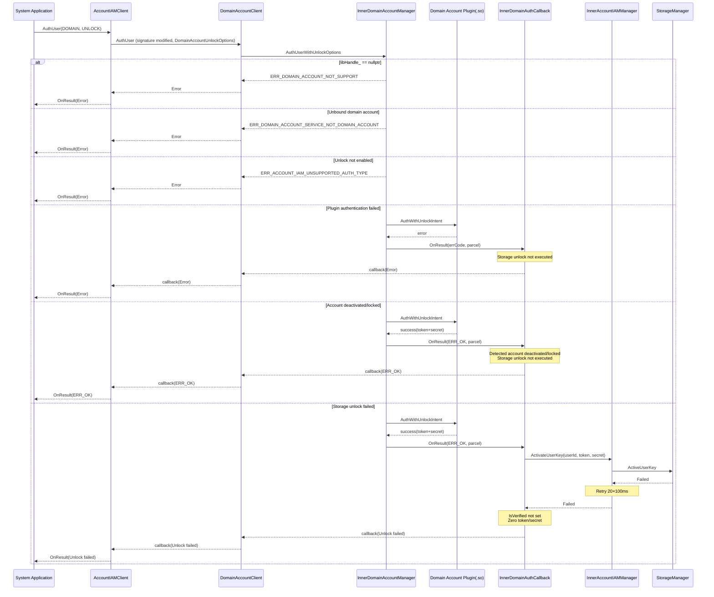

# Architecture Design

> Confirm the target repository and module architecture constraints, key design decisions, and Spec split direction.

## Design Metadata

| Field | Content |
|------|------|
| Design ID | DESIGN-20260703-001 |
| Related Requirement | `proposal.md` |
| Related Epic | `epic.md` (EPIC-20260703-001) |
| Target Feature | F1 + F2 + F3 (full) |
| Complexity | Complex |
| Target Version | TBD (refer to manifest.target_release) |
| Owner | Account Team |
| Status | Approved |

## Requirement Baseline

> The requirement baseline is detailed in proposal.md. The following lists only the points that need additional emphasis at the design stage.

| Item | Supplementary Notes |
|----|----------|
| DOMAIN authentication bypasses AuthCallback | DOMAIN authentication goes through `DomainAccountClient::AuthUser` → `InnerDomainAccountManager::PluginAuth` → `InnerDomainAuthCallback::OnResult` independent path, not via `AuthCallback`. The unlock logic must be added in `InnerDomainAuthCallback::OnResult` |
| authIntent is lost in the DOMAIN path | `AccountIAMClient::AuthUser` early-returns in the DOMAIN branch (line 396-399) without passing authIntent. Need to pass authIntent by modifying the `DomainAccountClient::AuthUser` signature (adding `DomainAccountUnlockOptions`) |
| token is zeroed in OnResult | `InnerDomainAuthCallback::OnResult` zeroes the token at line 232 via `memset_s`. The unlock logic must be inserted before line 232 |
| Plugin state is managed by the caller | `SetDomainAuthUnlockEnabled` only handles storage key management; plugin state (enableUnlockDevice/unlockDeviceMode) is set by the domain account service (uid 7058) itself |
| Feature isolation uses libHandle_ | Use `libHandle_ != nullptr` (SO plugin only), not `IsPluginAvailable()` (which also checks IPC plugin). New C-ABI functions are only available via the SO path |
| Unlock entry restricted | Only `AccountIAMClient::Auth`/`AuthUser` (DOMAIN+UNLOCK) via the `AuthUserWithUnlockOptions` IDL path can trigger unlock; `DomainAccountClient::Auth`/`AuthUser` (non-overloaded) goes through existing IDL methods, authenticates only without unlocking. The unlock logic in `InnerDomainAuthCallback::OnResult` must check `authIntent_ == UNLOCK` |

## Context and Current State

### Involved Repositories and Modules

> Repository, module, current responsibilities, and impact types are detailed in the "Impact Scope" section of proposal.md. This section supplements the architecture status at the design level.

| Repository | Supplementary Architecture Notes |
|------|-------------|
| os_account | Layered architecture: InnerKit (interface) → Framework (Client/Proxy) → IDL (IPC contract) → Service (Stub) → Inner Manager (business logic) → Plugin Adapter (C-ABI adaptation) → Plugin .so (external implementation). Storage integration is via `InnerAccountIAMManager` calling the `StorageManager` proxy |

### Call Chain Layer Analysis

> Scan the call chain layer by layer from the top to the bottom.

#### Capability 1: Enable/Disable Domain Account Unlock (SetDomainAuthUnlockEnabled)

| Layer | Module | Responsibility | Modification Type |
|----|------|------|----------|
| InnerKit Client | `AccountIAMClient` | Provides InnerKit API for the domain account service to call | New `SetDomainAuthUnlockEnabled` method |
| Framework Proxy | `IAccountIAM` Proxy (IDL generated) | IPC proxy, forwards calls to Service | New IDL method auto-generates Proxy code |
| IDL Contract | `IAccountIAM.idl` | Declares IPC interface contract | New `SetDomainAuthUnlockEnabled` method declaration |
| Service Stub | `AccountIAMService` | IPC Stub, delegates to Inner Manager after permission check | New `SetDomainAuthUnlockEnabled` Stub method |
| Inner Manager | `InnerAccountIAMManager` | Business logic: uid check, parameter validation, storage key management | New `SetDomainAuthUnlockEnabled` business implementation |
| Storage Integration | `InnerAccountIAMManager` → `StorageManager` | Storage key add/remove | Reuse existing `UpdateStorageUserAuth` |
| Domain Plugin Check | `InnerDomainAccountManager` | `libHandle_` check, domain account binding query | Reuse existing `libHandle_` and `GetDomainAccountInfoByUserId` |

**Checklist:**
- [x] Every layer of the call chain is covered
- [x] Each layer's responsibility boundary is clear, no cross-layer violation calls
- [x] Each layer's modification type is explicit

#### Capability 2: Status Query (GetUnlockDeviceConfig, internal method, not exposed externally)

| Layer | Module | Responsibility | Modification Type |
|----|------|------|----------|
| Inner Manager | `InnerDomainAccountManager` | Business logic: libHandle_ check, calls plugin to query | New `GetUnlockDeviceConfig` internal method (no IPC, called directly within the service) |
| Plugin Adapter | `DomainPluginAdapter` | C-ABI adaptation: calls `GetUnlockDeviceConfigResult`, converts result | New `GetAndCleanPluginUnlockDeviceConfigResult` |
| Plugin C-ABI | `domain_plugin.h` → `.so` | Plugin implements query logic | New `GetUnlockDeviceConfigResult` function symbol |

#### Capability 3: Domain Account Unlock Authentication (AuthUser signature modification → AuthWithUnlockIntent → storage unlock)

| Layer | Module | Responsibility | Modification Type |
|----|------|------|----------|
| InnerKit Client | `AccountIAMClient` | Entry: routes DOMAIN+UNLOCK in `AuthUser` | Modify `AuthUser` routing logic; no separate client function — `AuthUser` calls `StartDomainAuth` for all DOMAIN auth (passing `DomainAccountUnlockOptions` with challenge+authIntent); authIntent routing is server-side in `AuthUserWithUnlockOptions` |
| InnerKit Client | `DomainAccountClient` | Modify hook-based `AuthUser` signature (add `DomainAccountUnlockOptions` parameter) | Modify `AuthUser` hook-based overload signature |
| Framework Proxy | `IDomainAccount` Proxy (IDL generated) | IPC proxy | New `AuthUserWithUnlockOptions` IDL method auto-generates Proxy |
| IDL Contract | `IDomainAccount.idl` | Declares IPC interface contract | New `AuthUserWithUnlockOptions` method declaration |
| Service Stub | `DomainAccountManagerService` | IPC Stub | New `AuthUserWithUnlockOptions` Stub method |
| Inner Manager | `InnerDomainAccountManager` | Business logic: binding check, unlock check, plugin call, callback unlock | New `AuthUserWithUnlockOptions` business implementation (detect `authIntent=UNLOCK` and route to plugin `AuthWithUnlockIntent`); modify `InnerDomainAuthCallback` (authIntent_ + unlock logic) |
| Plugin Adapter | `DomainPluginAdapter` | C-ABI adaptation: calls `AuthWithUnlockIntent`, extracts token+secret | `METHOD_NAME_MAP` addition; `GetAndCleanPluginAuthResultInfo` extracts `secret` |
| Plugin C-ABI | `domain_plugin.h` → `.so` | Plugin implements authentication logic, returns token+secret | New `AuthWithUnlockIntent` function symbol; `PluginAuthResultInfo` adds `secret` field |
| Callback Adapter | `DomainAuthCallbackAdapter` | Converts DomainAuthResult to Attributes | Modify `OnResult`; does not set `ATTR_ROOT_SECRET` (secret not exposed externally) |
| Storage Integration | `InnerAccountIAMManager` → `StorageManager` | EL2 unlock (`ActivateUserKey`) + EL3/EL4 unlock (`UnlockUserScreen`) | Reuse existing APIs, called from `InnerDomainAuthCallback` |
| OS Account Manager | `IInnerOsAccountManager` | Set `IsVerified` | Reuse existing `SetOsAccountIsVerified` |

**Checklist:**
- [x] Every layer of the call chain is covered (from Client to Plugin .so to Storage)
- [x] Each layer's responsibility boundary is clear, no cross-layer violation calls
- [x] Each layer's modification type is explicit

### Applicable Architecture Rules

| Rule ID | Applicable Reason | Design Conclusion | Verification Method |
|---------|----------|----------|----------|
| OH-ARCH-LAYERING | Involves InnerKit→Framework→IDL→Service→InnerManager→Adapter→Plugin multi-layer calls | Call direction is strictly top-down; InnerDomainAuthCallback calling InnerAccountIAMManager is a cross-module same-layer call (domain → iam), accessed via already-included public API, no cross-layer violation | Architecture review/dependency check |
| OH-ARCH-IPC-SAF | Involves cross-process IPC (Client→Service) and SA proxy | New IDL methods follow existing patterns (IAccountIAM.idl, IDomainAccount.idl); proxy/stub auto-generated | Integration testing |
| OH-ARCH-API-LEVEL | Involves InnerKit API additions | All new APIs are InnerAPI level, no Public API involved; C-ABI plugin interface is an internal contract | API review |
| OH-ARCH-COMPONENT-BUILD | Involves BUILD.gn compilation | No new source files or components; new methods added to existing source files; plugin enum extension is within existing domain_plugin.h | Build verification |
| OH-ARCH-ERROR-LOG | Involves error codes and logs | Reuse existing error codes (ERR_DOMAIN_ACCOUNT_SERVICE_NOT_DOMAIN_ACCOUNT, etc.); new scenarios use existing error codes or supplement; HILOG uses existing log domain 0xD001B00 | Unit tests/hilog |

## Not-Involved Items Undertaking

> proposal.md has completed the N/A determination. This section only provides conclusions for dimensions marked as "involved" in proposal that need design expansion.

| Dimension | Design Conclusion |
|------|----------|
| Security and Permissions | uid 7058 whitelist check (`IPCSkeleton::GetCallingUid() == 7058`); `MANAGE_USER_IDM` permission check (`AccessTokenKit::VerifyAccessToken`); `ACCESS_USER_AUTH_INTERNAL` for authentication entry; token/secret is zeroed with `memset_s` after unlock in `OnResult`; storage key management reuses existing `UpdateStorageUserAuth` secure flow |
| Compatibility | Plugin .so upgrades synchronously; `PluginAuthResultInfo` adds `secret` field incrementally, does not affect existing `accountToken` usage; `PluginMethodEnum` new enum values require all plugins to export new symbols; `DomainAuthResult` has `secret` field but does not serialize it (security isolation), does not affect existing IPC serialization |
| API/SDK | 2 new InnerKit APIs (`SetDomainAuthUnlockEnabled` + `AuthUser` signature modification) + 1 new internal method (`GetUnlockDeviceConfig`) + 1 new struct (`DomainAccountUnlockOptions`) + 2 new IDL methods + 2 new C-ABI plugin functions + 3 new C-ABI structs/enums/fields; no Public API, NAPI, or CJ involved |
| IPC/Cross-Process | `IAccountIAM.idl` adds `SetDomainAuthUnlockEnabled`; `IDomainAccount.idl` adds `AuthUserWithUnlockOptions`; `DomainAccountUnlockOptions` must be serializable for IPC; proxy/stub auto-generated; serialization/deserialization handled by IDL framework |

## Key Design Decisions

> Complexity level: each key decision records at least 2-3 explored alternatives and trade-off rationale.

### ADR-1: DOMAIN Authentication Unlock Routing Scheme

| Field | Content |
|------|------|
| Decision ID | ADR-1 |
| Problem | How to trigger storage unlock after DOMAIN authentication succeeds? DOMAIN authentication bypasses AuthCallback, need to decide where to add the unlock logic |
| Recommended Scheme | A-1: Call `InnerAccountIAMManager` unlock API directly in `InnerDomainAuthCallback`. New `OnResultWithUnlock` method receives `DomainAuthResult` containing secret (no Marshalling, to avoid secret loss), calls `HandleUnlockResult` to execute `UnlockUserStorage` (EL2) + `UnlockEnhancedStorage` (EL3/EL4) + `SetOsAccountIsVerified`. `AuthResultInfoCallback` routes by `IsUnlockIntent()`: UNLOCK goes to `OnResultWithUnlock`, DEFAULT goes to existing `OnResult` |
| Explored Alternatives | A-2: Route DOMAIN authentication result back to `AuthCallback` unlock flow. **Reason for rejection**: Modifying the shared `AuthCallback` class (used by PIN/Face/Fingerprint) has high regression risk. A-1-original (insert unlock directly in `OnResult`): **Reason for rejection**: `OnResult` goes through Marshalling/Unmarshalling, `DomainAuthResult::Marshalling` does not serialize secret, causing secret to be empty at unlock time |
| Trade-off Rationale | `OnResultWithUnlock` directly passes the `DomainAuthResult` object (containing secret), skips Marshalling, secret can be used for `UnlockUserStorage`; DEFAULT path unaffected; unlock reuses the complete `UnlockUserStorage` + `UnlockEnhancedStorage` logic (including `HandleFileKeyException`, `CheckNeedReactivateUserKey`, `PrepareStartUser`), more complete than directly calling `ActivateUserKey` + `UnlockUserScreen` |
| Impact | `InnerDomainAuthCallback` adds `OnResultWithUnlock` method + `authIntent_` member + `IsUnlockIntent()` query + `HandleUnlockResult` private method; `AuthResultInfoCallback` routes by `IsUnlockIntent()`; existing `OnResult` no longer handles UNLOCK |

### ADR-2: authIntent Passing Scheme

| Field | Content |
|------|------|
| Decision ID | ADR-2 |
| Problem | `authIntent` is dropped in the current DOMAIN authentication path (`account_iam_client.cpp:396-399` early-return), how to pass it to `InnerDomainAuthCallback`? |
| Recommended Scheme | B-1-ext: Extend `StartDomainAuth` signature (add `DomainAccountUnlockOptions` parameter); no separate client function — `AccountIAMClient::AuthUser` calls `StartDomainAuth` for all DOMAIN auth (passing `DomainAccountUnlockOptions`), authIntent routing is server-side in `DomainAccountManagerService::AuthUserWithUnlockOptions`; modify hook-based `DomainAccountClient::AuthUser` signature (add `DomainAccountUnlockOptions` parameter, move `contextId` to last); add `DomainAccountUnlockOptions` struct (containing `challenge` + `authIntent`, public members without trailing underscore); add `IDomainAccount.idl::AuthUserWithUnlockOptions` IDL method → `InnerDomainAccountManager::AuthUserWithUnlockOptions` → `InnerDomainAuthCallback` (set `authIntent_`) |
| Explored Alternatives | B-1: Add separate `DomainAccountClient::AuthUserWithUnlockIntent` method + `IDomainAccount.idl::AuthUserWithUnlockIntent` IDL method. **Reason for rejection**: Extra method name, poor extensibility. B-2: Pass authIntent in existing `Auth`/`AuthUser` chain. **Reason for rejection**: Intrusive cross-layer modification, affects all domain account authentication callers |
| Trade-off Rationale | B-1-ext is best: (1) Extending `StartDomainAuth` signature rather than adding a new method, simpler API; (2) This hook-based overload is only called by `AccountIAMClient::StartDomainAuth` in production code, no external usage points, modifying signature has no compatibility risk; (3) `DomainAccountUnlockOptions` as an independent struct does not conflict with existing `DomainAccountAuthOptions`; public members without trailing underscore follows OpenHarmony C++ coding conventions |
| Impact | Add `DomainAccountUnlockOptions` struct (`domain_account_common.h`, public members `challenge`/`authIntent` without trailing underscore); modify `DomainAccountClient::AuthUser` hook-based overload signature (`contextId` moved to last); extend `StartDomainAuth` signature (add `DomainAccountUnlockOptions`); add `IDomainAccount.idl::AuthUserWithUnlockOptions` IDL method; `InnerDomainAccountManager` adds `AuthUserWithUnlockOptions` business implementation; `DomainAccountManagerService` adds stub + server-side routing (DEFAULT → `AuthUser`, UNLOCK → `AuthUserWithUnlockOptions`); existing tests need to update signature synchronously |

### ADR-3: Feature Isolation Scheme

| Field | Content |
|------|------|
| Decision ID | ADR-3 |
| Problem | How to isolate the domain account unlock feature across different devices (some devices have no plugin)? |
| Recommended Scheme | Runtime check `InnerDomainAccountManager::libHandle_ != nullptr` |
| Explored Alternatives | (1) Use GN flag `os_account_support_authorization` (compile-time isolation). **Reason for rejection**: User explicitly requires runtime check, and this flag controls the authorization manager, unrelated to this feature. (2) Use `IsPluginAvailable()` (checks `plugin_` + `libHandle_`). **Reason for rejection**: New C-ABI functions (`AuthWithUnlockIntent`, `GetUnlockDeviceConfigResult`) are only loaded via SO plugin dlsym, IPC plugin (`plugin_`) does not provide these functions; `IsPluginAvailable()` would incorrectly judge as available when only IPC plugin exists |
| Trade-off Rationale | `libHandle_` precisely reflects SO plugin loading state, consistent with C-ABI function availability; defaults to "not enabled" when no plugin, safe degradation |
| Impact | All feature isolation checkpoints use `libHandle_ != nullptr`; when no plugin, `SetDomainAuthUnlockEnabled` returns not supported, `GetUnlockDeviceConfig` returns `enableUnlockDevice=false`, `AuthWithUnlockIntent` returns not supported, PIN adaptation still goes through storage key management normally |

### ADR-4: State Management Scheme

| Field | Content |
|------|------|
| Decision ID | ADR-4 |
| Problem | Who manages the domain account unlock state (enableUnlockDevice/unlockDeviceMode)? |
| Recommended Scheme | State is fully managed by the plugin; os_account queries via plugin `GetUnlockDeviceConfigResult`; no local persistence |
| Explored Alternatives | (1) os_account persists state locally (e.g., JSON file). **Reason for rejection**: User explicitly requires state to be managed by plugin; local persistence would be inconsistent with plugin state. (2) Hybrid mode (local cache + plugin query). **Reason for rejection**: Increases sync complexity, no actual benefit |
| Trade-off Rationale | Plugin is the source of truth for state; os_account only queries and consumes; the caller (domain account service uid 7058) sets the plugin state itself before and after calling `SetDomainAuthUnlockEnabled` |
| Impact | No local persistence file; `os_account_control_file_manager.cpp` does not need modification; PIN adaptation queries plugin synchronously |

### ADR-5: Plugin Loading Compatibility Scheme

| Field | Content |
|------|------|
| Decision ID | ADR-5 |
| Problem | `LoadPlugin` iterates over all `PluginMethodEnum` values and dlsyms each symbol; adding new enum values would cause old plugins to fail loading. How to handle? |
| Recommended Scheme | Plugins upgrade synchronously, all .so must export new symbols |
| Explored Alternatives | (1) Modify `LoadPlugin` to do optional dlsym for new methods, set to nullptr when missing. **Reason for rejection**: User explicitly requires synchronous plugin upgrade. (2) Do not manage via `PluginMethodEnum`, dlsym separately. **Reason for rejection**: Breaks the existing unified loading mechanism |
| Trade-off Rationale | Synchronous plugin upgrade is the simplest scheme; new symbols are added incrementally, do not affect existing symbols; plugin and os_account are deployed at the same version on devices |
| Impact | `METHOD_NAME_MAP` adds 2 new mappings; `LoadPlugin` iteration requires all plugins to export new symbols; mock plugin needs to be updated synchronously |

### ADR-6: Unlock Trigger Entry Restriction Scheme

| Field | Content |
|------|------|
| Decision ID | ADR-6 |
| Problem | Domain account authentication can be triggered via two entry points: `AccountIAMClient::Auth`/`AuthUser` and `DomainAccountClient::Auth`/`AuthUser`. Can both entry points trigger storage unlock? |
| Recommended Scheme | Only `AccountIAMClient` entry can trigger unlock; `DomainAccountClient` entry only authenticates without unlocking; the two flows are independent |
| Explored Alternatives | (1) Both entry points can trigger unlock. **Reason for rejection**: `DomainAccountClient` can be called directly by external code without going through `AccountIAMClient` permission check (`ACCESS_USER_AUTH_INTERNAL`), directly triggering storage unlock has security risk. (2) Unconditionally unlock in `InnerDomainAuthCallback::OnResult`. **Reason for rejection**: Cannot distinguish authentication source, all domain account authentication would trigger unlock, does not conform to least privilege principle |
| Trade-off Rationale | B-1-ext scheme naturally supports entry isolation: (1) `AccountIAMClient::Auth/AuthUser` (DOMAIN+UNLOCK) → `DomainAccountClient::AuthUser` (signature modified, carries `DomainAccountUnlockOptions`) → `AuthUserWithUnlockOptions` IDL (carries `authIntent=UNLOCK`) → `InnerDomainAuthCallback` (`authIntent_=UNLOCK`) → unlock; (2) `DomainAccountClient::Auth/AuthUser` (non-modified overload, goes through existing IDL methods) → `InnerDomainAuthCallback` (`authIntent_=DEFAULT`) → authenticate only without unlock. The two flows use different IDL methods and different `InnerDomainAuthCallback` instances, fully independent |
| Impact | The unlock logic in `InnerDomainAuthCallback::OnResult` must check `authIntent_ == UNLOCK` before executing; the `InnerDomainAuthCallback` on existing `Auth`/`AuthUser` IDL paths does not set `authIntent_` (default `DEFAULT`); the two flows do not affect each other |

### ADR-7: secret Security Isolation Scheme

| Field | Content |
|------|------|
| Decision ID | ADR-7 |
| Problem | How to securely handle secret (storage unlock key)? Should it be transmitted via DomainAuthResult serialization? |
| Recommended Scheme | secret does not go through DomainAuthResult serialization; DomainAuthResult does not contain secret field; AuthWithUnlockIntent goes through an independent authentication callback flow (PluginAuthWithUnlockIntentCallback → AuthWithUnlockIntentResultCallback → OnResultWithUnlock), secret is extracted directly on the server side for unlock, not serialized, not cross-process |
| Explored Alternatives | (1) DomainAuthResult contains secret field and serializes it, zero it in InnerDomainAuthCallback::OnResult before re-marshalling. **Reason for rejection**: secret still goes through same-process serialization/deserialization, with risk of missing zeroing. (2) DomainAuthCallbackAdapter sets ATTR_ROOT_SECRET to transmit to client. **Reason for rejection**: secret is exposed in client process memory and IPC buffer, high security risk |
| Trade-off Rationale | Independent flow is most secure: secret only exists in server-side PluginAuthResultInfo → extract → unlock → zero, never serialized throughout; original DOMAIN authentication flow is completely unaffected; DomainPluginAdapter adds GetAndCleanPluginAuthResultInfoWithSecret to output secret as a separate parameter |
| Impact | DomainAuthResult has secret field but does not serialize it; add PluginAuthWithUnlockIntentCallback + AuthWithUnlockIntentResultCallback + OnResultWithUnlock; DomainAuthCallbackAdapter supplements ATTR_NEXT_FAIL_LOCKOUT_DURATION but does not set ATTR_ROOT_SECRET |

### ADR-8: OnAcquireInfo Callback Chain Extension

| Field | Content |
|------|------|
| Decision ID | ADR-8 |
| Problem | IAM's Auth interface calls `OnAcquireInfo` to return the authentication result early before decryption in `OnResult`. Domain account unlock authentication needs to implement the same function. Currently `DomainAccountCallback` only has `OnResult`, no `OnAcquireInfo`, causing the IAM caller's `IDMCallback::OnAcquireInfo` to not be triggered in the domain account authentication chain. How to extend the callback chain? |
| Recommended Scheme | Add `OnAcquireInfo` across the full chain: (1) Add `DomainAccountUnlockExtraInfo` (InnerKit) / `DomainAccountUnlockExtraInfoIdl` (IDL) struct to carry `successExtraInfo` (Uint8Array); (2) `DomainAccountCallback` (InnerKit) adds `OnAcquireInfo(module, acquireInfo, const DomainAccountUnlockExtraInfo &)` default empty implementation; (3) `IDomainAccountCallback` (IDL) adds `OnAcquireInfo` IPC method (parameters use struct, not DomainAccountParcel); (4) `DomainAccountCallbackService` implements IDL→InnerKit conversion forwarding; (5) `DomainAuthCallbackAdapter` wraps `ATTR_EXTRA_INFO` into `Attributes`, passes directly to `IDMCallback` (in-process, no Serialize); (6) `InnerDomainAuthCallback` no-op |
| Explored Alternatives | (1) Only handle in `DomainAuthCallbackAdapter`, do not modify `DomainAccountCallback`. **Reason for rejection**: `DomainAccountCallback` is an InnerKit base class, `OnAcquireInfo` needs to exist as a virtual method to be called by `DomainAccountCallbackService`. (2) Use a new callback interface to replace `DomainAccountCallback`. **Reason for rejection**: Affects all existing subclasses, high regression risk. (3) Use `DomainAccountParcel` to carry extraInfo. **Reason for rejection**: Parcel read/write needs manual matching, not type-safe. (4) Use `authResult + userId` two independent fields. **Reason for rejection**: Poor extensibility, Adapter needs data conversion |
| Trade-off Rationale | Struct `DomainAccountUnlockExtraInfo{successExtraInfo}` is type-safe and extensible; JSON construction is on the SA server side (TASK-11), Adapter only does `ATTR_EXTRA_INFO` wrapping and direct passthrough (`IDMCallback` is an in-process interface, passes `Attributes` directly, consistent with `OnResult` pattern); default empty implementation ensures all existing `DomainAccountCallback` subclasses need no changes |
| Impact | `DomainAccountCallback` adds virtual method; `IDomainAccountCallback` IDL adds method + `DomainAccountTypes.idl` adds struct; `DomainAccountCallbackService` adds forwarding; `DomainAuthCallbackAdapter` adds `ATTR_EXTRA_INFO` wrapping; `InnerDomainAuthCallback` adds no-op override; in TASK-11, `InnerDomainAuthCallback::OnResult` calls `callback_->OnAcquireInfo(DOMAIN=1024, 1, {successExtraInfo: JSON})` before unlock |

## Design Skeleton

### Skeleton Scope

| Skeleton Item | Target | Not Included | Verification Method |
|--------|------|--------|----------|
| C-ABI Interface Skeleton | `domain_plugin.h` adds struct/enum/function pointer type/PluginMethodEnum values; `domain_account_common.h` adds `DomainAccountUnlockOptions` struct + `DomainAuthResult.secret` field | Plugin implementation logic | Compile passes + header check |
| IDL Interface Skeleton | `IAccountIAM.idl` + `IDomainAccount.idl` add method declarations | Business logic implementation | IDL generation + compile passes |
| InnerKit API Skeleton | `account_iam_client.h` + `domain_account_client.h` add/modify method declarations | Full implementation | Compile passes |
| Inner Manager Skeleton | `InnerAccountIAMManager` + `InnerDomainAccountManager` add method empty implementations | Full business logic | Compile passes |
| Mock Plugin Skeleton | `mock_domain_so_plugin.cpp` adds mock functions | Real logic | LoadPlugin succeeds |

### Skeleton Spec Split

| Task ID | Target | Affected Files | AC |
|---------|------|------------|-----|
| TASK-SKELETON-1 | C-ABI + struct definitions (domain_plugin.h + domain_account_common.h extension) | `domain_plugin.h`, `domain_account_common.h` | WHEN header compiles THEN no compile errors; WHEN viewing PluginAuthResultInfo THEN contains secret field; WHEN viewing PluginMethodEnum THEN contains AUTH_WITH_UNLOCK_INTENT and GET_UNLOCK_DEVICE_CONFIG; WHEN viewing DomainAccountUnlockOptions THEN contains challenge and authIntent fields |
| TASK-SKELETON-2 | IDL method declarations | `IAccountIAM.idl`, `IDomainAccount.idl` | WHEN IDL generates THEN proxy/stub code auto-generated and compiles |
| TASK-SKELETON-3 | InnerKit + Service + Inner Manager empty implementations | `account_iam_client.h/.cpp`, `domain_account_client.h/.cpp`, `account_iam_service.cpp`, `domain_account_manager_service.cpp`, `inner_account_iam_manager.cpp`, `inner_domain_account_manager.h/.cpp` | WHEN calling new methods THEN returns ERR_OK (empty implementation); compiles |

## Follow-up Task Split

> design.md and spec.md are produced in parallel, both taking proposal.md as the sole upstream input. This section describes the handoff information from design output to Stage 3.

| Task ID | Target | Affected Files | Dependencies |
|---------|------|------------|------|
| TASK-1 | C-ABI + struct definitions (domain_plugin.h + domain_account_common.h extension: DomainAuthResult.secret + DomainAccountUnlockOptions with Marshalling/ReadFromParcel/Unmarshalling) | `domain_plugin.h`, `domain_account_common.h`, `domain_account_common.cpp` | design.md + spec.md Approved |
| TASK-2 | DomainPluginAdapter adaptation (METHOD_NAME_MAP + LoadPlugin + GetAndCleanPluginAuthResultInfo + new config conversion) | `domain_plugin_adapter.cpp`, `domain_plugin_adapter.h` | TASK-1 complete |
| TASK-3 | DomainAuthCallbackAdapter extension (does not set ATTR_ROOT_SECRET) | `account_iam_callback_service.cpp` | TASK-1 complete |
| TASK-4 | Mock plugin update | `mock_domain_so_plugin.cpp`, `mock_domain_so_plugin.h` | TASK-1 + TASK-2 complete |
| TASK-5 | SetDomainAuthUnlockEnabled InnerKit API + IDL + Service Stub | `account_iam_client.h/.cpp`, `IAccountIAM.idl`, `account_iam_service.cpp` | TASK-1 complete |
| TASK-6 | InnerAccountIAMManager SetDomainAuthUnlockEnabled business logic | `inner_account_iam_manager.cpp`, `inner_account_iam_manager.h` | TASK-5 complete |
| TASK-7 | GetUnlockDeviceConfig internal query (InnerDomainAccountManager internal method, no IPC) | `inner_domain_account_manager.cpp`, `inner_domain_account_manager.h`, `domain_plugin_adapter.cpp` | TASK-2 complete |
| TASK-8 | PIN add flow adaptation | `account_iam_callback.cpp` | TASK-7 complete |
| TASK-9 | PIN delete flow adaptation | `account_iam_callback.cpp` | TASK-7 complete |
| TASK-10 | AuthUser signature modification + AuthUserWithUnlockOptions IDL (Client + IDL + Service) | `account_iam_client.cpp`, `domain_account_client.h/.cpp`, `IDomainAccount.idl`, `domain_account_manager_service.cpp` | TASK-1 + TASK-5 complete |
| TASK-11 | InnerDomainAccountManager AuthUserWithUnlockOptions implementation + InnerDomainAuthCallback unlock logic | `inner_domain_account_manager.h/.cpp` | TASK-2 + TASK-7 + TASK-10 complete |
| TASK-12 | Unit tests + integration tests | Test files | TASK-4 ~ TASK-11 all complete |

## API Signatures, Kit and Permissions

### New APIs

| API Signature | Type | Kit | d.ts Location | Permission Required | SysCap |
|----------|------|-----|-----------|----------|--------|
| `ErrCode AccountIAMClient::SetDomainAuthUnlockEnabled(int32_t localId, const std::vector<uint8_t> &token, const std::vector<uint8_t> &secret, bool enabled)` | InnerAPI | AccountIAM | N/A (InnerKit, no d.ts) | `ohos.permission.MANAGE_USER_IDM` + uid 7058 | N/A |
| `ErrCode DomainAccountClient::AuthUser(int32_t userId, const std::function<std::vector<uint8_t>()> getPasswordHooks, const DomainAccountUnlockOptions &unlockOptions, const std::shared_ptr<DomainAccountCallback> &callback, uint64_t &contextId)` (signature modification) | InnerAPI | DomainAccount | N/A | `ohos.permission.ACCESS_USER_AUTH_INTERNAL` (checked at AccountIAMClient layer) | N/A |
| `DomainAccountUnlockOptions` (new struct: `challenge` + `authIntent`) | InnerAPI | DomainAccount | N/A | N/A | N/A |
| `ErrCode InnerDomainAccountManager::GetUnlockDeviceConfig(int32_t userId, bool &enableUnlockDevice, int32_t &unlockDeviceMode)` | Internal method (not exposed externally) | N/A | N/A | N/A | N/A |

### Changed/Deprecated APIs

| Original API | Change Type | New API | Migration Notes |
|----------|----------|--------|----------|
| `PluginAuthResultInfo` (C-ABI struct) | Changed (new field) | `PluginAuthResultInfo` + `PluginUint8Vector secret` | Added incrementally, existing fields like `accountToken` unchanged; `GetAndCleanPluginAuthResultInfo` needs extension to extract `secret` |
| `DomainAuthResult` (InnerAPI struct) | Changed (new field but not serialized) | `DomainAuthResult` + `std::vector<uint8_t> secret` | `secret` field exists but does not participate in `Marshalling`/`ReadFromParcel`; accessed directly on server side, not cross-process |
| `DomainAuthCallbackAdapter::OnResult` | Modified | Supplement `ATTR_NEXT_FAIL_LOCKOUT_DURATION` output; does not set `ATTR_ROOT_SECRET` (secret not exposed externally) | Set from `authStatusInfo.nextPhaseFreezingTime` |

### C-ABI Plugin Interface Additions

| C-ABI Definition | Type | Description |
|------------|------|------|
| `PluginUint8Vector secret` (new field in `PluginAuthResultInfo`) | Struct field | Unlock secret, returned by plugin when `AuthWithUnlockIntent` authentication succeeds |
| `PluginUnlockDeviceConfigResult` (new struct) | Struct | `int32_t enableUnlockDevice` + `int32_t unlockDeviceMode` |
| `UnlockDeviceMode` (new enum) | Enum | `OFFLINE_AUTH_UNLOCK_DEVICE = 1`, `ONLINE_OFFLINE_AUTH_UNLOCK_DEVICE = 2` |
| `AuthWithUnlockIntentFunc` (new function pointer type) | Function pointer | `PluginBusinessError* (*)(const PluginDomainAccountInfo*, const PluginUint8Vector*, int32_t, PluginAuthResultInfoCallback, uint64_t*, const PluginUint8Vector*)` |
| `GetUnlockDeviceConfigResultFunc` (new function pointer type) | Function pointer | `PluginBusinessError* (*)(const PluginDomainAccountInfo*, PluginUnlockDeviceConfigResult**)` |
| `PluginMethodEnum::AUTH_WITH_UNLOCK_INTENT` (new enum value) | Enum value | `LoadPlugin` dlsyms `"AuthWithUnlockIntent"` during iteration |
| `PluginMethodEnum::GET_UNLOCK_DEVICE_CONFIG` (new enum value) | Enum value | `LoadPlugin` dlsyms `"GetUnlockDeviceConfigResult"` during iteration |

## Build System Impact

### BUILD.gn Changes

```
No changes needed. All new methods are added to existing source files, no new source files.
The extension of domain_plugin.h is within existing build targets.
New IDL methods are auto-generated within the existing idl_gen_interface target.
```

### bundle.json Changes

No changes. No new components or dependency relationship changes.

---

## Optional Design Extensions

### Sequence Design

> Required when involving API/IPC/SA/asynchronous call chains. Detailed sequence diagrams are in `sequence-diagrams.md`.

Core sequence diagram references:

| Sequence Diagram | Location | Description |
|--------|------|------|
| Enable domain account unlock feature | `sequence-diagrams.md` §1 | SetDomainAuthUnlockEnabled(enable=true) full flow |
| Disable domain account unlock feature | `sequence-diagrams.md` §2 | SetDomainAuthUnlockEnabled(enable=false) full flow |
| Domain account unlock authentication | `sequence-diagrams.md` §3 | AuthWithUnlockIntent → plugin authentication → storage unlock core flow |
| PIN add flow adaptation | `sequence-diagrams.md` §4 | Query plugin config in AddCredCallback + conditional skip |
| PIN delete flow adaptation | `sequence-diagrams.md` §5 | Query plugin config in DelUser + conditional skip |
| Status query | `sequence-diagrams.md` §6 | GetUnlockDeviceConfig → plugin query |

### Exception Propagation Sequence Diagram

> Required when involving cross-layer/cross-process API calls.



| Exception Scenario | Trigger Layer | Propagation Path | Final Handling |
|----------|--------|----------|----------|
| No plugin | InnerDomainAccountManager | InnerDM→DMClient→Client→App | Returns ERR_DOMAIN_ACCOUNT_NOT_SUPPORT |
| Unbound domain account | InnerDomainAccountManager | InnerDM→DMClient→Client→App | Returns ERR_DOMAIN_ACCOUNT_SERVICE_NOT_DOMAIN_ACCOUNT |
| Unlock not enabled | InnerDomainAccountManager | InnerDM→DMClient→Client→App | Returns ERR_ACCOUNT_IAM_UNSUPPORTED_AUTH_TYPE |
| Plugin authentication failed | Plugin | Plugin→InnerDM→Callback→DMClient→Client→App | Returns plugin error code, unlock not executed |
| Account deactivated/locked | InnerDomainAuthCallback | Callback→DMClient→Client→App | Returns ERR_OK but does not execute unlock |
| Storage unlock failed | StorageManager | Storage→InnerIAM→Callback→DMClient→Client→App | Returns failure after 20 retries, does not set IsVerified, zeroes token/secret |

### Resource Ownership Matrix

> Required when involving dynamic resource creation/cross-module transfer/asynchronous release.

| Resource | Creator | Holder | Destroy Trigger | Actual Release | Exception Recovery |
|------|--------|--------|----------|----------|----------|
| token (accountToken) | Domain account plugin (returned by AuthWithUnlockIntent) | InnerDomainAccountManager (extracted by AuthResultInfoCallback) → InnerDomainAuthCallback (OnResult parameter) | OnResult execution complete | `memset_s` + `clear` in InnerDomainAuthCallback::OnResult (line 232, after unlock logic) | Token not generated on plugin authentication exception; memset_s fallback on OnResult exception |
| secret | Domain account plugin (returned by AuthWithUnlockIntent) | InnerDomainAccountManager (extracted by GetAndCleanPluginAuthResultInfo) → InnerDomainAuthCallback (OnResult parameter) | OnResult unlock logic execution complete | `memset_s` + `clear` after unlock in InnerDomainAuthCallback::OnResult | Must still zero on unlock failure; destructor fallback on OnResult exception |
| PluginAuthResultInfo | Domain account plugin (malloc allocated) | DomainPluginAdapter (free after GetAndCleanPluginAuthResultInfo extracts) | When GetAndCleanPluginAuthResultInfo is called | `free((*authResultInfo))` (domain_plugin_adapter.cpp:366) | InnerDomainAccountManager fallback release on plugin callback exception |
| contextId | InnerDomainAccountManager (GenerateContextId) | authContextIdMap_ (key→callback mapping) | EraseFromContextMap on OnResult callback | EraseFromContextMap releases mapping | Cleaned by CancelAuth on timeout/cancel |
| PluginUnlockDeviceConfigResult | Domain account plugin (malloc allocated) | DomainPluginAdapter (free after GetAndCleanPluginUnlockDeviceConfigResult extracts) | After query result extraction | `free((*configResult))` | Returns default value on plugin query exception |

### Thread and Concurrency Model

> Required when involving asynchronous callbacks/cross-process/concurrent access.

| Operation | Initiating Thread | Callback Thread | Cross-Process Boundary | Thread Safety | Reentrancy Constraints |
|------|----------|----------|------------|----------|----------|
| SetDomainAuthUnlockEnabled | Binder thread (IPC) | Synchronous return (Binder thread) | Yes (Client→Service) | InnerAccountIAMManager has internal lock | Allows concurrent calls for different userId |
| GetUnlockDeviceConfig | In-service call (same process) | Synchronous return | No (same-process dlsym call) | InnerDomainAccountManager has internal mutex_ + libMutex_ | Allows concurrent queries |
| AuthUserWithUnlockOptions | Binder thread (IPC) → detach thread | Plugin callback thread (async) | Yes (Client→Service→Plugin) | authContextIdMap_ protected by authContextIdMapMutex_; InnerDomainAuthCallback has mutex_ | Concurrent authentication for same userId not allowed |
| ActivateUserKey | Plugin callback thread (InnerDomainAuthCallback::OnResult) | Synchronous return | Yes (Service→StorageManager) | InnerAccountIAMManager has per-user lock | Allows concurrent unlock for different userId |
| UnlockUserScreen | Plugin callback thread (InnerDomainAuthCallback::OnResult) | Synchronous return | Yes (Service→StorageManager) | Same as above | Same as above |
| GetUnlockDeviceConfig query in PIN add | AddCredCallback::OnResult thread | Synchronous return | No (same-process dlsym call) | InnerDomainAccountManager has internal lock | Mutually exclusive with plugin calls of AuthUserWithUnlockOptions (same .so) |

**Concurrency Scenarios:**

| Scenario | Contended Object | Protection Mechanism | Expected Behavior |
|------|----------|----------|----------|
| Domain account unlock authentication + PIN add occur simultaneously | Plugin .so (AuthWithUnlockIntent + GetUnlockDeviceConfigResult) | InnerDomainAccountManager mutex_ + libMutex_ | Serializes plugin calls |
| Multiple users unlock domain account simultaneously | authContextIdMap_ | authContextIdMapMutex_ | Independent contextId per user, no mutual interference |
| ActivateUserKey + UnlockUserScreen in unlock logic | StorageManager proxy | InnerAccountIAMManager per-user lock | Serializes unlock operations for same user |

### Interface Parameter Specifications

> Required when involving Public/System API changes. This feature is InnerAPI, but supplements key parameter constraints.

| Interface | Parameter | Type | Valid Range | Illegal Handling | Boundary Notes |
|------|------|------|----------|----------|----------|
| SetDomainAuthUnlockEnabled | localId | int32_t | Existing OS account ID | Returns ERR_ACCOUNT_COMMON_INVALID_PARAMETER | Negative or non-existent returns error |
| SetDomainAuthUnlockEnabled | token | vector<uint8_t> | Valid token verified via VerifyAuthToken | Returns authentication token error | Empty token returns error |
| SetDomainAuthUnlockEnabled | secret | vector<uint8_t> | Non-empty key data | Returns ERR_ACCOUNT_COMMON_INVALID_PARAMETER | Empty vector returns error |
| SetDomainAuthUnlockEnabled | enabled | bool | true/false | N/A | true=enable, false=disable |
| AuthWithUnlockIntent | challenge | PluginUint8Vector | Challenge passed by AuthUser caller | Passed through to plugin | Empty challenge handled by plugin |
| GetUnlockDeviceConfigResult | domainAccountInfo | PluginDomainAccountInfo | Bound domain account info | Plugin returns error | Not called here when unbound |

## Risks and Open Issues

| Item | Type | Impact | Handling | Owner |
|----|------|------|----------|-------|
| DomainAuthResult serialization extension compatibility | Compatibility | Medium | `Marshalling`/`ReadFromParcel` adds `secret` field serialization; when old version deserializes, secret is empty, does not affect existing logic | Account Team |
| Synchronous plugin query performance in PIN adaptation | Performance | Medium | `GetUnlockDeviceConfigResult` is a synchronous call, executed in PIN add/delete callback; if plugin responds slowly it may affect user experience; consider caching if necessary | Account Team |
| Plugin callback thread safety | Concurrency | Medium | `InnerDomainAuthCallback::OnResult` executes unlock logic in plugin callback thread; `InnerAccountIAMManager` unlock API has per-user lock protection; need to confirm StorageManager proxy thread safety | Account Team |
| AuthWithUnlockIntent IDL parameter design | API | Low | IDL method parameters need to include userId, password, challenge, callback; challenge is a new parameter, need to confirm IDL serialization support | Account Team |

## Design Approval

- [ ] Requirement baseline confirmed, design covers P0/P1 AC
- [ ] Not-involved items undertaken, N/A and expanded items have conclusions
- [ ] Involved repository and module responsibilities clear
- [ ] Call chain layer analysis complete, each layer covered (3 capability call chains all analyzed)
- [ ] Applicable architecture rules identified and design conclusions formed
- [ ] Layering and subsystem boundaries compliant
- [ ] API changes have signature, permission, error code and compatibility descriptions
- [ ] BUILD.gn/bundle.json impact clear (no changes)
- [ ] Design output and follow-up Task split clear (12 Tasks)
- [ ] Key design decisions have rationale and impact descriptions (7 ADRs)
- [ ] Risks and open issues have Owner

**Conclusion:** Approved (Design review passed, 2026-07-03)
