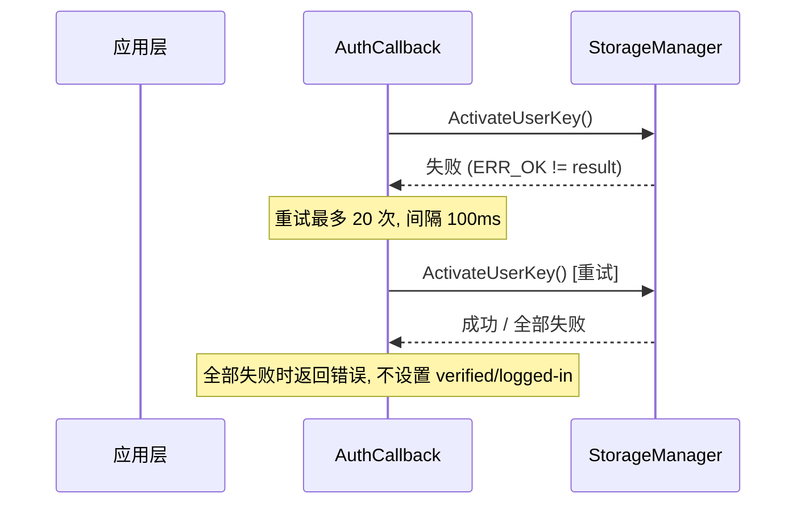

# 架构设计

## 设计元数据

| 字段 | 内容 |
|------|------|
| Design ID | DESIGN-20260528-001 |
| 关联需求 | proposal.md |
| 关联 Epic | 无 |
| 目标 Feature | FEAT-20260528-001 |
| 复杂度 | 标准 |
| 目标版本 | OpenHarmony-6.0-Release |
| Owner | Account 团队 |
| 状态 | Approved |

## 需求基线

| 项 | 补充说明 |
|----|------------------|
| CUSTOM 认证安全等级与 PIN 同级 | 设计决策 ADR-1：CUSTOM 享有完整解密权限 |
| COMPANION_DEVICE 移除 UnlockUserScreen 跳过逻辑 | 设计决策 ADR-2：COMPANION_DEVICE 享有 EL3/EL4 解密权限（不含 EL2） |
| HandleAuthResult() 无需为 CUSTOM 新增代码 | 依赖源码确认：仅 DOMAIN 类型做提前返回 |

## 上下文和现状

### 涉及仓和模块

| 仓库 | 补充架构说明 |
|------|-------------|
| os_account | NAPI 层动态/静态并行、IPC 序列化、认证回调处理三层架构；HandleAuthResult() 仅对 DOMAIN 做提前返回，其他类型自然进入 UnlockAccount 流程 |

### 适用架构规则

| Rule ID | 适用原因 | 设计结论 | 验证方式 |
|---------|----------|----------|----------|
| OH-ARCH-LAYERING | 涉及应用→NAPI→服务→UserIam 跨层调用 | 调用方向：应用→NAPI→AccountIAMClient→AccountIAMService→InnerAccountIAMManager→UserIam，禁止反向调用 | 代码评审 |
| OH-ARCH-SUBSYSTEM | 变均在 account 子系统内部 | 无跨子系统调用，仅依赖 UserIam（外部子系统）通过 IPC 代理 | 集成测试 |
| OH-ARCH-IPC-SAF | 涉及 AccountIAMService SA 跨进程调用 | AuthParam 序列化需扩展 additionalInfo 字段 | 单测 |
| OH-ARCH-API-LEVEL | 涉及 Public API 枚举值新增 | AuthType.CUSTOM = 128 为新增 Public API 枚举值，AuthOptions.additionalInfo 为新增可选字段 | API 评审/XTS |
| OH-ARCH-COMPONENT-BUILD | 无新增部件 | 无 BUILD.gn/bundle.json 变更 | 构建验证 |
| OH-ARCH-ERROR-LOG | 涉及认证失败重试和错误处理 | 复用现有错误码和日志机制，无新增错误码 | 单测/hilog |

## 不涉及项承接

| 维度 | 设计结论 |
|------|----------|
| 性能 | N/A — 无新增耗时路径 |
| 安全与权限 | CUSTOM 与 PIN 同级别，享有完整 EL2-EL5 解密权限；COMPANION_DEVICE 享有 EL3/EL4 解密权限（不含 EL2） |
| 兼容性 | 所有新增字段为可选，向后兼容 |
| API/SDK | AuthType.CUSTOM = 128 新增枚举值，AuthOptions.additionalInfo 新增可选 string 字段 |
| IPC/跨进程 | AuthParam Marshalling/Unmarshalling 需扩展 additionalInfo |
| 构建与部件 | N/A — 无新增源文件或部件 |
| 国际化/无障碍 | N/A — 无 UI 变更 |
| 数据迁移 | N/A — 无存储格式变更 |

## 关键设计决策

| 决策 ID | 问题 | 推荐方案 | 探索过的替代方案 | 取舍理由 | 影响 |
|---------|------|----------|-----------------|------|------|
| ADR-1 | CUSTOM 认证成功后如何执行用户空间解密？ | 依赖现有 HandleAuthResult() 逻辑，无需新增代码（仅 DOMAIN 提前返回，CUSTOM 自然进入） | 为 CUSTOM 新增显式分支处理代码 | 零新增代码、完全复用现有流程、与 PIN/FACE 行为一致 | 无代码变更，仅确认现有逻辑已覆盖 |
| ADR-2 | COMPANION_DEVICE 认证成功后如何支持 EL3/EL4 解密？ | 移除 UnlockUserScreen() 中 COMPANION_DEVICE 的跳过条件；COMPANION_DEVICE 不在 CheckAllowUnlockUserStorage allowlist 中，不触发 ActivateUserKey | 为 COMPANION_DEVICE 新增单独解密路径或加入 allowlist | 移除跳过条件是最小化变更，保留 RECOVERY_KEY 跳过逻辑不受影响；COMPANION_DEVICE 不在 allowlist 中意味着 EL2 不解密 | 修改 account_iam_callback.cpp 一处条件判断；UnlockAccount allowlist 仅包含 PIN 和 CUSTOM_AUTH |
| ADR-3 | AuthType.CUSTOM 枚举值选择？ | CUSTOM = 128（2 的幂次） | 其他数值（如 256） | 128 是下一个 2 的幂次，与现有风格一致，不与 DOMAIN=1024 冲突 | AuthTypeIndex 映射为 7 |
| ADR-4 | AuthOptions.additionalInfo 数据类型？ | Optional<string>（可选字符串） | JSON object / Map<string, string> | string 类型最简单，可传递 JSON 格式结构化数据；可选保证向后兼容 | NAPI 层使用 GetOptionalStringPropertyByKey 解析 |

## 设计骨架

### 骨架范围

| 骨架项 | 目标 | 不包含 | 验证方式 |
|--------|------|--------|----------|
| 类型定义骨架 | AuthType.CUSTOM、AuthOptions.additionalInfo 数据结构 | 完整业务逻辑 | 编译通过 |
| NAPI 解析骨架 | ParseContextForAuthOptions 扩展 additionalInfo | 全场景测试 | 最小用例通过 |
| 解密流程确认 | HandleAuthResult() 对 CUSTOM 的覆盖确认 | 新增分支代码 | 源码确认 |

### 骨架 Spec 拆分

| Task ID | 目标 | 受影响文件 | AC |
|---------|------|------------|-----|
| TASK-SKELETON-1 | 类型定义：AuthType.CUSTOM + AuthOptions.additionalInfo | account_iam_info.h、d.ts、taihe IDL | WHEN 编译 THEN 类型定义完整 |
| TASK-SKELETON-2 | COMPANION_DEVICE 跳过逻辑移除 | account_iam_callback.cpp | WHEN COMPANION_DEVICE 认证成功 THEN UnlockUserScreen 不被跳过 |

## 后续 Task 拆分

| Task ID | 目标 | 受影响文件 | 依赖 |
|---------|------|------------|------|
| TASK-1 | 类型定义 + AuthTypeIndex 映射 + IPC 序列化 | account_iam_info.h、account_iam_client.cpp | design.md + spec.md Approved |
| TASK-2 | NAPI/Taihe 参数解析 | napi_account_iam_user_auth.cpp、ohos.account.osAccount.impl.cpp | TASK-1 完成 |
| TASK-3 | COMPANION_DEVICE 跳过逻辑移除 + 解密验证 | account_iam_callback.cpp | TASK-1 完成 |
| TASK-4 | 单元测试 | test/ | TASK-1~3 完成 |
| TASK-5 | Fuzz 测试更新 | fuzz/ | TASK-4 完成 |

## API 签名、Kit 与权限

### 新增 API

| API 签名 | 类型 | Kit | d.ts 位置 | 权限要求 | SysCap |
|----------|------|-----|-----------|----------|--------|
| `AuthType.CUSTOM = 128` | Public 枚举值 | BasicServicesKit | `@ohos.account.osAccount.d.ts` | - | SystemCapability.Account.OsAccount |
| `AuthOptions.additionalInfo?: string` | Public 可选字段 | BasicServicesKit | `@ohos.account.osAccount.d.ts` | - | SystemCapability.Account.OsAccount |

### 变更/废弃 API

| 原有 API | 变更类型 | 新 API | 迁移说明 |
|----------|----------|--------|----------|
| 无 | - | - | 无废弃，所有新增为扩展 |

## 构建系统影响

### BUILD.gn 变更

无新增源文件或编译目标。

### bundle.json 变更

无新增部件或依赖变更。

---

## 可选设计扩展

### 数据流/控制流

| 步骤 | 调用方 | 被调用方 | 数据/接口 | 说明 |
|------|--------|----------|-----------|------|
| 1 | 应用 | UserAuth NAPI | auth(challenge, 128, trustLevel, {additionalInfo}) | 应用发起 CUSTOM 认证 |
| 2 | NAPI | AccountIAMClient | Auth(challenge, AuthType::CUSTOM, trustLevel, AuthOptions) | NAPI 解析 additionalInfo 并调用 InnerKit |
| 3 | AccountIAMClient | AccountIAMService (IPC) | AuthUser() | IPC 传输 AuthParam（含 additionalInfo） |
| 4 | AccountIAMService | InnerAccountIAMManager | AuthUser() | 服务层参数校验和传递 |
| 5 | InnerAccountIAMManager | UserIam 框架 | AuthUser() | 调用 UserIam 开始认证 |
| 6 | UserIam 框架 | AuthCallback | OnResult() | 认证结果回调 |
| 7a | AuthCallback (CUSTOM) | HandleAuthResult() | — | authType_ ≠ DOMAIN → 进入 UnlockAccount() → ActivateUserKey + UnlockUserScreen（EL2-EL5） |
| 7b | AuthCallback (COMPANION_DEVICE) | HandleAuthResult() | — | authType_ ≠ DOMAIN → 进入 UnlockAccount() → 仅 UnlockUserScreen（EL3/EL4）；ActivateUserKey 不被调用（不在 allowlist） |

### 时序设计

```mermaid
sequenceDiagram
  participant App as 应用层
  participant NAPI as NAPI 层
  participant IAMClient as AccountIAMClient
  participant IAMService as AccountIAMService (IPC)
  participant InnerMgr as InnerAccountIAMManager
  participant UserIam as UserIam 框架
  participant Callback as AuthCallback

  App->>NAPI: auth(challenge, 128, trustLevel, {additionalInfo})
  NAPI->>IAMClient: Auth(challenge, AuthType::CUSTOM, trustLevel, AuthOptions)
  IAMClient->>IAMService: AuthUser() [IPC, AuthParam 含 additionalInfo]
  IAMService->>InnerMgr: AuthUser()
  InnerMgr->>UserIam: AuthUser()
  UserIam-->>Callback: OnResult(成功, token, secret)
  Callback->>Callback: HandleAuthResult()
  Note over Callback: CUSTOM: authType_ ≠ DOMAIN → UnlockAccount() → ActivateUserKey + UnlockUserScreen (EL2-EL5)
  Note over Callback: COMPANION_DEVICE: authType_ ≠ DOMAIN → UnlockAccount() → 仅 UnlockUserScreen (EL3/EL4); ActivateUserKey 不被调用 (不在 allowlist)
```

### COMPANION_DEVICE 解密时序图

```mermaid
sequenceDiagram
  participant Callback as AuthCallback (COMPANION_DEVICE)
  participant Storage as StorageManager

  Note over Callback: UnlockAccount: CheckAllowUnlockUserStorage(COMPANION_DEVICE) = false → 跳过 ActivateUserKey
  Callback->>Storage: UnlockUserScreen()
  Storage-->>Callback: 成功 / 失败
  Note over Callback: 失败时重试最多 20 次, 间隔 100ms; 全部失败返回错误
```

### 异常传播时序图



| 异常场景 | 触发层 | 传播路径 | 最终处理 |
|----------|--------|----------|----------|
| ActivateUserKey 失败 | AuthCallback (CUSTOM) | AuthCallback → StorageManager → 重试 → 全部失败返回错误 | 返回错误码，不设置 verified/logged-in |
| UnlockUserScreen 失败 | AuthCallback (CUSTOM/COMPANION_DEVICE) | AuthCallback → InnerAccountIAMManager → 重试 → 全部失败返回错误 | 返回错误码，不设置 verified/logged-in |
| 账户停用状态 | AuthCallback | AuthCallback 检查账户状态 → 不执行解密 | 返回认证结果，不修改存储状态 |
| COMPANION_DEVICE ActivateUserKey 跳过 | AuthCallback (COMPANION_DEVICE) | CheckAllowUnlockUserStorage 返回 false → 不调用 ActivateUserKey | EL2 不解密，仅执行 UnlockUserScreen (EL3/EL4) |

### 线程与并发模型

| 操作 | 发起线程 | 回调线程 | 跨进程边界 | 程安全 | 重入约束 |
|------|----------|----------|------------|----------|----------|
| AuthUser | IPC 线程 | Binder 回调线程 | 是（App→Service） | 无新竞争 | 禁止重入 |
| HandleAuthResult | Binder 回调线程 | 同线程 | 否 | 无新竞争 | 禁止重入 |
| ActivateUserKey/UnlockUserScreen | Binder 回调线程 | 同线程 | 是（Service→StorageManager） | 无新竞争 | 禁止重入 |

## 风险和开放问题

| 项 | 类型 | 影响 | 处理方式 | Owner |
|----|------|------|----------|-------|
| UserIam 框架不支持 CUSTOM 类型 | 外部 | 高 | 需在 UserIam 框架侧同步添加支持（不在本 spec 范围内） | UserIam 团队 |
| additionalInfo 格式不规范 | 技术 | 低 | 文档建议使用 JSON 格式 | Account 团队 |

## 设计审批

- [x] 需求基线已确认，设计覆盖 P0/P1 AC
- [x] 不涉及项已承接，N/A 和展开项都有结论
- [x] 涉及仓和模块职责清楚
- [x] 适用架构规则已识别并形成设计结论
- [x] 分层和子系统边界合规
- [x] API 变更有签名、权限、错误码和兼容性说明
- [x] BUILD.gn/bundle.json 影响明确（无变更）
- [x] 设计输出和后续 Task 拆分明确
- [x] 关键设计决策有理由和影响说明
- [x] 风险和开放问题有 Owner

**结论:** Approved