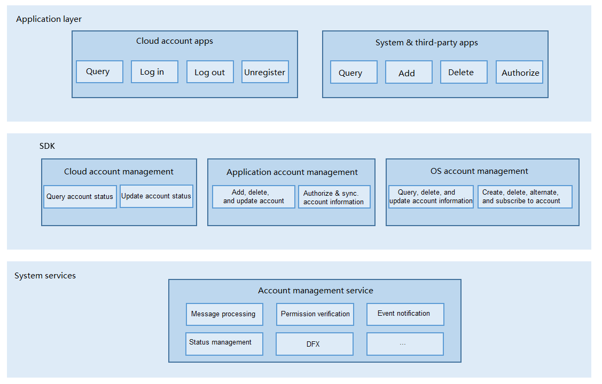

# OS Account<a name="EN-US_TOPIC_0000001123681215"></a>

## Introduction<a name="section11660541593"></a>

In the standard system, the account subsystem implements lifecycle management of OS accounts, manages the distributed account login status, and adds or deletes app accounts.

## Architecture<a name="section1412183212132"></a>

**Figure 1** Architecture of the OS account module<a name="fig4460722185514"></a>




## Directory Structure<a name="section161941989596"></a>

```
/base/account/os_account
├── figures                  Figures
├── frameworks               Code of the account subsystem
│   ├── appaccount           Internal API code of the app account module
│   │   └── native           Code used to implement the app account internal APIs
│   ├── common               Code of the common module
│   │   ├── account_error    Error codes
│   │   ├── database         Database code
│   │   ├── log              Code for printing logs
│   │   ├── perf_stat        Code for performance statistics
│   │   └── test             Test code for the common module
│   ├── ohosaccount         Internal API code of the distributed account module
│   │   ├── native            Code used to implement the distributed account internal APIs
│   │   └── test             Test code for the distributed account internal APIs
│   └── osaccount            Internal API code of the OS account module
│       ├── core             OS account IPC
│       └── native           Code used to implement the OS account internal APIs
├── interfaces               External APIs of the account subsystem
│   ├── innerkits            Internal API header file
│   │   ├── appaccount       Header file of the app account internal APIs
│   │   ├── ohosaccount      Header file of the distributed account internal APIs
│   │   └── osaccount        Header file of the OS account internal APIs
│   └── kits                 External API encapsulation
│       └── napi             External API encapsulation code of the account subsystem
├── sa_profile               SA profile directory of the account subsystem
├── services                accountmgr service code
│   └── accountmgr           Account subsystem service code
│       ├── include          Service code header file
│       ├── src              Source code of the account subsystem service code
│       └── test             Test of the account subsystem service code
├── test                     Test code
│   ├── resource             Test resource files
│   └── systemtest           System test code
└── tools                    Tool code
    ├── acm                  acm tool
    │   ├── include          acm header file
    │   └── src              acm source file
    └── test                 acm test code
```

## Usage<a name="section1312121216216"></a>

### Available APIs<a name="section1551164914237"></a>

#### 1. Distributed account module

The distributed account module provides APIs to query and update the account login status. These APIs can be used only by system apps.

**Table 1** Description of the distributed account module

<a name="table1650615420620"></a>

<table><thead align="left"><tr id="row175061254462"><th class="cellrowborder" valign="top" width="51.53%" id="mcps1.2.3.1.1"><p id="p1250613547612"><a name="p1250613547612"></a><a name="p1250613547612"></a>Module Name</p>
</th>
<th class="cellrowborder" valign="top" width="48.47%" id="mcps1.2.3.1.2"><p id="p85066541767"><a name="p85066541767"></a><a name="p85066541767"></a>Description</p>
</th>
</tr>
</thead>
<tbody>
<tr id="row0506185417614"><td class="cellrowborder" valign="top" width="51.53%" headers="mcps1.2.3.1.1 "><p id="p1561112131788"><a name="p1561112131788"></a><a name="p1561112131788"></a>distributedAccount</p>
</td>
<td class="cellrowborder" valign="top" width="48.47%" headers="mcps1.2.3.1.2 "><p id="p1954531161115"><a name="p1954531161115"></a><a name="p1954531161115"></a>Provides methods for managing distributed accounts.</p>
</td>
</tr>
</tbody>
</table>

**Table 2** Classes of distributedAccount

<a name="table1324102194217"></a>
<table><thead align="left"><tr id="row43241021174219"><th class="cellrowborder" valign="top" width="51.61%" id="mcps1.2.3.1.1"><p id="p10324621104214"><a name="p10324621104214"></a><a name="p10324621104214"></a>Class</p>
</th>
<th class="cellrowborder" valign="top" width="48.39%" id="mcps1.2.3.1.2"><p id="p2324221174213"><a name="p2324221174213"></a><a name="p2324221174213"></a>Description</p>
</th>
</tr>
</thead>
<tbody><tr id="row1432413213425"><td class="cellrowborder" valign="top" width="51.61%" headers="mcps1.2.3.1.1 "><p id="p1732472184212"><a name="p1732472184212"></a><a name="p1732472184212"></a>DistributedAccountAbility</p>
</td>
<td class="cellrowborder" valign="top" width="48.39%" headers="mcps1.2.3.1.2 "><p id="p1932432110421"><a name="p1932432110421"></a><a name="p1932432110421"></a>Provides methods for querying and updating the distributed account login status.</p>
</td>
</tr>
<tr id="row12324162116427"><td class="cellrowborder" valign="top" width="51.61%" headers="mcps1.2.3.1.1 "><p id="p1232422184216"><a name="p1232422184216"></a><a name="p1232422184216"></a>DistributedInfo</p>
</td>
<td class="cellrowborder" valign="top" width="48.39%" headers="mcps1.2.3.1.2 "><p id="p1324821164215"><a name="p1324821164215"></a><a name="p1324821164215"></a>Defines distributed account information, including the account name, account user ID (UID), and login status.</p>
</td>
</tr>
</tbody>
</table>

**Table 3** Description of DistributedAccountAbility

<a name="table6561120114219"></a>
<table><thead align="left"><tr id="row115642084211"><th class="cellrowborder" valign="top" width="51.67%" id="mcps1.2.3.1.1"><p id="p7565201424"><a name="p7565201424"></a><a name="p7565201424"></a>Method</p>
</th>
<th class="cellrowborder" valign="top" width="48.33%" id="mcps1.2.3.1.2"><p id="p0568204427"><a name="p0568204427"></a><a name="p0568204427"></a>Description</p>
</th>
</tr>
</thead>
<tbody><tr id="row456162064218"><td class="cellrowborder" valign="top" width="51.67%" headers="mcps1.2.3.1.1 "><p id="p8388718174317"><a name="p8388718174317"></a><a name="p8388718174317"></a>function getDistributedAccountAbility(): DistributedAccountAbility</p>
</td>
<td class="cellrowborder" valign="top" width="48.33%" headers="mcps1.2.3.1.2 "><p id="p5561920194211"><a name="p5561920194211"></a><a name="p5561920194211"></a>Obtains the **DistributedAccountAbility** singleton instance.</p>
</td>
</tr>
</tbody>
</table>

**Table 4** Methods of DistributedAccountAbility

<a name="table1738121244713"></a>
<table><thead align="left"><tr id="row4381111254710"><th class="cellrowborder" valign="top" width="64.72%" id="mcps1.2.3.1.1"><p id="p1738116127470"><a name="p1738116127470"></a><a name="p1738116127470"></a>Method</p>
</th>
<th class="cellrowborder" valign="top" width="35.28%" id="mcps1.2.3.1.2"><p id="p10381161224717"><a name="p10381161224717"></a><a name="p10381161224717"></a>Description</p>
</th>
</tr>
</thead>
<tbody><tr id="row18381121274715"><td class="cellrowborder" valign="top" width="64.72%" headers="mcps1.2.3.1.1 "><p id="p1671817233812"><a name="p1671817233812"></a><a name="p1671817233812"></a>queryOsAccountDistributedInfo(callback: AsyncCallback&lt;DistributedInfo&gt;): void</p>
</td>
<td class="cellrowborder" valign="top" width="35.28%" headers="mcps1.2.3.1.2 "><p id="p63421233134612"><a name="p63421233134612"></a><a name="p63421233134612"></a>Queries information about a distributed account. This method uses an asynchronous callback to return the result.</p>
</td>
</tr>
<tr id="row1938113125470"><td class="cellrowborder" valign="top" width="64.72%" headers="mcps1.2.3.1.1 "><p id="p73429332466"><a name="p73429332466"></a><a name="p73429332466"></a>queryOsAccountDistributedInfo(): Promise&lt;DistributedInfo&gt;</p>
</td>
<td class="cellrowborder" valign="top" width="35.28%" headers="mcps1.2.3.1.2 "><p id="p7342133394620"><a name="p7342133394620"></a><a name="p7342133394620"></a>Queries information about a distributed account. This method uses a promise to return the result.</p>
</td>
</tr>
<tr id="row13811912164716"><td class="cellrowborder" valign="top" width="64.72%" headers="mcps1.2.3.1.1 "><p id="p186182593814"><a name="p186182593814"></a><a name="p186182593814"></a>updateOsAccountDistributedInfo(accountInfo: DistributedInfo, callback: AsyncCallback&lt;boolean&gt;): void</p>
</td>
<td class="cellrowborder" valign="top" width="35.28%" headers="mcps1.2.3.1.2 "><p id="p1534263304617"><a name="p1534263304617"></a><a name="p1534263304617"></a>Updates information about a distributed account. This method uses an asynchronous callback to return the result.</p>
</td>
</tr>
<tr id="row10382181218477"><td class="cellrowborder" valign="top" width="64.72%" headers="mcps1.2.3.1.1 "><p id="p686934433810"><a name="p686934433810"></a><a name="p686934433810"></a>updateOsAccountDistributedInfo(accountInfo: DistributedInfo): Promise&lt;boolean&gt;</p>
</td>
<td class="cellrowborder" valign="top" width="35.28%" headers="mcps1.2.3.1.2 "><p id="p0342193384611"><a name="p0342193384611"></a><a name="p0342193384611"></a>Updates information about a distributed account. This method uses a promise to return the result.</p>
</td>
</tr>
</tbody>
</table>


#### 2. App account module

The app account module provides APIs to add, delete, query, and modify an app account, enable or disable access to an app account, and flush and synchronize account data.

**Table 5** Description of the app account module

<a name="table1650615420620"></a>

<table><thead align="left"><tr id="row175061254462"><th class="cellrowborder" valign="top" width="51.53%" id="mcps1.2.3.1.1"><p id="p1250613547612"><a name="p1250613547612"></a><a name="p1250613547612"></a>Module Name</p>
</th>
<th class="cellrowborder" valign="top" width="48.47%" id="mcps1.2.3.1.2"><p id="p85066541767"><a name="p85066541767"></a><a name="p85066541767"></a>Description</p>
</th>
</tr>
</thead>
<tbody>
<tr id="row0506185417614"><td class="cellrowborder" valign="top" width="51.53%" headers="mcps1.2.3.1.1 "><p id="p1561112131788"><a name="p1561112131788"></a><a name="p1561112131788"></a>appAccount</p>
</td>
<td class="cellrowborder" valign="top" width="48.47%" headers="mcps1.2.3.1.2 "><p id="p1954531161115"><a name="p1954531161115"></a><a name="p1954531161115"></a>Provides methods for managing app accounts.</p>
</td>
</tr>
</tbody>
</table>

**Table 6** Classes of appAccount

<a name="table1324102194217"></a>

<table><thead align="left"><tr id="row43241021174219"><th class="cellrowborder" valign="top" width="51.61%" id="mcps1.2.3.1.1"><p id="p10324621104214"><a name="p10324621104214"></a><a name="p10324621104214"></a>Class</p>
</th>
<th class="cellrowborder" valign="top" width="48.39%" id="mcps1.2.3.1.2"><p id="p2324221174213"><a name="p2324221174213"></a><a name="p2324221174213"></a>Description</p>
</th>
</tr>
</thead>
<tbody><tr id="row1432413213425"><td class="cellrowborder" valign="top" width="51.61%" headers="mcps1.2.3.1.1 "><p id="p1732472184212"><a name="p1732472184212"></a><a name="p1732472184212"></a>AppAccountManager</p>
</td>
<td class="cellrowborder" valign="top" width="48.39%" headers="mcps1.2.3.1.2 "><p id="p1932432110421"><a name="p1932432110421"></a><a name="p1932432110421"></a>Provides methods for adding, deleting, querying, and modifying app accounts, and enabling or disabling access to app accounts.</p>
</td>
</tr>
<tr id="row12324162116427"><td class="cellrowborder" valign="top" width="51.61%" headers="mcps1.2.3.1.1 "><p id="p1232422184216"><a name="p1232422184216"></a><a name="p1232422184216"></a>AppAccountInfo</p>
</td>
<td class="cellrowborder" valign="top" width="48.39%" headers="mcps1.2.3.1.2 "><p id="p1324821164215"><a name="p1324821164215"></a><a name="p1324821164215"></a>Defines app account information, including the account name and bundle name.</p>
</td>
</tr>
<tr id="row12324162116427"><td class="cellrowborder" valign="top" width="51.61%" headers="mcps1.2.3.1.1 "><p id="p1232422184216"><a name="p1232422184216"></a><a name="p1232422184216"></a>OAuthTokenInfo</p>
</td>
<td class="cellrowborder" valign="top" width="48.39%" headers="mcps1.2.3.1.2 "><p id="p1324821164215"><a name="p1324821164215"></a><a name="p1324821164215"></a>Defines OAuth access token information, including the authentication type and token value, for an app account.</p>
</td>
</tr>
<tr id="row12324162116427"><td class="cellrowborder" valign="top" width="51.61%" headers="mcps1.2.3.1.1 "><p id="p1232422184216"><a name="p1232422184216"></a><a name="p1232422184216"></a>AuthenticatorInfo</p>
</td>
<td class="cellrowborder" valign="top" width="48.39%" headers="mcps1.2.3.1.2 "><p id="p1324821164215"><a name="p1324821164215"></a><a name="p1324821164215"></a>Defines OAuth authenticator information, including the bundle name, icon ID, and label ID, for an app account.</p>
</td>
</tr>
<tr id="row12324162116427"><td class="cellrowborder" valign="top" width="51.61%" headers="mcps1.2.3.1.1 "><p id="p1232422184216"><a name="p1232422184216"></a><a name="p1232422184216"></a>AuthenticatorCallback</p>
</td>
<td class="cellrowborder" valign="top" width="48.39%" headers="mcps1.2.3.1.2 "><p id="p1324821164215"><a name="p1324821164215"></a><a name="p1324821164215"></a>Provides callbacks for returning the OAUth authentication result notification or redirecting an authentication request for an app account.</p>
</td>
</tr>
<tr id="row12324162116427"><td class="cellrowborder" valign="top" width="51.61%" headers="mcps1.2.3.1.1 "><p id="p1232422184216"><a name="p1232422184216"></a><a name="p1232422184216"></a>Authenticator</p>
</td>
<td class="cellrowborder" valign="top" width="48.39%" headers="mcps1.2.3.1.2 "><p id="p1324821164215"><a name="p1324821164215"></a><a name="p1324821164215"></a>Provides methods for managing the OAuth authenticator information for an app account.</p>
</td>
</tr>
<tr id="row12324162116427"><td class="cellrowborder" valign="top" width="51.61%" headers="mcps1.2.3.1.1 "><p id="p1232422184216"><a name="p1232422184216"></a><a name="p1232422184216"></a>Constants</p>
</td>
<td class="cellrowborder" valign="top" width="48.39%" headers="mcps1.2.3.1.2 "><p id="p1324821164215"><a name="p1324821164215"></a><a name="p1324821164215"></a>Defines constants, such as the key name and operation name.</p>
</td>
</tr>
<tr id="row12324162116427"><td class="cellrowborder" valign="top" width="51.61%" headers="mcps1.2.3.1.1 "><p id="p1232422184216"><a name="p1232422184216"></a><a name="p1232422184216"></a>ResultCode</p>
</td>
<td class="cellrowborder" valign="top" width="48.39%" headers="mcps1.2.3.1.2 "><p id="p1324821164215"><a name="p1324821164215"></a><a name="p1324821164215"></a>Provides the result codes for the app account APIs.</p>
</td>
</tr>
</tbody>
</table>

**Table 7** Description of AppAccountManager

<a name="table6561120114219"></a>

<table><thead align="left"><tr id="row115642084211"><th class="cellrowborder" valign="top" width="51.67%" id="mcps1.2.3.1.1"><p id="p7565201424"><a name="p7565201424"></a><a name="p7565201424"></a>Method</p>
</th>
<th class="cellrowborder" valign="top" width="48.33%" id="mcps1.2.3.1.2"><p id="p0568204427"><a name="p0568204427"></a><a name="p0568204427"></a>Description</p>
</th>
</tr>
</thead>
<tbody><tr id="row456162064218"><td class="cellrowborder" valign="top" width="51.67%" headers="mcps1.2.3.1.1 "><p id="p8388718174317"><a name="p8388718174317"></a><a name="p8388718174317"></a>function createAppAccountManager(): AppAccountManager</p>
</td>
<td class="cellrowborder" valign="top" width="48.33%" headers="mcps1.2.3.1.2 "><p id="p5561920194211"><a name="p5561920194211"></a><a name="p5561920194211"></a>Obtains the **AppAccountManager** singleton instance.</p>
</td>
</tr>
</tbody>
</table>

**Table 8**Methods of AppAccountManager

<a name="table1738121244713"></a>

<table><thead align="left"><tr id="row4381111254710"><th class="cellrowborder" valign="top" width="64.72%" id="mcps1.2.3.1.1"><p id="p1738116127470"><a name="p1738116127470"></a><a name="p1738116127470"></a>Method</p>
</th>
<th class="cellrowborder" valign="top" width="35.28%" id="mcps1.2.3.1.2"><p id="p10381161224717"><a name="p10381161224717"></a><a name="p10381161224717"></a>Description</p>
</th>
</tr>
</thead>
<tbody><tr id="row18381121274715"><td class="cellrowborder" valign="top" width="64.72%" headers="mcps1.2.3.1.1 "><p id="p1671817233812"><a name="p1671817233812"></a><a name="p1671817233812"></a>addAccount(name: string, callback: AsyncCallback&lt;void&gt;): void;</p>
</td>
<td class="cellrowborder" valign="top" width="35.28%" headers="mcps1.2.3.1.2 "><p id="p63421233134612"><a name="p63421233134612"></a><a name="p63421233134612"></a>Adds an app account.</p>
</td>
</tr>
<tr id="row1938113125470"><td class="cellrowborder" valign="top" width="64.72%" headers="mcps1.2.3.1.1 "><p id="p73429332466"><a name="p73429332466"></a><a name="p73429332466"></a>addAccountImplicitly(owner: string, authType: string, options: {[key: string]: any}, callback: AuthenticatorCallback): void;</p>
</td>
<td class="cellrowborder" valign="top" width="35.28%" headers="mcps1.2.3.1.2 "><p id="p7342133394620"><a name="p7342133394620"></a><a name="p7342133394620"></a>Adds an app account implicitly.</p>
</td>
</tr>
<tr id="row1938113125470"><td class="cellrowborder" valign="top" width="64.72%" headers="mcps1.2.3.1.1 "><p id="p73429332466"><a name="p73429332466"></a><a name="p73429332466"></a>deleteAccount(name: string, callback: AsyncCallback&lt;void&gt;): void;</p>
</td>
<td class="cellrowborder" valign="top" width="35.28%" headers="mcps1.2.3.1.2 "><p id="p7342133394620"><a name="p7342133394620"></a><a name="p7342133394620"></a>Deletes an app account.</p>
</td>
</tr>
<tr id="row13811912164716"><td class="cellrowborder" valign="top" width="64.72%" headers="mcps1.2.3.1.1 "><p id="p186182593814"><a name="p186182593814"></a><a name="p186182593814"></a>enableAppAccess(name: string, bundleName: string, callback: AsyncCallback&lt;void&gt;): void;</p>
</td>
<td class="cellrowborder" valign="top" width="35.28%" headers="mcps1.2.3.1.2 "><p id="p1534263304617"><a name="p1534263304617"></a><a name="p1534263304617"></a>Enables access to an app account.</p>
</td>
</tr>
<tr id="row10382181218477"><td class="cellrowborder" valign="top" width="64.72%" headers="mcps1.2.3.1.1 "><p id="p686934433810"><a name="p686934433810"></a><a name="p686934433810"></a>disableAppAccess(name: string, bundleName: string, callback: AsyncCallback&lt;void&gt;): void;</p>
</td>
<td class="cellrowborder" valign="top" width="35.28%" headers="mcps1.2.3.1.2 "><p id="p0342193384611"><a name="p0342193384611"></a><a name="p0342193384611"></a>Disables access to an app account.</p>
</td>
</tr>
<tr id="row10382181218477"><td class="cellrowborder" valign="top" width="64.72%" headers="mcps1.2.3.1.1 "><p id="p686934433810"><a name="p686934433810"></a><a name="p686934433810"></a>checkAppAccountSyncEnable(name: string, callback: AsyncCallback&lt;boolean&gt;): void;</p>
</td>
<td class="cellrowborder" valign="top" width="35.28%" headers="mcps1.2.3.1.2 "><p id="p0342193384611"><a name="p0342193384611"></a><a name="p0342193384611"></a>Checks whether application data synchronization is enabled for an app account.</p>
</td>
</tr>
<tr id="row10382181218477"><td class="cellrowborder" valign="top" width="64.72%" headers="mcps1.2.3.1.1 "><p id="p686934433810"><a name="p686934433810"></a><a name="p686934433810"></a>setAccountCredential(name: string, credentialType: string, credential: string,callback: AsyncCallback&lt;void&gt;): void;</p>
</td>
<td class="cellrowborder" valign="top" width="35.28%" headers="mcps1.2.3.1.2 "><p id="p0342193384611"><a name="p0342193384611"></a><a name="p0342193384611"></a>Sets credential information for an app account.</p>
</td>
</tr>
<tr id="row10382181218477"><td class="cellrowborder" valign="top" width="64.72%" headers="mcps1.2.3.1.1 "><p id="p686934433810"><a name="p686934433810"></a><a name="p686934433810"></a>setAccountExtraInfo(name: string, extraInfo: string, callback: AsyncCallback&lt;void&gt;): void;</p>
</td>
<td class="cellrowborder" valign="top" width="35.28%" headers="mcps1.2.3.1.2 "><p id="p0342193384611"><a name="p0342193384611"></a><a name="p0342193384611"></a>Sets additional information for an app account.</p>
</td>
</tr>
<tr id="row10382181218477"><td class="cellrowborder" valign="top" width="64.72%" headers="mcps1.2.3.1.1 "><p id="p686934433810"><a name="p686934433810"></a><a name="p686934433810"></a>setAppAccountSyncEnable(name: string, isEnable: boolean, callback: AsyncCallback&lt;void&gt;): void;</p>
</td>
<td class="cellrowborder" valign="top" width="35.28%" headers="mcps1.2.3.1.2 "><p id="p0342193384611"><a name="p0342193384611"></a><a name="p0342193384611"></a>Sets the synchronization status for an app account.</p>
</td>
</tr>
<tr id="row10382181218477"><td class="cellrowborder" valign="top" width="64.72%" headers="mcps1.2.3.1.1 "><p id="p686934433810"><a name="p686934433810"></a><a name="p686934433810"></a>setAssociatedData(name: string, key: string, value: string, callback: AsyncCallback&lt;void&gt;): void;</p>
</td>
<td class="cellrowborder" valign="top" width="35.28%" headers="mcps1.2.3.1.2 "><p id="p0342193384611"><a name="p0342193384611"></a><a name="p0342193384611"></a>Sets the data associated with an app account.</p>
</td>
</tr>
<tr id="row10382181218477"><td class="cellrowborder" valign="top" width="64.72%" headers="mcps1.2.3.1.1 "><p id="p686934433810"><a name="p686934433810"></a><a name="p686934433810"></a>getAllAccessibleAccounts(callback: AsyncCallback &#60;Array&#60; AppAccountInfo&gt;&gt;): void;</p>
</td>
<td class="cellrowborder" valign="top" width="35.28%" headers="mcps1.2.3.1.2 "><p id="p0342193384611"><a name="p0342193384611"></a><a name="p0342193384611"></a>Obtains information about all accessible app accounts.</p>
</td>
</tr>
<tr id="row10382181218477"><td class="cellrowborder" valign="top" width="64.72%" headers="mcps1.2.3.1.1 "><p id="p686934433810"><a name="p686934433810"></a><a name="p686934433810"></a>getAllAccounts(owner: string, callback: AsyncCallback&#60;Array&#60;AppAccountInfo&gt;&gt;): void;</p>
</td>
<td class="cellrowborder" valign="top" width="35.28%" headers="mcps1.2.3.1.2 "><p id="p0342193384611"><a name="p0342193384611"></a><a name="p0342193384611"></a>Obtains all app accounts of the specified bundle.</p>
</td>
</tr>
<tr id="row10382181218477"><td class="cellrowborder" valign="top" width="64.72%" headers="mcps1.2.3.1.1 "><p id="p686934433810"><a name="p686934433810"></a><a name="p686934433810"></a>getAccountCredential(name: string, credentialType: string, callback: AsyncCallback&lt;string&gt;): void;</p>
</td>
<td class="cellrowborder" valign="top" width="35.28%" headers="mcps1.2.3.1.2 "><p id="p0342193384611"><a name="p0342193384611"></a><a name="p0342193384611"></a>Obtains the credential information about an app account.</p>
</td>
</tr>
<tr id="row10382181218477"><td class="cellrowborder" valign="top" width="64.72%" headers="mcps1.2.3.1.1 "><p id="p686934433810"><a name="p686934433810"></a><a name="p686934433810"></a>getAccountExtraInfo(name: string, callback: AsyncCallback&lt;string&gt;): void;</p>
</td>
<td class="cellrowborder" valign="top" width="35.28%" headers="mcps1.2.3.1.2 "><p id="p0342193384611"><a name="p0342193384611"></a><a name="p0342193384611"></a>Obtains additional information about an app account.</p>
</td>
</tr>
<tr id="row10382181218477"><td class="cellrowborder" valign="top" width="64.72%" headers="mcps1.2.3.1.1 "><p id="p686934433810"><a name="p686934433810"></a><a name="p686934433810"></a>getAssociatedData(name: string, key: string, callback: AsyncCallback&lt;string&gt;): void;</p>
</td>
<td class="cellrowborder" valign="top" width="35.28%" headers="mcps1.2.3.1.2 "><p id="p0342193384611"><a name="p0342193384611"></a><a name="p0342193384611"></a>Obtains the associated data of an app account.</p>
</td>
</tr>
<tr id="row10382181218477"><td class="cellrowborder" valign="top" width="64.72%" headers="mcps1.2.3.1.1 "><p id="p686934433810"><a name="p686934433810"></a><a name="p686934433810"></a>on(type: 'change', owners: Array&lt;string&gt;, callback: Callback&#60;Array&#60;AppAccountInfo&gt;&gt;): void;</p>
</td>
<td class="cellrowborder" valign="top" width="35.28%" headers="mcps1.2.3.1.2 "><p id="p0342193384611"><a name="p0342193384611"></a><a name="p0342193384611"></a>Subscribes to the changes in the app account information.</p>
</td>
</tr>
<tr id="row10382181218477"><td class="cellrowborder" valign="top" width="64.72%" headers="mcps1.2.3.1.1 "><p id="p686934433810"><a name="p686934433810"></a><a name="p686934433810"></a>off(type: 'change', callback?: Callback&#60;void&gt;): void;</p>
</td>
<td class="cellrowborder" valign="top" width="35.28%" headers="mcps1.2.3.1.2 "><p id="p0342193384611"><a name="p0342193384611"></a><a name="p0342193384611"></a>Unsubscribes from the changes in the app account information.</p>
</td>
</tr>
<tr id="row10382181218477"><td class="cellrowborder" valign="top" width="64.72%" headers="mcps1.2.3.1.1 "><p id="p686934433810"><a name="p686934433810"></a><a name="p686934433810"></a>authenticate(name: string, owner: string, authType: string, options: {[key: string]: any}, callback: AuthenticatorCallback): void;</p>
</td>
<td class="cellrowborder" valign="top" width="35.28%" headers="mcps1.2.3.1.2 "><p id="p0342193384611"><a name="p0342193384611"></a><a name="p0342193384611"></a>Authenticates an app account to obtain an OAuth access token.</p>
</td>
</tr>
<tr id="row10382181218477"><td class="cellrowborder" valign="top" width="64.72%" headers="mcps1.2.3.1.1 "><p id="p686934433810"><a name="p686934433810"></a><a name="p686934433810"></a>getOAuthToken(name: string, owner: string, authType: string, callback: AsyncCallback&lt;string&gt;): void;</p>
</td>
<td class="cellrowborder" valign="top" width="35.28%" headers="mcps1.2.3.1.2 "><p id="p0342193384611"><a name="p0342193384611"></a><a name="p0342193384611"></a>Obtains the OAuth access token of an app account.</p>
</td>
</tr>
<tr id="row10382181218477"><td class="cellrowborder" valign="top" width="64.72%" headers="mcps1.2.3.1.1 "><p id="p686934433810"><a name="p686934433810"></a><a name="p686934433810"></a>setOAuthToken(name: string, authType: string, token: string, callback: AsyncCallback&lt;void&gt;): void;</p>
</td>
<td class="cellrowborder" valign="top" width="35.28%" headers="mcps1.2.3.1.2 "><p id="p0342193384611"><a name="p0342193384611"></a><a name="p0342193384611"></a>Sets the OAuth access token for an app account.</p>
</td>
</tr>
<tr id="row10382181218477"><td class="cellrowborder" valign="top" width="64.72%" headers="mcps1.2.3.1.1 "><p id="p686934433810"><a name="p686934433810"></a><a name="p686934433810"></a>deleteOAuthToken(name: string, owner: string, authType: string, token: string, callback: AsyncCallback&lt;void&gt;): void;</p>
</td>
<td class="cellrowborder" valign="top" width="35.28%" headers="mcps1.2.3.1.2 "><p id="p0342193384611"><a name="p0342193384611"></a><a name="p0342193384611"></a>Deletes the OAuth access token for an app account.</p>
</td>
</tr>
<tr id="row10382181218477"><td class="cellrowborder" valign="top" width="64.72%" headers="mcps1.2.3.1.1 "><p id="p686934433810"><a name="p686934433810"></a><a name="p686934433810"></a>setOAuthTokenVisibility(name: string, authType: string, bundleName: string, isVisible: boolean, callback: AsyncCallback&lt;void&gt;): void;</p>
</td>
<td class="cellrowborder" valign="top" width="35.28%" headers="mcps1.2.3.1.2 "><p id="p0342193384611"><a name="p0342193384611"></a><a name="p0342193384611"></a>Sets the OAuth access token visibility for an app account.</p>
</td>
</tr>
<tr id="row10382181218477"><td class="cellrowborder" valign="top" width="64.72%" headers="mcps1.2.3.1.1 "><p id="p686934433810"><a name="p686934433810"></a><a name="p686934433810"></a>checkOAuthTokenVisibility(name: string, authType: string, bundleName: string, callback: AsyncCallback&lt;boolean&gt;): void;</p>
</td>
<td class="cellrowborder" valign="top" width="35.28%" headers="mcps1.2.3.1.2 "><p id="p0342193384611"><a name="p0342193384611"></a><a name="p0342193384611"></a>Checks the OAuth access token visibility for an app account.</p>
</td>
</tr>
<tr id="row10382181218477"><td class="cellrowborder" valign="top" width="64.72%" headers="mcps1.2.3.1.1 "><p id="p686934433810"><a name="p686934433810"></a><a name="p686934433810"></a>getAllOAuthTokens(name: string, owner: string, callback: AsyncCallback&lt;Array&lt;OAuthTokenInfo&gt;&gt;): void;</p>
</td>
<td class="cellrowborder" valign="top" width="35.28%" headers="mcps1.2.3.1.2 "><p id="p0342193384611"><a name="p0342193384611"></a><a name="p0342193384611"></a>Obtains all visible OAuth access tokens of an app account.</p>
</td>
</tr>
<tr id="row10382181218477"><td class="cellrowborder" valign="top" width="64.72%" headers="mcps1.2.3.1.1 "><p id="p686934433810"><a name="p686934433810"></a><a name="p686934433810"></a>getOAuthList(name: string, authType: string, callback: AsyncCallback&lt;Array&lt;string&gt;&gt;): void;</p>
</td>
<td class="cellrowborder" valign="top" width="35.28%" headers="mcps1.2.3.1.2 "><p id="p0342193384611"><a name="p0342193384611"></a><a name="p0342193384611"></a>Obtains the OAuth access token list of an app account.</p>
</td>
</tr>
<tr id="row10382181218477"><td class="cellrowborder" valign="top" width="64.72%" headers="mcps1.2.3.1.1 "><p id="p686934433810"><a name="p686934433810"></a><a name="p686934433810"></a>getAuthenticatorCallback(sessionId: string, callback: AsyncCallback&lt;AuthenticatorCallback&gt;): void;</p>
</td>
<td class="cellrowborder" valign="top" width="35.28%" headers="mcps1.2.3.1.2 "><p id="p0342193384611"><a name="p0342193384611"></a><a name="p0342193384611"></a>Obtains the OAuth authenticator callback of an app account.</p>
</td>
</tr>
<tr id="row10382181218477"><td class="cellrowborder" valign="top" width="64.72%" headers="mcps1.2.3.1.1 "><p id="p686934433810"><a name="p686934433810"></a><a name="p686934433810"></a>getAuthenticatorInfo(owner: string, callback: AsyncCallback&lt;AuthenticatorInfo&gt;): void;</p>
</td>
<td class="cellrowborder" valign="top" width="35.28%" headers="mcps1.2.3.1.2 "><p id="p0342193384611"><a name="p0342193384611"></a><a name="p0342193384611"></a>Obtains the OAuth authenticator information of an app account.</p>
</td>
</tr>
</tbody>
</table>

#### 3. OS account module

The OS account module provides APIs to add, delete, query, set, subscribe to, and activate OS accounts, and flush OS account data to disks.

**Table 9** Description of the OS account module

<a name="table1650615420620"></a>

<table><thead align="left"><tr id="row175061254462"><th class="cellrowborder" valign="top" width="51.53%" id="mcps1.2.3.1.1"><p id="p1250613547612"><a name="p1250613547612"></a><a name="p1250613547612"></a>Module Name</p>
</th>
<th class="cellrowborder" valign="top" width="48.47%" id="mcps1.2.3.1.2"><p id="p85066541767"><a name="p85066541767"></a><a name="p85066541767"></a>Description</p>
</th>
</tr>
</thead>
<tbody>
<tr id="row0506185417614"><td class="cellrowborder" valign="top" width="51.53%" headers="mcps1.2.3.1.1 "><p id="p1561112131788"><a name="p1561112131788"></a><a name="p1561112131788"></a>osAccount</p>
</td>
<td class="cellrowborder" valign="top" width="48.47%" headers="mcps1.2.3.1.2 "><p id="p1954531161115"><a name="p1954531161115"></a><a name="p1954531161115"></a>Provides methods for managing OS accounts.</p>
</td>
</tr>
</tbody>
</table>


**Table 10** Classes of osAccount

<a name="table1324102194217"></a>

<table><thead align="left"><tr id="row43241021174219"><th class="cellrowborder" valign="top" width="51.61%" id="mcps1.2.3.1.1"><p id="p10324621104214"><a name="p10324621104214"></a><a name="p10324621104214"></a>Class</p>
</th>
<th class="cellrowborder" valign="top" width="48.39%" id="mcps1.2.3.1.2"><p id="p2324221174213"><a name="p2324221174213"></a><a name="p2324221174213"></a>Description</p>
</th>
</tr>
</thead>
<tbody><tr id="row1432413213425"><td class="cellrowborder" valign="top" width="51.61%" headers="mcps1.2.3.1.1 "><p id="p1732472184212"><a name="p1732472184212"></a><a name="p1732472184212"></a>AccountManager</p>
</td>
<td class="cellrowborder" valign="top" width="48.39%" headers="mcps1.2.3.1.2 "><p id="p1932432110421"><a name="p1932432110421"></a><a name="p1932432110421"></a>Provides methods for adding, deleting, querying, setting, subscribing to, and activating OS accounts.</p>
</td>
</tr>
<tr id="row12324162116427"><td class="cellrowborder" valign="top" width="51.61%" headers="mcps1.2.3.1.1 "><p id="p1232422184216"><a name="p1232422184216"></a><a name="p1232422184216"></a>OsAccountInfo</p>
</td>
<td class="cellrowborder" valign="top" width="48.39%" headers="mcps1.2.3.1.2 "><p id="p1324821164215"><a name="p1324821164215"></a><a name="p1324821164215"></a>Provides OS account information, including the account name and ID.</p>
</td>
</tr>
<tr id="row12324162116427"><td class="cellrowborder" valign="top" width="51.61%" headers="mcps1.2.3.1.1 "><p id="p1232422184216"><a name="p1232422184216"></a><a name="p1232422184216"></a>DomainAccountInfo</p>
</td>
<td class="cellrowborder" valign="top" width="48.39%" headers="mcps1.2.3.1.2 "><p id="p1324821164215"><a name="p1324821164215"></a><a name="p1324821164215"></a>Provides domain account information, such as the domain name and domain account name.</p>
</td>
</tr>
<tr id="row12324162116427"><td class="cellrowborder" valign="top" width="51.61%" headers="mcps1.2.3.1.1 "><p id="p1232422184216"><a name="p1232422184216"></a><a name="p1232422184216"></a>OsAccountType</p>
</td>
<td class="cellrowborder" valign="top" width="48.39%" headers="mcps1.2.3.1.2 "><p id="p1324821164215"><a name="p1324821164215"></a><a name="p1324821164215"></a>Defines OS account types, including administrator, common user, and guest.</p>
</td>
</tr>
</tbody>
</table>


**Table 11** Description of AccountManager

<a name="table6561120114219"></a>

<table><thead align="left"><tr id="row115642084211"><th class="cellrowborder" valign="top" width="51.67%" id="mcps1.2.3.1.1"><p id="p7565201424"><a name="p7565201424"></a><a name="p7565201424"></a>Method</p>
</th>
<th class="cellrowborder" valign="top" width="48.33%" id="mcps1.2.3.1.2"><p id="p0568204427"><a name="p0568204427"></a><a name="p0568204427"></a>Description</p>
</th>
</tr>
</thead>
<tbody><tr id="row456162064218"><td class="cellrowborder" valign="top" width="51.67%" headers="mcps1.2.3.1.1 "><p id="p8388718174317"><a name="p8388718174317"></a><a name="p8388718174317"></a>function getAccountManager(): AccountManager</p>
</td>
<td class="cellrowborder" valign="top" width="48.33%" headers="mcps1.2.3.1.2 "><p id="p5561920194211"><a name="p5561920194211"></a><a name="p5561920194211"></a>Obtains the **AccountManager** singleton instance.</p>
</td>
</tr>
</tbody>
</table>


**Table 12** Methods of AccountManager

<a name="table1738121244713"></a>

<table><thead align="left"><tr id="row4381111254710"><th class="cellrowborder" valign="top" width="64.72%" id="mcps1.2.3.1.1"><p id="p1738116127470"><a name="p1738116127470"></a><a name="p1738116127470"></a>Method</p>
</th>
<th class="cellrowborder" valign="top" width="35.28%" id="mcps1.2.3.1.2"><p id="p10381161224717"><a name="p10381161224717"></a><a name="p10381161224717"></a>Description</p>
</th>
</tr>
</thead>
<tbody><tr id="row18381121274715"><td class="cellrowborder" valign="top" width="64.72%" headers="mcps1.2.3.1.1 "><p id="p1671817233812"><a name="p1671817233812"></a><a name="p1671817233812"></a>activateOsAccount(localId: number, callback: AsyncCallback&lt;void&gt;): void;</p>
</td>
<td class="cellrowborder" valign="top" width="35.28%" headers="mcps1.2.3.1.2 "><p id="p63421233134612"><a name="p63421233134612"></a><a name="p63421233134612"></a>Activates an OS account. This method uses an asynchronous callback to return the result.</p>
</td>
</tr>
<tr id="row18381121274715"><td class="cellrowborder" valign="top" width="64.72%" headers="mcps1.2.3.1.1 "><p id="p1671817233812"><a name="p1671817233812"></a><a name="p1671817233812"></a>activateOsAccount(localId: number): Promise&lt;void&gt;;</p>
</td>
<td class="cellrowborder" valign="top" width="35.28%" headers="mcps1.2.3.1.2 "><p id="p63421233134612"><a name="p63421233134612"></a><a name="p63421233134612"></a>Activates an OS account. This method uses a promise to return the result.</p>
</td>
</tr>
<tr id="row1938113125470"><td class="cellrowborder" valign="top" width="64.72%" headers="mcps1.2.3.1.1 "><p id="p73429332466"><a name="p73429332466"></a><a name="p73429332466"></a>isMultiOsAccountEnable(callback: AsyncCallback&lt;boolean&gt;): void;</p>
</td>
<td class="cellrowborder" valign="top" width="35.28%" headers="mcps1.2.3.1.2 "><p id="p7342133394620"><a name="p7342133394620"></a><a name="p7342133394620"></a>Checks whether multiple OS accounts are supported. This method uses an asynchronous callback to return the result.</p>
</td>
</tr>
<tr id="row1938113125470"><td class="cellrowborder" valign="top" width="64.72%" headers="mcps1.2.3.1.1 "><p id="p73429332466"><a name="p73429332466"></a><a name="p73429332466"></a>isMultiOsAccountEnable(): Promise&lt;boolean&gt;;</p>
</td>
<td class="cellrowborder" valign="top" width="35.28%" headers="mcps1.2.3.1.2 "><p id="p7342133394620"><a name="p7342133394620"></a><a name="p7342133394620"></a>Checks whether multiple OS accounts are supported. This method uses a promise to return the result.</p>
</td>
</tr>
<tr id="row13811912164716"><td class="cellrowborder" valign="top" width="64.72%" headers="mcps1.2.3.1.1 "><p id="p186182593814"><a name="p186182593814"></a><a name="p186182593814"></a>isOsAccountActived(localId: number, callback: AsyncCallback&lt;boolean&gt;): void;</p>
</td>
<td class="cellrowborder" valign="top" width="35.28%" headers="mcps1.2.3.1.2 "><p id="p1534263304617"><a name="p1534263304617"></a><a name="p1534263304617"></a>Checks whether an OS account is activated. This method uses an asynchronous callback to return the result.</p>
</td>
</tr>
<tr id="row13811912164716"><td class="cellrowborder" valign="top" width="64.72%" headers="mcps1.2.3.1.1 "><p id="p186182593814"><a name="p186182593814"></a><a name="p186182593814"></a>isOsAccountActived(localId: number): Promise&lt;boolean&gt;;</p>
</td>
<td class="cellrowborder" valign="top" width="35.28%" headers="mcps1.2.3.1.2 "><p id="p1534263304617"><a name="p1534263304617"></a><a name="p1534263304617"></a>Checks whether an OS account is activated. This method uses a promise to return the result.</p>
</td>
</tr>
<tr id="row10382181218477"><td class="cellrowborder" valign="top" width="64.72%" headers="mcps1.2.3.1.1 "><p id="p686934433810"><a name="p686934433810"></a><a name="p686934433810"></a>isOsAccountConstraintEnable(localId: number, constraint: string, callback: AsyncCallback&lt;boolean&gt;): void;</p>
</td>
<td class="cellrowborder" valign="top" width="35.28%" headers="mcps1.2.3.1.2 "><p id="p0342193384611"><a name="p0342193384611"></a><a name="p0342193384611"></a>Checks whether an OS account has the given constraints. This method uses an asynchronous callback to return the result.</p>
</td>
</tr>
<tr id="row10382181218477"><td class="cellrowborder" valign="top" width="64.72%" headers="mcps1.2.3.1.1 "><p id="p686934433810"><a name="p686934433810"></a><a name="p686934433810"></a>isOsAccountConstraintEnable(localId: number, constraint: string): Promise&lt;boolean&gt;;</p>
</td>
<td class="cellrowborder" valign="top" width="35.28%" headers="mcps1.2.3.1.2 "><p id="p0342193384611"><a name="p0342193384611"></a><a name="p0342193384611"></a>Checks whether an OS account has the given constraints. This method uses a promise to return the result.</p>
</td>
</tr>
<tr id="row10382181218477"><td class="cellrowborder" valign="top" width="64.72%" headers="mcps1.2.3.1.1 "><p id="p686934433810"><a name="p686934433810"></a><a name="p686934433810"></a>isTestOsAccount(callback: AsyncCallback&lt;boolean&gt;): void;</p>
</td>
<td class="cellrowborder" valign="top" width="35.28%" headers="mcps1.2.3.1.2 "><p id="p0342193384611"><a name="p0342193384611"></a><a name="p0342193384611"></a>Checks whether this OS account is a test account. This method uses an asynchronous callback to return the result.</p>
</td>
</tr>
<tr id="row10382181218477"><td class="cellrowborder" valign="top" width="64.72%" headers="mcps1.2.3.1.1 "><p id="p686934433810"><a name="p686934433810"></a><a name="p686934433810"></a>isTestOsAccount(): Promise&lt;boolean&gt;;</p>
</td>
<td class="cellrowborder" valign="top" width="35.28%" headers="mcps1.2.3.1.2 "><p id="p0342193384611"><a name="p0342193384611"></a><a name="p0342193384611"></a>Checks whether this OS account is a test account. This method uses a promise to return the result.</p>
</td>
</tr>
<tr id="row10382181218477"><td class="cellrowborder" valign="top" width="64.72%" headers="mcps1.2.3.1.1 "><p id="p686934433810"><a name="p686934433810"></a><a name="p686934433810"></a>isOsAccountVerified(callback: AsyncCallback&lt;boolean&gt;): void;</p>
</td>
<td class="cellrowborder" valign="top" width="35.28%" headers="mcps1.2.3.1.2 "><p id="p0342193384611"><a name="p0342193384611"></a><a name="p0342193384611"></a>Checks whether this OS account has been verified. This method uses an asynchronous callback to return the result.</p>
</td>
</tr>
<tr id="row10382181218477"><td class="cellrowborder" valign="top" width="64.72%" headers="mcps1.2.3.1.1 "><p id="p686934433810"><a name="p686934433810"></a><a name="p686934433810"></a>isOsAccountVerified(localId: number, callback: AsyncCallback&lt;boolean&gt;): void;</p>
</td>
<td class="cellrowborder" valign="top" width="35.28%" headers="mcps1.2.3.1.2 "><p id="p0342193384611"><a name="p0342193384611"></a><a name="p0342193384611"></a>Checks whether an OS account has been verified. This method uses an asynchronous callback to return the result.</p>
</td>
</tr>
<tr id="row10382181218477"><td class="cellrowborder" valign="top" width="64.72%" headers="mcps1.2.3.1.1 "><p id="p686934433810"><a name="p686934433810"></a><a name="p686934433810"></a>isOsAccountVerified(localId?: number): Promise&lt;boolean&gt;;</p>
</td>
<td class="cellrowborder" valign="top" width="35.28%" headers="mcps1.2.3.1.2 "><p id="p0342193384611"><a name="p0342193384611"></a><a name="p0342193384611"></a>Checks whether an OS account has been verified. This method uses a promise to return the result.</p>
</td>
</tr>
<tr id="row10382181218477"><td class="cellrowborder" valign="top" width="64.72%" headers="mcps1.2.3.1.1 "><p id="p686934433810"><a name="p686934433810"></a><a name="p686934433810"></a>removeOsAccount(localId: number, callback: AsyncCallback&lt;void&gt;): void;</p>
</td>
<td class="cellrowborder" valign="top" width="35.28%" headers="mcps1.2.3.1.2 "><p id="p0342193384611"><a name="p0342193384611"></a><a name="p0342193384611"></a>Deletes an OS account. This method uses an asynchronous callback to return the result.</p>
</td>
</tr>
<tr id="row10382181218477"><td class="cellrowborder" valign="top" width="64.72%" headers="mcps1.2.3.1.1 "><p id="p686934433810"><a name="p686934433810"></a><a name="p686934433810"></a>removeOsAccount(localId: number): Promise&lt;void&gt;;</p>
</td>
<td class="cellrowborder" valign="top" width="35.28%" headers="mcps1.2.3.1.2 "><p id="p0342193384611"><a name="p0342193384611"></a><a name="p0342193384611"></a>Deletes an OS account. This method uses a promise to return the result.</p>
</td>
</tr>
<tr id="row10382181218477"><td class="cellrowborder" valign="top" width="64.72%" headers="mcps1.2.3.1.1 "><p id="p686934433810"><a name="p686934433810"></a><a name="p686934433810"></a>setOsAccountConstraints(localId: number, constraints: Array&lt;string&gt;, enable: boolean, callback: AsyncCallback&lt;void&gt;): void;</p>
</td>
<td class="cellrowborder" valign="top" width="35.28%" headers="mcps1.2.3.1.2 "><p id="p0342193384611"><a name="p0342193384611"></a><a name="p0342193384611"></a>Sets constraints for an OS account. This method uses an asynchronous callback to return the result.</p>
</td>
</tr>
</tr>
<tr id="row10382181218477"><td class="cellrowborder" valign="top" width="64.72%" headers="mcps1.2.3.1.1 "><p id="p686934433810"><a name="p686934433810"></a><a name="p686934433810"></a>setOsAccountConstraints(localId: number, constraints: Array&lt;string&gt;, enable: boolean): Promise&lt;void&gt;;</p>
</td>
<td class="cellrowborder" valign="top" width="35.28%" headers="mcps1.2.3.1.2 "><p id="p0342193384611"><a name="p0342193384611"></a><a name="p0342193384611"></a>Sets constraints for an OS account. This method uses a promise to return the result.</p>
</td>
</tr>
<tr id="row10382181218477"><td class="cellrowborder" valign="top" width="64.72%" headers="mcps1.2.3.1.1 "><p id="p686934433810"><a name="p686934433810"></a><a name="p686934433810"></a>setOsAccountName(localId: number, localName: string, callback: AsyncCallback&lt;void&gt;): void;</p>
</td>
<td class="cellrowborder" valign="top" width="35.28%" headers="mcps1.2.3.1.2 "><p id="p0342193384611"><a name="p0342193384611"></a><a name="p0342193384611"></a>Sets a name for an OS account. This method uses an asynchronous callback to return the result.</p>
</td>
</tr>
<tr id="row10382181218477"><td class="cellrowborder" valign="top" width="64.72%" headers="mcps1.2.3.1.1 "><p id="p686934433810"><a name="p686934433810"></a><a name="p686934433810"></a>setOsAccountName(localId: number, localName: string): Promise&lt;void&gt;;</p>
</td>
<td class="cellrowborder" valign="top" width="35.28%" headers="mcps1.2.3.1.2 "><p id="p0342193384611"><a name="p0342193384611"></a><a name="p0342193384611"></a>Sets a name for an OS account. This method uses a promise to return the result.</p>
</td>
</tr>
<tr id="row10382181218477"><td class="cellrowborder" valign="top" width="64.72%" headers="mcps1.2.3.1.1 "><p id="p686934433810"><a name="p686934433810"></a><a name="p686934433810"></a>getCreatedOsAccountsCount(callback: AsyncCallback&lt;number&gt;): void;</p>
</td>
<td class="cellrowborder" valign="top" width="35.28%" headers="mcps1.2.3.1.2 "><p id="p0342193384611"><a name="p0342193384611"></a><a name="p0342193384611"></a>Obtains the number of OS accounts created. This method uses an asynchronous callback to return the result.</p>
</td>
</tr>
<tr id="row10382181218477"><td class="cellrowborder" valign="top" width="64.72%" headers="mcps1.2.3.1.1 "><p id="p686934433810"><a name="p686934433810"></a><a name="p686934433810"></a>getCreatedOsAccountsCount(): Promise&lt;number&gt;;</p>
</td>
<td class="cellrowborder" valign="top" width="35.28%" headers="mcps1.2.3.1.2 "><p id="p0342193384611"><a name="p0342193384611"></a><a name="p0342193384611"></a>Obtains the number of OS accounts created. This method uses a promise to return the result.</p>
</td>
</tr>
<tr id="row10382181218477"><td class="cellrowborder" valign="top" width="64.72%" headers="mcps1.2.3.1.1 "><p id="p686934433810"><a name="p686934433810"></a><a name="p686934433810"></a>getOsAccountLocalIdFromProcess(callback: AsyncCallback&lt;number&gt;): void;</p>
</td>
<td class="cellrowborder" valign="top" width="35.28%" headers="mcps1.2.3.1.2 "><p id="p0342193384611"><a name="p0342193384611"></a><a name="p0342193384611"></a>Obtain the ID of the OS account to which the current process belongs. This method uses an asynchronous callback to return the result.</p>
</td>
</tr>
<tr id="row10382181218477"><td class="cellrowborder" valign="top" width="64.72%" headers="mcps1.2.3.1.1 "><p id="p686934433810"><a name="p686934433810"></a><a name="p686934433810"></a>getOsAccountLocalIdFromProcess(): Promise&lt;number&gt;;</p>
</td>
<td class="cellrowborder" valign="top" width="35.28%" headers="mcps1.2.3.1.2 "><p id="p0342193384611"><a name="p0342193384611"></a><a name="p0342193384611"></a>Obtain the ID of the OS account to which the current process belongs. This method uses a promise to return the result.</p>
</td>
</tr>
<tr id="row10382181218477"><td class="cellrowborder" valign="top" width="64.72%" headers="mcps1.2.3.1.1 "><p id="p686934433810"><a name="p686934433810"></a><a name="p686934433810"></a>getOsAccountLocalIdFromUid(uid: number, callback: AsyncCallback&lt;number&gt;): void;</p>
</td>
<td class="cellrowborder" valign="top" width="35.28%" headers="mcps1.2.3.1.2 "><p id="p0342193384611"><a name="p0342193384611"></a><a name="p0342193384611"></a>Obtains the OS account ID based on the process UID. This method uses an asynchronous callback to return the result.</p>
</td>
</tr>
<tr id="row10382181218477"><td class="cellrowborder" valign="top" width="64.72%" headers="mcps1.2.3.1.1 "><p id="p686934433810"><a name="p686934433810"></a><a name="p686934433810"></a>getOsAccountLocalIdFromUid(uid: number): Promise&lt;number&gt;;</p>
</td>
<td class="cellrowborder" valign="top" width="35.28%" headers="mcps1.2.3.1.2 "><p id="p0342193384611"><a name="p0342193384611"></a><a name="p0342193384611"></a>Obtains the OS account ID based on the process UID. This method uses a promise to return the result.</p>
</td>
</tr>
<tr id="row10382181218477"><td class="cellrowborder" valign="top" width="64.72%" headers="mcps1.2.3.1.1 "><p id="p686934433810"><a name="p686934433810"></a><a name="p686934433810"></a>getOsAccountLocalIdFromDomain(domainInfo: DomainAccountInfo, callback: AsyncCallback&lt;number&gt;): void;</p>
</td>
<td class="cellrowborder" valign="top" width="35.28%" headers="mcps1.2.3.1.2 "><p id="p0342193384611"><a name="p0342193384611"></a><a name="p0342193384611"></a>Obtains the OS account ID based on the domain information. This method uses an asynchronous callback to return the result.</p>
</td>
</tr>
<tr id="row10382181218477"><td class="cellrowborder" valign="top" width="64.72%" headers="mcps1.2.3.1.1 "><p id="p686934433810"><a name="p686934433810"></a><a name="p686934433810"></a>getOsAccountLocalIdFromDomain(domainInfo: DomainAccountInfo): Promise&lt;number&gt;;</p>
</td>
<td class="cellrowborder" valign="top" width="35.28%" headers="mcps1.2.3.1.2 "><p id="p0342193384611"><a name="p0342193384611"></a><a name="p0342193384611"></a>Obtains the OS account ID based on the domain information. This method uses a promise to return the result.</p>
</td>
</tr>
<tr id="row10382181218477"><td class="cellrowborder" valign="top" width="64.72%" headers="mcps1.2.3.1.1 "><p id="p686934433810"><a name="p686934433810"></a><a name="p686934433810"></a>queryMaxOsAccountNumber(callback: AsyncCallback&lt;number&gt;): void;</p>
</td>
<td class="cellrowborder" valign="top" width="35.28%" headers="mcps1.2.3.1.2 "><p id="p0342193384611"><a name="p0342193384611"></a><a name="p0342193384611"></a>Obtains the maximum number of OS accounts that can be created. This method uses an asynchronous callback to return the result.</p>
</td>
</tr>
<tr id="row10382181218477"><td class="cellrowborder" valign="top" width="64.72%" headers="mcps1.2.3.1.1 "><p id="p686934433810"><a name="p686934433810"></a><a name="p686934433810"></a>queryMaxOsAccountNumber(): Promise&lt;number&gt;;</p>
</td>
<td class="cellrowborder" valign="top" width="35.28%" headers="mcps1.2.3.1.2 "><p id="p0342193384611"><a name="p0342193384611"></a><a name="p0342193384611"></a>Obtains the maximum number of OS accounts that can be created. This method uses a promise to return the result.</p>
</td>
</tr>
<tr id="row10382181218477"><td class="cellrowborder" valign="top" width="64.72%" headers="mcps1.2.3.1.1 "><p id="p686934433810"><a name="p686934433810"></a><a name="p686934433810"></a>getOsAccountAllConstraints(localId: number, callback: AsyncCallback&lt;Array&lt;string&gt;&gt;): void;</p>
</td>
<td class="cellrowborder" valign="top" width="35.28%" headers="mcps1.2.3.1.2 "><p id="p0342193384611"><a name="p0342193384611"></a><a name="p0342193384611"></a>Obtains all constraints of an OS account. This method uses an asynchronous callback to return the result.</p>
</td>
</tr>
<tr id="row10382181218477"><td class="cellrowborder" valign="top" width="64.72%" headers="mcps1.2.3.1.1 "><p id="p686934433810"><a name="p686934433810"></a><a name="p686934433810"></a>getOsAccountAllConstraints(localId: number): Promise&lt;Array&lt;string&gt;&gt;;</p>
</td>
<td class="cellrowborder" valign="top" width="35.28%" headers="mcps1.2.3.1.2 "><p id="p0342193384611"><a name="p0342193384611"></a><a name="p0342193384611"></a>Obtains all constraints of an OS account. This method uses a promise to return the result.</p>
</td>
</tr>
<tr id="row10382181218477"><td class="cellrowborder" valign="top" width="64.72%" headers="mcps1.2.3.1.1 "><p id="p686934433810"><a name="p686934433810"></a><a name="p686934433810"></a>queryAllCreatedOsAccounts(callback: AsyncCallback&lt;Array&lt;OsAccountInfo&gt;&gt;): void;</p>
</td>
<td class="cellrowborder" valign="top" width="35.28%" headers="mcps1.2.3.1.2 "><p id="p0342193384611"><a name="p0342193384611"></a><a name="p0342193384611"></a>Obtains information about all the OS accounts created. This method uses an asynchronous callback to return the result.</p>
</td>
</tr>
<tr id="row10382181218477"><td class="cellrowborder" valign="top" width="64.72%" headers="mcps1.2.3.1.1 "><p id="p686934433810"><a name="p686934433810"></a><a name="p686934433810"></a>queryAllCreatedOsAccounts(): Promise&lt;Array&lt;OsAccountInfo&gt;&gt;;</p>
</td>
<td class="cellrowborder" valign="top" width="35.28%" headers="mcps1.2.3.1.2 "><p id="p0342193384611"><a name="p0342193384611"></a><a name="p0342193384611"></a>Obtains information about all the OS accounts created. This method uses a promise to return the result.</p>
</td>
</tr>
<tr id="row10382181218477"><td class="cellrowborder" valign="top" width="64.72%" headers="mcps1.2.3.1.1 "><p id="p686934433810"><a name="p686934433810"></a><a name="p686934433810"></a>createOsAccount(localName: string, type: OsAccountType, callback: AsyncCallback&lt;OsAccountInfo&gt;): void;</p>
</td>
<td class="cellrowborder" valign="top" width="35.28%" headers="mcps1.2.3.1.2 "><p id="p0342193384611"><a name="p0342193384611"></a><a name="p0342193384611"></a>Creates an OS account. This method uses an asynchronous callback to return the result.</p>
</td>
</tr>
<tr id="row10382181218477"><td class="cellrowborder" valign="top" width="64.72%" headers="mcps1.2.3.1.1 "><p id="p686934433810"><a name="p686934433810"></a><a name="p686934433810"></a>createOsAccount(localName: string, type: OsAccountType): Promise&lt;OsAccountInfo&gt;;</p>
</td>
<td class="cellrowborder" valign="top" width="35.28%" headers="mcps1.2.3.1.2 "><p id="p0342193384611"><a name="p0342193384611"></a><a name="p0342193384611"></a>Creates an OS account. This method uses a promise to return the result.</p>
</td>
</tr>
<tr id="row10382181218477"><td class="cellrowborder" valign="top" width="64.72%" headers="mcps1.2.3.1.1 "><p id="p686934433810"><a name="p686934433810"></a><a name="p686934433810"></a>createOsAccountForDomain(type: OsAccountType, domainInfo: DomainAccountInfo, callback: AsyncCallback&lt;OsAccountInfo&gt;): void;</p>
</td>
<td class="cellrowborder" valign="top" width="35.28%" headers="mcps1.2.3.1.2 "><p id="p0342193384611"><a name="p0342193384611"></a><a name="p0342193384611"></a>Creates an OS account based on the domain information and binds this OS account to the domain. This method uses an asynchronous callback to return the result.</p>
</td>
</tr>
<tr id="row10382181218477"><td class="cellrowborder" valign="top" width="64.72%" headers="mcps1.2.3.1.1 "><p id="p686934433810"><a name="p686934433810"></a><a name="p686934433810"></a>createOsAccountForDomain(type: OsAccountType, domainInfo: DomainAccountInfo): Promise&lt;OsAccountInfo&gt;;</p>
</td>
<td class="cellrowborder" valign="top" width="35.28%" headers="mcps1.2.3.1.2 "><p id="p0342193384611"><a name="p0342193384611"></a><a name="p0342193384611"></a>Creates an OS account based on the domain information and binds this OS account to the domain. This method uses a promise to return the result.</p>
</td>
</tr>
<tr id="row10382181218477"><td class="cellrowborder" valign="top" width="64.72%" headers="mcps1.2.3.1.1 "><p id="p686934433810"><a name="p686934433810"></a><a name="p686934433810"></a>queryCurrentOsAccount(callback: AsyncCallback&lt;OsAccountInfo&gt;): void;</p>
</td>
<td class="cellrowborder" valign="top" width="35.28%" headers="mcps1.2.3.1.2 "><p id="p0342193384611"><a name="p0342193384611"></a><a name="p0342193384611"></a>Obtains information about the OS account to which this process belongs. This method uses an asynchronous callback to return the result.</p>
</td>
</tr>
<tr id="row10382181218477"><td class="cellrowborder" valign="top" width="64.72%" headers="mcps1.2.3.1.1 "><p id="p686934433810"><a name="p686934433810"></a><a name="p686934433810"></a>queryCurrentOsAccount(): Promise&lt;OsAccountInfo&gt;;</p>
</td>
<td class="cellrowborder" valign="top" width="35.28%" headers="mcps1.2.3.1.2 "><p id="p0342193384611"><a name="p0342193384611"></a><a name="p0342193384611"></a>Obtains information about the OS account to which this process belongs. This method uses a promise to return the result.</p>
</td>
</tr>
<tr id="row10382181218477"><td class="cellrowborder" valign="top" width="64.72%" headers="mcps1.2.3.1.1 "><p id="p686934433810"><a name="p686934433810"></a><a name="p686934433810"></a>queryOsAccountById(localId: number, callback: AsyncCallback&lt;OsAccountInfo&gt;): void;</p>
</td>
<td class="cellrowborder" valign="top" width="35.28%" headers="mcps1.2.3.1.2 "><p id="p0342193384611"><a name="p0342193384611"></a><a name="p0342193384611"></a>Obtains information about an OS account based on the account ID. This method uses an asynchronous callback to return the result.</p>
</td>
</tr>
<tr id="row10382181218477"><td class="cellrowborder" valign="top" width="64.72%" headers="mcps1.2.3.1.1 "><p id="p686934433810"><a name="p686934433810"></a><a name="p686934433810"></a>queryOsAccountById(localId: number): Promise&lt;OsAccountInfo&gt;;</p>
</td>
<td class="cellrowborder" valign="top" width="35.28%" headers="mcps1.2.3.1.2 "><p id="p0342193384611"><a name="p0342193384611"></a><a name="p0342193384611"></a>Obtains information about an OS account based on the account ID. This method uses a promise to return the result.</p>
</td>
</tr>
<tr id="row10382181218477"><td class="cellrowborder" valign="top" width="64.72%" headers="mcps1.2.3.1.1 "><p id="p686934433810"><a name="p686934433810"></a><a name="p686934433810"></a>getOsAccountTypeFromProcess(callback: AsyncCallback&lt;OsAccountType&gt;): void;</p>
</td>
<td class="cellrowborder" valign="top" width="35.28%" headers="mcps1.2.3.1.2 "><p id="p0342193384611"><a name="p0342193384611"></a><a name="p0342193384611"></a>Obtains the type of the OS account to which the current process belongs. This method uses an asynchronous callback to return the result.</p>
</td>
</tr>
<tr id="row10382181218477"><td class="cellrowborder" valign="top" width="64.72%" headers="mcps1.2.3.1.1 "><p id="p686934433810"><a name="p686934433810"></a><a name="p686934433810"></a>getOsAccountTypeFromProcess(): Promise&lt;OsAccountType&gt;;</p>
</td>
<td class="cellrowborder" valign="top" width="35.28%" headers="mcps1.2.3.1.2 "><p id="p0342193384611"><a name="p0342193384611"></a><a name="p0342193384611"></a>Obtains the type of the OS account to which the current process belongs. This method uses a promise to return the result.</p>
</td>
</tr>
<tr id="row10382181218477"><td class="cellrowborder" valign="top" width="64.72%" headers="mcps1.2.3.1.1 "><p id="p686934433810"><a name="p686934433810"></a><a name="p686934433810"></a>getDistributedVirtualDeviceId(callback: AsyncCallback&lt;string&gt;): void;</p>
</td>
<td class="cellrowborder" valign="top" width="35.28%" headers="mcps1.2.3.1.2 "><p id="p0342193384611"><a name="p0342193384611"></a><a name="p0342193384611"></a>Obtains the distributed virtual device ID. This method uses an asynchronous callback to return the result.</p>
</td>
</tr>
<tr id="row10382181218477"><td class="cellrowborder" valign="top" width="64.72%" headers="mcps1.2.3.1.1 "><p id="p686934433810"><a name="p686934433810"></a><a name="p686934433810"></a>getDistributedVirtualDeviceId(): Promise&lt;string&gt;;</p>
</td>
<td class="cellrowborder" valign="top" width="35.28%" headers="mcps1.2.3.1.2 "><p id="p0342193384611"><a name="p0342193384611"></a><a name="p0342193384611"></a>Obtains the distributed virtual device ID. This method uses a promise to return the result.</p>
</td>
</tr>
<tr id="row10382181218477"><td class="cellrowborder" valign="top" width="64.72%" headers="mcps1.2.3.1.1 "><p id="p686934433810"><a name="p686934433810"></a><a name="p686934433810"></a>getOsAccountProfilePhoto(localId: number, callback: AsyncCallback&lt;string&gt;): void;</p>
</td>
<td class="cellrowborder" valign="top" width="35.28%" headers="mcps1.2.3.1.2 "><p id="p0342193384611"><a name="p0342193384611"></a><a name="p0342193384611"></a>Obtains the profile picture of an OS account. This method uses an asynchronous callback to return the result.</p>
</td>
</tr>
<tr id="row10382181218477"><td class="cellrowborder" valign="top" width="64.72%" headers="mcps1.2.3.1.1 "><p id="p686934433810"><a name="p686934433810"></a><a name="p686934433810"></a>getOsAccountProfilePhoto(localId: number): Promise&lt;string&gt;;</p>
</td>
<td class="cellrowborder" valign="top" width="35.28%" headers="mcps1.2.3.1.2 "><p id="p0342193384611"><a name="p0342193384611"></a><a name="p0342193384611"></a>Obtains the profile picture of an OS account. This method uses a promise to return the result.</p>
</td>
</tr>
<tr id="row10382181218477"><td class="cellrowborder" valign="top" width="64.72%" headers="mcps1.2.3.1.1 "><p id="p686934433810"><a name="p686934433810"></a><a name="p686934433810"></a>setOsAccountProfilePhoto(localId: number, photo: string, callback: AsyncCallback&lt;void&gt;): void;</p>
</td>
<td class="cellrowborder" valign="top" width="35.28%" headers="mcps1.2.3.1.2 "><p id="p0342193384611"><a name="p0342193384611"></a><a name="p0342193384611"></a>Sets a profile picture for an OS account. This method uses an asynchronous callback to return the result.</p>
</td>
</tr>
<tr id="row10382181218477"><td class="cellrowborder" valign="top" width="64.72%" headers="mcps1.2.3.1.1 "><p id="p686934433810"><a name="p686934433810"></a><a name="p686934433810"></a>setOsAccountProfilePhoto(localId: number, photo: string): Promise&lt;void&gt;;</p>
</td>
<td class="cellrowborder" valign="top" width="35.28%" headers="mcps1.2.3.1.2 "><p id="p0342193384611"><a name="p0342193384611"></a><a name="p0342193384611"></a>Sets a profile picture for an OS account. This method uses a promise to return the result.</p>
</td>
</tr>
<tr id="row10382181218477"><td class="cellrowborder" valign="top" width="64.72%" headers="mcps1.2.3.1.1 "><p id="p686934433810"><a name="p686934433810"></a><a name="p686934433810"></a>getOsAccountLocalIdBySerialNumber(serialNumber: number, callback: AsyncCallback&lt;number&gt;): void;</p>
</td>
<td class="cellrowborder" valign="top" width="35.28%" headers="mcps1.2.3.1.2 "><p id="p0342193384611"><a name="p0342193384611"></a><a name="p0342193384611"></a>Obtains the ID of the OS account associated with the specified SN. This method uses an asynchronous callback to return the result.</p>
</td>
</tr>
<tr id="row10382181218477"><td class="cellrowborder" valign="top" width="64.72%" headers="mcps1.2.3.1.1 "><p id="p686934433810"><a name="p686934433810"></a><a name="p686934433810"></a>getOsAccountLocalIdBySerialNumber(serialNumber: number): Promise&lt;number&gt;;</p>
</td>
<td class="cellrowborder" valign="top" width="35.28%" headers="mcps1.2.3.1.2 "><p id="p0342193384611"><a name="p0342193384611"></a><a name="p0342193384611"></a>Obtains the ID of the OS account associated with the specified SN. This method uses a promise to return the result.</p>
</td>
</tr>
<tr id="row10382181218477"><td class="cellrowborder" valign="top" width="64.72%" headers="mcps1.2.3.1.1 "><p id="p686934433810"><a name="p686934433810"></a><a name="p686934433810"></a>getSerialNumberByOsAccountLocalId(localId: number, callback: AsyncCallback&lt;number&gt;): void;</p>
</td>
<td class="cellrowborder" valign="top" width="35.28%" headers="mcps1.2.3.1.2 "><p id="p0342193384611"><a name="p0342193384611"></a><a name="p0342193384611"></a>Obtains the SN based on the specified OS account ID. This method uses an asynchronous callback to return the result.</p>
</td>
</tr>
<tr id="row10382181218477"><td class="cellrowborder" valign="top" width="64.72%" headers="mcps1.2.3.1.1 "><p id="p686934433810"><a name="p686934433810"></a><a name="p686934433810"></a>getSerialNumberByOsAccountLocalId(localId: number): Promise&lt;number&gt;;</p>
</td>
<td class="cellrowborder" valign="top" width="35.28%" headers="mcps1.2.3.1.2 "><p id="p0342193384611"><a name="p0342193384611"></a><a name="p0342193384611"></a>Obtains the SN based on the specified OS account ID. This method uses a promise to return the result.</p>
</td>
</tr>
<tr id="row10382181218477"><td class="cellrowborder" valign="top" width="64.72%" headers="mcps1.2.3.1.1 "><p id="p686934433810"><a name="p686934433810"></a><a name="p686934433810"></a>on(type: 'activate' | 'activating', name: string, callback: Callback&lt;number&gt;): void;</p>
</td>
<td class="cellrowborder" valign="top" width="35.28%" headers="mcps1.2.3.1.2 "><p id="p0342193384611"><a name="p0342193384611"></a><a name="p0342193384611"></a>Subscribes to the changes in OS accounts.</p>
</td>
</tr>
<tr id="row10382181218477"><td class="cellrowborder" valign="top" width="64.72%" headers="mcps1.2.3.1.1 "><p id="p686934433810"><a name="p686934433810"></a><a name="p686934433810"></a>off(type: 'activate' | 'activating', name: string, callback?: Callback&lt;number&gt;): void;</p>
</td>
<td class="cellrowborder" valign="top" width="35.28%" headers="mcps1.2.3.1.2 "><p id="p0342193384611"><a name="p0342193384611"></a><a name="p0342193384611"></a>Unsubscribes from the changes in OS accounts.</p>
</td>
</tr>
</tbody>
</table>


## 

## Repositories Involved<a name="section1371113476307"></a>

Account subsystem

**account\_os\_account**
