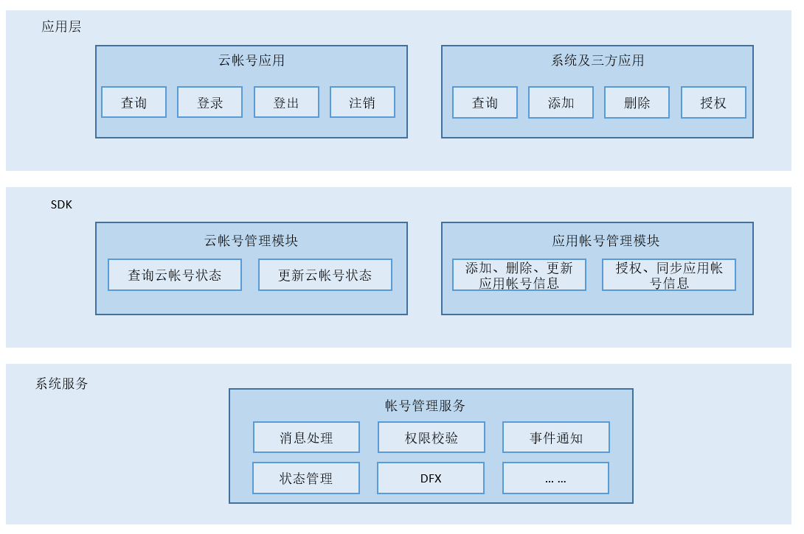

# 帐号子系统<a name="ZH-CN_TOPIC_0000001123681215"></a>

-   [简介](#section11660541593)
-   [组件架构图](#section1412183212132)
-   [目录](#section161941989596)
-   [说明](#section1312121216216)
    -   [接口说明](#section1551164914237)

-   [相关仓](#section1371113476307)

## 简介<a name="section11660541593"></a>

在标准系统上，帐号子系统主要提供系统帐号生命周期管理，分布式帐号登录状态管理和应用帐号添加删除等基础管理能力。

## 架构图<a name="section1412183212132"></a>

**图 1**  帐号子系统架构图<a name="fig4460722185514"></a>




## 目录<a name="section161941989596"></a>

```
/base/account/os_account
├── dfx                      
│   ├── hidumper_adapter     系统服务信息导出适配器代码          
│   ├── hisysevent_adapter   系统事件打点适配器代码          
├── figures                  README图片
├── frameworks               帐号子系统kit代码
│   ├── account_iam          账号身份认证和访问管理内部API代码
│   │   └── src              账号身份认证和访问管理内部API实现代码          
│   ├── appaccount           应用帐号内部API代码
│   │   └── native           应用帐号内部API实现代码
│   ├── common               共通模块代码
│   │   ├── account_error    错误码
│   │   ├── database         数据库基础代码
│   │   ├── file_operator    文件操作代码
│   │   ├── log              打印日志代码
│   │   ├── perf_stat        性能统计
│   │   └── test             共通模块测试代码
│   ├── ohosaccount          分布式帐号内部API代码
│   │   ├── native           分布式帐号内部API实现代码
│   │   └── test             分布式帐号内部API测试代码
│   └── osaccount            系统帐号内部API代码
│       ├── core             系统帐号ipc
│       └── native           系统帐号内部API实现代码
├── interfaces               帐号子系统对外公开的API
│   ├── innerkits            内部API头文件
│   │   ├── account_iam      账号身份认证和访问管理
│   │   ├── appaccount       应用帐号内部API头文件
│   │   ├── ohosaccount      分布式帐号内部API头文件
│   │   └── osaccount        系统帐号内部API头文件
│   └── kits                 对外API封装
│       └── napi             帐号子系统对外API封装代码
├── sa_profile               帐号子系统SA配置文件定义目录
├── services                 帐号子系统accountmgr服务代码
│   └── accountmgr           帐号子系统服务代码
│       ├── include          帐号子系统服务代码头文件
│       ├── src              帐号子系统服务代码源文件
│       └── test             帐号子系统服务测试
├── test                     测试代码
│   ├── fuzztest             模糊测试代码
│   ├── resource             测试资源文件
│   └── systemtest           系统测试代码
└── tools                    acm工具代码
    ├── acm                  acm工具代码
    │   ├── include          acm工具代码头文件
    │   └── src              acm工具代码源文件
    └── test                 acm工具测试代码
```

## 说明<a name="section1312121216216"></a>

### 接口说明<a name="section1551164914237"></a>

#### 1，分布式帐号

分布式帐号的功能主要包括查询和更新帐号登录状态，仅支持系统应用。

**表 1**  分布式帐号模块说明

<a name="table1650615420620"></a>

<table><thead align="left"><tr id="row175061254462"><th class="cellrowborder" valign="top" width="51.53%" id="mcps1.2.3.1.1"><p id="p1250613547612"><a name="p1250613547612"></a><a name="p1250613547612"></a>模块名</p>
</th>
<th class="cellrowborder" valign="top" width="48.47%" id="mcps1.2.3.1.2"><p id="p85066541767"><a name="p85066541767"></a><a name="p85066541767"></a>描述</p>
</th>
</tr>
</thead>
<tbody>
<tr id="row0506185417614"><td class="cellrowborder" valign="top" width="51.53%" headers="mcps1.2.3.1.1 "><p id="p1561112131788"><a name="p1561112131788"></a><a name="p1561112131788"></a>distributedAccount</p>
</td>
<td class="cellrowborder" valign="top" width="48.47%" headers="mcps1.2.3.1.2 "><p id="p1954531161115"><a name="p1954531161115"></a><a name="p1954531161115"></a>提供分布式帐号模块管理方法</p>
</td>
</tr>
</tbody>
</table>

**表 2**  分布式帐号类说明

<a name="table1324102194217"></a>
<table><thead align="left"><tr id="row43241021174219"><th class="cellrowborder" valign="top" width="51.61%" id="mcps1.2.3.1.1"><p id="p10324621104214"><a name="p10324621104214"></a><a name="p10324621104214"></a>类名</p>
</th>
<th class="cellrowborder" valign="top" width="48.39%" id="mcps1.2.3.1.2"><p id="p2324221174213"><a name="p2324221174213"></a><a name="p2324221174213"></a>描述</p>
</th>
</tr>
</thead>
<tbody><tr id="row1432413213425"><td class="cellrowborder" valign="top" width="51.61%" headers="mcps1.2.3.1.1 "><p id="p1732472184212"><a name="p1732472184212"></a><a name="p1732472184212"></a>DistributedAccountAbility</p>
</td>
<td class="cellrowborder" valign="top" width="48.39%" headers="mcps1.2.3.1.2 "><p id="p1932432110421"><a name="p1932432110421"></a><a name="p1932432110421"></a>提供查询和更新分布式帐号登录状态方法。</p>
</td>
</tr>
<tr id="row12324162116427"><td class="cellrowborder" valign="top" width="51.61%" headers="mcps1.2.3.1.1 "><p id="p1232422184216"><a name="p1232422184216"></a><a name="p1232422184216"></a>DistributedInfo</p>
</td>
<td class="cellrowborder" valign="top" width="48.39%" headers="mcps1.2.3.1.2 "><p id="p1324821164215"><a name="p1324821164215"></a><a name="p1324821164215"></a>提供分布式帐号信息，主要包括帐号名、帐号UID和帐号登录状态。</p>
</td>
</tr>
</tbody>
</table>

**表 3**  分布式帐号模块方法说明

<a name="table6561120114219"></a>
<table><thead align="left"><tr id="row115642084211"><th class="cellrowborder" valign="top" width="51.67%" id="mcps1.2.3.1.1"><p id="p7565201424"><a name="p7565201424"></a><a name="p7565201424"></a>方法</p>
</th>
<th class="cellrowborder" valign="top" width="48.33%" id="mcps1.2.3.1.2"><p id="p0568204427"><a name="p0568204427"></a><a name="p0568204427"></a>描述。</p>
</th>
</tr>
</thead>
<tbody><tr id="row456162064218"><td class="cellrowborder" valign="top" width="51.67%" headers="mcps1.2.3.1.1 "><p id="p8388718174317"><a name="p8388718174317"></a><a name="p8388718174317"></a>function getDistributedAccountAbility(): DistributedAccountAbility</p>
</td>
<td class="cellrowborder" valign="top" width="48.33%" headers="mcps1.2.3.1.2 "><p id="p5561920194211"><a name="p5561920194211"></a><a name="p5561920194211"></a>获取分布式帐号单实例对象。</p>
</td>
</tr>
</tbody>
</table>

**表 4**  DistributedAccountAbility方法说明

<a name="table1738121244713"></a>
<table><thead align="left"><tr id="row4381111254710"><th class="cellrowborder" valign="top" width="64.72%" id="mcps1.2.3.1.1"><p id="p1738116127470"><a name="p1738116127470"></a><a name="p1738116127470"></a>方法</p>
</th>
<th class="cellrowborder" valign="top" width="35.28%" id="mcps1.2.3.1.2"><p id="p10381161224717"><a name="p10381161224717"></a><a name="p10381161224717"></a>描述</p>
</th>
</tr>
</thead>
<tbody><tr id="row18381121274715"><td class="cellrowborder" valign="top" width="64.72%" headers="mcps1.2.3.1.1 "><p id="p1671817233812"><a name="p1671817233812"></a><a name="p1671817233812"></a>queryOsAccountDistributedInfo(callback: AsyncCallback&lt;DistributedInfo&gt;): void;<br/>queryOsAccountDistributedInfo(): Promise&lt;DistributedInfo&gt;;</p>
</td>
<td class="cellrowborder" valign="top" width="35.28%" headers="mcps1.2.3.1.2 "><p id="p63421233134612"><a name="p63421233134612"></a><a name="p63421233134612"></a>查询分布式帐号信息。</p>
</td>
</tr>
<tr id="row13811912164716"><td class="cellrowborder" valign="top" width="64.72%" headers="mcps1.2.3.1.1 "><p id="p186182593814"><a name="p186182593814"></a><a name="p186182593814"></a>updateOsAccountDistributedInfo(accountInfo: DistributedInfo, callback: AsyncCallback&lt;void&gt;): void;<br/>updateOsAccountDistributedInfo(accountInfo: DistributedInfo): Promise&lt;void&gt;;</p>
</td>
<td class="cellrowborder" valign="top" width="35.28%" headers="mcps1.2.3.1.2 "><p id="p1534263304617"><a name="p1534263304617"></a><a name="p1534263304617"></a>更新分布式帐号信息。</p>
</td>
</tr>
</tbody>
</table>


#### 2，应用帐号

应用帐号的主要功能包括应用帐号的添加、删除，查询，修改，授权等功能，提供帐号数据落盘和数据同步的能力。

**表 1**  应用帐号模块说明

<a name="table1650615420620"></a>

<table><thead align="left"><tr id="row175061254462"><th class="cellrowborder" valign="top" width="51.53%" id="mcps1.2.3.1.1"><p id="p1250613547612"><a name="p1250613547612"></a><a name="p1250613547612"></a>模块名</p>
</th>
<th class="cellrowborder" valign="top" width="48.47%" id="mcps1.2.3.1.2"><p id="p85066541767"><a name="p85066541767"></a><a name="p85066541767"></a>描述</p>
</th>
</tr>
</thead>
<tbody>
<tr id="row0506185417614"><td class="cellrowborder" valign="top" width="51.53%" headers="mcps1.2.3.1.1 "><p id="p1561112131788"><a name="p1561112131788"></a><a name="p1561112131788"></a>appAccount</p>
</td>
<td class="cellrowborder" valign="top" width="48.47%" headers="mcps1.2.3.1.2 "><p id="p1954531161115"><a name="p1954531161115"></a><a name="p1954531161115"></a>提供应用帐号模块管理方法。</p>
</td>
</tr>
</tbody>
</table>

**表 2**  应用帐号类说明

<a name="table1324102194217"></a>

<table><thead align="left"><tr id="row43241021174219"><th class="cellrowborder" valign="top" width="51.61%" id="mcps1.2.3.1.1"><p id="p10324621104214"><a name="p10324621104214"></a><a name="p10324621104214"></a>类名</p>
</th>
<th class="cellrowborder" valign="top" width="48.39%" id="mcps1.2.3.1.2"><p id="p2324221174213"><a name="p2324221174213"></a><a name="p2324221174213"></a>描述</p>
</th>
</tr>
</thead>
<tbody><tr id="row1432413213425"><td class="cellrowborder" valign="top" width="51.61%" headers="mcps1.2.3.1.1 "><p id="p1732472184212"><a name="p1732472184212"></a><a name="p1732472184212"></a>AppAccountManager</p>
</td>
<td class="cellrowborder" valign="top" width="48.39%" headers="mcps1.2.3.1.2 "><p id="p1932432110421"><a name="p1932432110421"></a><a name="p1932432110421"></a>提供添加、删除，查询，修改，授权等应用帐号相关方法。</p>
</td>
</tr>
<tr id="row12324162116427"><td class="cellrowborder" valign="top" width="51.61%" headers="mcps1.2.3.1.1 "><p id="p1232422184216"><a name="p1232422184216"></a><a name="p1232422184216"></a>AppAccountInfo</p>
</td>
<td class="cellrowborder" valign="top" width="48.39%" headers="mcps1.2.3.1.2 "><p id="p1324821164215"><a name="p1324821164215"></a><a name="p1324821164215"></a>提供应用帐号信息，包括应用帐号名称，所属包名等。</p>
</td>
</tr>
<tr id="row12324162116427"><td class="cellrowborder" valign="top" width="51.61%" headers="mcps1.2.3.1.1 "><p id="p1232422184216"><a name="p1232422184216"></a><a name="p1232422184216"></a>OAuthTokenInfo</p>
</td>
<td class="cellrowborder" valign="top" width="48.39%" headers="mcps1.2.3.1.2 "><p id="p1324821164215"><a name="p1324821164215"></a><a name="p1324821164215"></a>提供应用帐号OAuth令牌信息，包括令牌的鉴权类型和取值。</p>
</td>
</tr>
<tr id="row12324162116427"><td class="cellrowborder" valign="top" width="51.61%" headers="mcps1.2.3.1.1 "><p id="p1232422184216"><a name="p1232422184216"></a><a name="p1232422184216"></a>AuthenticatorInfo</p>
</td>
<td class="cellrowborder" valign="top" width="48.39%" headers="mcps1.2.3.1.2 "><p id="p1324821164215"><a name="p1324821164215"></a><a name="p1324821164215"></a>提供应用帐号OAuth认证器信息，包括所属包名、图标标识、标签标识等。</p>
</td>
</tr>
<tr id="row12324162116427"><td class="cellrowborder" valign="top" width="51.61%" headers="mcps1.2.3.1.1 "><p id="p1232422184216"><a name="p1232422184216"></a><a name="p1232422184216"></a>AuthenticatorCallback</p>
</td>
<td class="cellrowborder" valign="top" width="48.39%" headers="mcps1.2.3.1.2 "><p id="p1324821164215"><a name="p1324821164215"></a><a name="p1324821164215"></a>提供鉴权结果通知、鉴权请求跳转等应用帐号OAuth认证器回调方法。</p>
</td>
</tr>
<tr id="row12324162116427"><td class="cellrowborder" valign="top" width="51.61%" headers="mcps1.2.3.1.1 "><p id="p1232422184216"><a name="p1232422184216"></a><a name="p1232422184216"></a>Authenticator</p>
</td>
<td class="cellrowborder" valign="top" width="48.39%" headers="mcps1.2.3.1.2 "><p id="p1324821164215"><a name="p1324821164215"></a><a name="p1324821164215"></a>提供隐式添加帐号、鉴权等应用帐号OAuth认证器方法。</p>
</td>
</tr>
<tr id="row12324162116427"><td class="cellrowborder" valign="top" width="51.61%" headers="mcps1.2.3.1.1 "><p id="p1232422184216"><a name="p1232422184216"></a><a name="p1232422184216"></a>Constants</p>
</td>
<td class="cellrowborder" valign="top" width="48.39%" headers="mcps1.2.3.1.2 "><p id="p1324821164215"><a name="p1324821164215"></a><a name="p1324821164215"></a>提供键名、操作名等常量。</p>
</td>
</tr>
<tr id="row12324162116427"><td class="cellrowborder" valign="top" width="51.61%" headers="mcps1.2.3.1.1 "><p id="p1232422184216"><a name="p1232422184216"></a><a name="p1232422184216"></a>ResultCode</p>
</td>
<td class="cellrowborder" valign="top" width="48.39%" headers="mcps1.2.3.1.2 "><p id="p1324821164215"><a name="p1324821164215"></a><a name="p1324821164215"></a>提供应用帐号接口返回码。</p>
</td>
</tr>
<tr id="row12324162116427"><td class="cellrowborder" valign="top" width="51.61%" headers="mcps1.2.3.1.1 "><p id="p1232422184216"><a name="p1232422184216"></a><a name="p1232422184216"></a>SelectAccountsOptions</p>
</td>
<td class="cellrowborder" valign="top" width="48.39%" headers="mcps1.2.3.1.2 "><p id="p1324821164215"><a name="p1324821164215"></a><a name="p1324821164215"></a>提供选项用于选择帐号。</p>
</td>
</tr>
<tr id="row12324162116427"><td class="cellrowborder" valign="top" width="51.61%" headers="mcps1.2.3.1.1 "><p id="p1232422184216"><a name="p1232422184216"></a><a name="p1232422184216"></a>VerifyCredentialOptions</p>
</td>
<td class="cellrowborder" valign="top" width="48.39%" headers="mcps1.2.3.1.2 "><p id="p1324821164215"><a name="p1324821164215"></a><a name="p1324821164215"></a>提供选项用于验证凭据。</p>
</td>
</tr>
<tr id="row12324162116427"><td class="cellrowborder" valign="top" width="51.61%" headers="mcps1.2.3.1.1 "><p id="p1232422184216"><a name="p1232422184216"></a><a name="p1232422184216"></a>SetPropertiesOptions</p>
</td>
<td class="cellrowborder" valign="top" width="48.39%" headers="mcps1.2.3.1.2 "><p id="p1324821164215"><a name="p1324821164215"></a><a name="p1324821164215"></a>提供选项用于设置属性。</p>
</td>
</tr>
</tbody>
</table>

**表 3**  应用帐号模块方法说明

<a name="table6561120114219"></a>

<table><thead align="left"><tr id="row115642084211"><th class="cellrowborder" valign="top" width="51.67%" id="mcps1.2.3.1.1"><p id="p7565201424"><a name="p7565201424"></a><a name="p7565201424"></a>方法</p>
</th>
<th class="cellrowborder" valign="top" width="48.33%" id="mcps1.2.3.1.2"><p id="p0568204427"><a name="p0568204427"></a><a name="p0568204427"></a>描述</p>
</th>
</tr>
</thead>
<tbody><tr id="row456162064218"><td class="cellrowborder" valign="top" width="51.67%" headers="mcps1.2.3.1.1 "><p id="p8388718174317"><a name="p8388718174317"></a><a name="p8388718174317"></a>function createAppAccountManager(): AppAccountManager</p>
</td>
<td class="cellrowborder" valign="top" width="48.33%" headers="mcps1.2.3.1.2 "><p id="p5561920194211"><a name="p5561920194211"></a><a name="p5561920194211"></a>获取应用帐号单实例对象。</p>
</td>
</tr>
</tbody>
</table>

**表 4**  AppAccountManager方法说明

<a name="table1738121244713"></a>

<table><thead align="left"><tr id="row4381111254710"><th class="cellrowborder" valign="top" width="64.72%" id="mcps1.2.3.1.1"><p id="p1738116127470"><a name="p1738116127470"></a><a name="p1738116127470"></a>方法</p>
</th>
<th class="cellrowborder" valign="top" width="35.28%" id="mcps1.2.3.1.2"><p id="p10381161224717"><a name="p10381161224717"></a><a name="p10381161224717"></a>描述</p>
</th>
</tr>
</thead>
<tbody><tr id="row18381121274715"><td class="cellrowborder" valign="top" width="64.72%" headers="mcps1.2.3.1.1 "><p id="p1671817233812"><a name="p1671817233812"></a><a name="p1671817233812"></a>addAccount(name: string, callback: AsyncCallback&lt;void&gt;): void;<br/>addAccount(name: string, extraInfo: string, callback: AsyncCallback&lt;void&gt;): void;<br/>addAccount(name: string, extraInfo?: string): Promise&lt;void&gt;;</p>
</td>
<td class="cellrowborder" valign="top" width="35.28%" headers="mcps1.2.3.1.2 "><p id="p63421233134612"><a name="p63421233134612"></a><a name="p63421233134612"></a>添加应用帐号。</p>
</td>
</tr>
<tr id="row1938113125470"><td class="cellrowborder" valign="top" width="64.72%" headers="mcps1.2.3.1.1 "><p id="p73429332466"><a name="p73429332466"></a><a name="p73429332466"></a>addAccountImplicitly(owner: string, authType: string, options: {[key: string]: any}, callback: AuthenticatorCallback): void;</p>
</td>
<td class="cellrowborder" valign="top" width="35.28%" headers="mcps1.2.3.1.2 "><p id="p7342133394620"><a name="p7342133394620"></a><a name="p7342133394620"></a>隐式添加应用帐号。</p>
</td>
</tr>
<tr id="row1938113125470"><td class="cellrowborder" valign="top" width="64.72%" headers="mcps1.2.3.1.1 "><p id="p73429332466"><a name="p73429332466"></a><a name="p73429332466"></a>deleteAccount(name: string, callback: AsyncCallback&lt;void&gt;): void;<br/>disableAppAccess(name: string, bundleName: string, callback: AsyncCallback&lt;void&gt;): void;<br/>deleteAccount(name: string): Promise&lt;void&gt;;</p>
</td>
<td class="cellrowborder" valign="top" width="35.28%" headers="mcps1.2.3.1.2 "><p id="p7342133394620"><a name="p7342133394620"></a><a name="p7342133394620"></a>删除应用帐号。</p>
</td>
</tr>
<tr id="row13811912164716"><td class="cellrowborder" valign="top" width="64.72%" headers="mcps1.2.3.1.1 "><p id="p186182593814"><a name="p186182593814"></a><a name="p186182593814"></a>enableAppAccess(name: string, bundleName: string, callback: AsyncCallback&lt;void&gt;): void;<br/>enableAppAccess(name: string, bundleName: string): Promise&lt;void&gt;;</p>
</td>
<td class="cellrowborder" valign="top" width="35.28%" headers="mcps1.2.3.1.2 "><p id="p1534263304617"><a name="p1534263304617"></a><a name="p1534263304617"></a>应用帐号信息访问授权。</p>
</td>
</tr>
<tr id="row10382181218477"><td class="cellrowborder" valign="top" width="64.72%" headers="mcps1.2.3.1.1 "><p id="p686934433810"><a name="p686934433810"></a><a name="p686934433810"></a>disableAppAccess(name: string, bundleName: string, callback: AsyncCallback&lt;void&gt;): void;<br/>disableAppAccess(name: string, bundleName: string): Promise&lt;void&gt;;</p>
</td>
<td class="cellrowborder" valign="top" width="35.28%" headers="mcps1.2.3.1.2 "><p id="p0342193384611"><a name="p0342193384611"></a><a name="p0342193384611"></a>应用帐号信息访问取消授权。</p>
</td>
</tr>
</tr>
<tr id="row10382181218477"><td class="cellrowborder" valign="top" width="64.72%" headers="mcps1.2.3.1.1 "><p id="p686934433810"><a name="p686934433810"></a><a name="p686934433810"></a>checkAppAccess(name: string, bundleName: string, callback: AsyncCallback&gt;boolean&gt;): void;<br/>checkAppAccess(name: string, bundleName: string): Promise&gt;boolean&gt;;</p>
</td>
<td class="cellrowborder" valign="top" width="35.28%" headers="mcps1.2.3.1.2 "><p id="p0342193384611"><a name="p0342193384611"></a><a name="p0342193384611"></a>检查应用帐号信息访问授权。</p>
</td>
</tr>
<tr id="row10382181218477"><td class="cellrowborder" valign="top" width="64.72%" headers="mcps1.2.3.1.1 "><p id="p686934433810"><a name="p686934433810"></a><a name="p686934433810"></a>checkAppAccountSyncEnable(name: string, callback: AsyncCallback&lt;boolean&gt;): void;<br/>checkAppAccountSyncEnable(name: string): Promise&lt;boolean&gt;;</p>
</td>
<td class="cellrowborder" valign="top" width="35.28%" headers="mcps1.2.3.1.2 "><p id="p0342193384611"><a name="p0342193384611"></a><a name="p0342193384611"></a>检查应用帐号同步状态。</p>
</td>
</tr>
<tr id="row10382181218477"><td class="cellrowborder" valign="top" width="64.72%" headers="mcps1.2.3.1.1 "><p id="p686934433810"><a name="p686934433810"></a><a name="p686934433810"></a>setAccountCredential(name: string, credentialType: string, credential: string, callback: AsyncCallback&lt;void&gt;): void;<br/>setAccountCredential(name: string, credentialType: string, credential: string): Promise&lt;void&gt;;</p>
</td>
<td class="cellrowborder" valign="top" width="35.28%" headers="mcps1.2.3.1.2 "><p id="p0342193384611"><a name="p0342193384611"></a><a name="p0342193384611"></a>设置应用帐号认证信息。</p>
</td>
</tr>
<tr id="row10382181218477"><td class="cellrowborder" valign="top" width="64.72%" headers="mcps1.2.3.1.1 "><p id="p686934433810"><a name="p686934433810"></a><a name="p686934433810"></a>deleteAccountCredential(name: string, credentialType: string, callback: AsyncCallback&lt;void&gt;): void;<br/>deleteAccountCredential(name: string, credentialType: string): Promise&lt;void&gt;;</p>
</td>
<td class="cellrowborder" valign="top" width="35.28%" headers="mcps1.2.3.1.2 "><p id="p0342193384611"><a name="p0342193384611"></a><a name="p0342193384611"></a>删除应用帐号认证信息。</p>
</td>
</tr>
<tr id="row10382181218477"><td class="cellrowborder" valign="top" width="64.72%" headers="mcps1.2.3.1.1 "><p id="p686934433810"><a name="p686934433810"></a><a name="p686934433810"></a>setAccountExtraInfo(name: string, extraInfo: string, callback: AsyncCallback&lt;void&gt;): void;<br/>setAccountExtraInfo(name: string, extraInfo: string): Promise&lt;void&gt;;</p>
</td>
<td class="cellrowborder" valign="top" width="35.28%" headers="mcps1.2.3.1.2 "><p id="p0342193384611"><a name="p0342193384611"></a><a name="p0342193384611"></a>设置应用帐号附加信息。</p>
</td>
</tr>
<tr id="row10382181218477"><td class="cellrowborder" valign="top" width="64.72%" headers="mcps1.2.3.1.1 "><p id="p686934433810"><a name="p686934433810"></a><a name="p686934433810"></a>setAppAccountSyncEnable(name: string, isEnable: boolean, callback: AsyncCallback&lt;void&gt;): void;<br/>setAppAccountSyncEnable(name: string, isEnable: boolean): Promise&lt;void&gt;;</p>
</td>
<td class="cellrowborder" valign="top" width="35.28%" headers="mcps1.2.3.1.2 "><p id="p0342193384611"><a name="p0342193384611"></a><a name="p0342193384611"></a>设置应用帐号同步状态。</p>
</td>
</tr>
<tr id="row10382181218477"><td class="cellrowborder" valign="top" width="64.72%" headers="mcps1.2.3.1.1 "><p id="p686934433810"><a name="p686934433810"></a><a name="p686934433810"></a>setAssociatedData(name: string, key: string, value: string, callback: AsyncCallback&lt;void&gt;): void;<br/>setAssociatedData(name: string, key: string, value: string): Promise&lt;void&gt;;</p>
</td>
<td class="cellrowborder" valign="top" width="35.28%" headers="mcps1.2.3.1.2 "><p id="p0342193384611"><a name="p0342193384611"></a><a name="p0342193384611"></a>设置应用帐号关联数据。</p>
</td>
</tr>
<tr id="row10382181218477"><td class="cellrowborder" valign="top" width="64.72%" headers="mcps1.2.3.1.1 "><p id="p686934433810"><a name="p686934433810"></a><a name="p686934433810"></a>getAllAccounts(owner: string, callback: AsyncCallback&#60;Array&#60;AppAccountInfo&gt;&gt;): void;<br/>getAllAccounts(owner: string): Promise&#60;Array&#60;AppAccountInfo&gt;&gt;;</p>
</td>
<td class="cellrowborder" valign="top" width="35.28%" headers="mcps1.2.3.1.2 "><p id="p0342193384611"><a name="p0342193384611"></a><a name="p0342193384611"></a>查询指定包名下应用帐号信息。</p>
</td>
</tr>
<tr id="row10382181218477"><td class="cellrowborder" valign="top" width="64.72%" headers="mcps1.2.3.1.1 "><p id="p686934433810"><a name="p686934433810"></a><a name="p686934433810"></a>getAllAccessibleAccounts(callback: AsyncCallback&#60;Array&#60;AppAccountInfo&gt;&gt;): void;<br/>getAllAccessibleAccounts(): Promise&#60;Array&#60;AppAccountInfo&gt;&gt;;</p>
</td>
<td class="cellrowborder" valign="top" width="35.28%" headers="mcps1.2.3.1.2 "><p id="p0342193384611"><a name="p0342193384611"></a><a name="p0342193384611"></a>查询指定包名下应用帐号信息。</p>
</td>
</tr>
<tr id="row10382181218477"><td class="cellrowborder" valign="top" width="64.72%" headers="mcps1.2.3.1.1 "><p id="p686934433810"><a name="p686934433810"></a><a name="p686934433810"></a>getAccountCredential(name: string, credentialType: string, callback: AsyncCallback&lt;string&gt;): void;<br/>getAccountCredential(name: string, credentialType: string): Promise&lt;string&gt;;</p>
</td>
<td class="cellrowborder" valign="top" width="35.28%" headers="mcps1.2.3.1.2 "><p id="p0342193384611"><a name="p0342193384611"></a><a name="p0342193384611"></a>查询应用帐号认证信息。</p>
</td>
</tr>
<tr id="row10382181218477"><td class="cellrowborder" valign="top" width="64.72%" headers="mcps1.2.3.1.1 "><p id="p686934433810"><a name="p686934433810"></a><a name="p686934433810"></a>getAccountExtraInfo(name: string, callback: AsyncCallback&lt;string&gt;): void;<br/>getAccountExtraInfo(name: string): Promise&lt;string&gt;;</p>
</td>
<td class="cellrowborder" valign="top" width="35.28%" headers="mcps1.2.3.1.2 "><p id="p0342193384611"><a name="p0342193384611"></a><a name="p0342193384611"></a>查询应用帐号附加信息。</p>
</td>
</tr>
<tr id="row10382181218477"><td class="cellrowborder" valign="top" width="64.72%" headers="mcps1.2.3.1.1 "><p id="p686934433810"><a name="p686934433810"></a><a name="p686934433810"></a>getAssociatedData(name: string, key: string, callback: AsyncCallback&lt;string&gt;): void;<br/>getAssociatedData(name: string, key: string): Promise&lt;string&gt;;</p>
</td>
<td class="cellrowborder" valign="top" width="35.28%" headers="mcps1.2.3.1.2 "><p id="p0342193384611"><a name="p0342193384611"></a><a name="p0342193384611"></a>查询应用帐号关联信息。</p>
</td>
</tr>
<tr id="row10382181218477"><td class="cellrowborder" valign="top" width="64.72%" headers="mcps1.2.3.1.1 "><p id="p686934433810"><a name="p686934433810"></a><a name="p686934433810"></a>getAssociatedDataSync(name: string, key: string): string;</p>
</td>
<td class="cellrowborder" valign="top" width="35.28%" headers="mcps1.2.3.1.2 "><p id="p0342193384611"><a name="p0342193384611"></a><a name="p0342193384611"></a>同步获取与指定帐户关联的数据。</p>
</td>
</tr>
<tr id="row10382181218477"><td class="cellrowborder" valign="top" width="64.72%" headers="mcps1.2.3.1.1 "><p id="p686934433810"><a name="p686934433810"></a><a name="p686934433810"></a>on(type: 'change', owners: Array&lt;string&gt;, callback: Callback&#60;Array&#60;AppAccountInfo&gt;&gt;): void;</p>
</td>
<td class="cellrowborder" valign="top" width="35.28%" headers="mcps1.2.3.1.2 "><p id="p0342193384611"><a name="p0342193384611"></a><a name="p0342193384611"></a>订阅应用帐号信息变化。</p>
</td>
</tr>
<tr id="row10382181218477"><td class="cellrowborder" valign="top" width="64.72%" headers="mcps1.2.3.1.1 "><p id="p686934433810"><a name="p686934433810"></a><a name="p686934433810"></a>off(type: 'change', callback?: Callback&#60;void&gt;): void;</p>
</td>
<td class="cellrowborder" valign="top" width="35.28%" headers="mcps1.2.3.1.2 "><p id="p0342193384611"><a name="p0342193384611"></a><a name="p0342193384611"></a>取消订阅应用帐号信息变化。</p>
</td>
</tr>
<tr id="row10382181218477"><td class="cellrowborder" valign="top" width="64.72%" headers="mcps1.2.3.1.1 "><p id="p686934433810"><a name="p686934433810"></a><a name="p686934433810"></a>authenticate(name: string, owner: string, authType: string, options: {[key: string]: any}, callback: AuthenticatorCallback): void;</p>
</td>
<td class="cellrowborder" valign="top" width="35.28%" headers="mcps1.2.3.1.2 "><p id="p0342193384611"><a name="p0342193384611"></a><a name="p0342193384611"></a>鉴权应用帐号以获取OAuth令牌。</p>
</td>
</tr>
<tr id="row10382181218477"><td class="cellrowborder" valign="top" width="64.72%" headers="mcps1.2.3.1.1 "><p id="p686934433810"><a name="p686934433810"></a><a name="p686934433810"></a>getOAuthToken(name: string, owner: string, authType: string, callback: AsyncCallback&lt;string&gt;): void;<br/>getOAuthToken(name: string, owner: string, authType: string): Promise&lt;string&gt;;</p>
</td>
<td class="cellrowborder" valign="top" width="35.28%" headers="mcps1.2.3.1.2 "><p id="p0342193384611"><a name="p0342193384611"></a><a name="p0342193384611"></a>查询应用帐号OAuth令牌。</p>
</td>
</tr>
<tr id="row10382181218477"><td class="cellrowborder" valign="top" width="64.72%" headers="mcps1.2.3.1.1 "><p id="p686934433810"><a name="p686934433810"></a><a name="p686934433810"></a>setOAuthToken(name: string, authType: string, token: string, callback: AsyncCallback&lt;void&gt;): void;<br/>setOAuthToken(name: string, authType: string, token: string): Promise&lt;void&gt;;</p>
</td>
<td class="cellrowborder" valign="top" width="35.28%" headers="mcps1.2.3.1.2 "><p id="p0342193384611"><a name="p0342193384611"></a><a name="p0342193384611"></a>设置应用帐号OAuth令牌。</p>
</td>
</tr>
<tr id="row10382181218477"><td class="cellrowborder" valign="top" width="64.72%" headers="mcps1.2.3.1.1 "><p id="p686934433810"><a name="p686934433810"></a><a name="p686934433810"></a>deleteOAuthToken(name: string, owner: string, authType: string, token: string, callback: AsyncCallback&lt;void&gt;): void;<br/>deleteOAuthToken(name: string, owner: string, authType: string, token: string): Promise&lt;void&gt;;</p>
</td>
<td class="cellrowborder" valign="top" width="35.28%" headers="mcps1.2.3.1.2 "><p id="p0342193384611"><a name="p0342193384611"></a><a name="p0342193384611"></a>删除应用帐号OAuth令牌。</p>
</td>
</tr>
<tr id="row10382181218477"><td class="cellrowborder" valign="top" width="64.72%" headers="mcps1.2.3.1.1 "><p id="p686934433810"><a name="p686934433810"></a><a name="p686934433810"></a>setOAuthTokenVisibility(name: string, authType: string, bundleName: string, isVisible: boolean, callback: AsyncCallback&lt;void&gt;): void;<br/>setOAuthTokenVisibility(name: string, authType: string, bundleName: string, isVisible: boolean): Promise&lt;void&gt;;</p>
</td>
<td class="cellrowborder" valign="top" width="35.28%" headers="mcps1.2.3.1.2 "><p id="p0342193384611"><a name="p0342193384611"></a><a name="p0342193384611"></a>设置应用帐号OAuth令牌的可见性。</p>
</td>
</tr>
<tr id="row10382181218477"><td class="cellrowborder" valign="top" width="64.72%" headers="mcps1.2.3.1.1 "><p id="p686934433810"><a name="p686934433810"></a><a name="p686934433810"></a>checkOAuthTokenVisibility(name: string, authType: string, bundleName: string, callback: AsyncCallback&lt;boolean&gt;): void;<br/>checkOAuthTokenVisibility(name: string, authType: string, bundleName: string): Promise&lt;boolean&gt;;</p>
</td>
<td class="cellrowborder" valign="top" width="35.28%" headers="mcps1.2.3.1.2 "><p id="p0342193384611"><a name="p0342193384611"></a><a name="p0342193384611"></a>检查应用帐号OAuth令牌的可见性。</p>
</td>
</tr>
<tr id="row10382181218477"><td class="cellrowborder" valign="top" width="64.72%" headers="mcps1.2.3.1.1 "><p id="p686934433810"><a name="p686934433810"></a><a name="p686934433810"></a>getAllOAuthTokens(name: string, owner: string, callback: AsyncCallback&lt;Array&lt;OAuthTokenInfo&gt;&gt;): void;<br/>getAllOAuthTokens(name: string, owner: string): Promise&lt;Array&lt;OAuthTokenInfo&gt;&gt;;</p>
</td>
<td class="cellrowborder" valign="top" width="35.28%" headers="mcps1.2.3.1.2 "><p id="p0342193384611"><a name="p0342193384611"></a><a name="p0342193384611"></a>查询所有可见的应用帐号OAuth令牌。</p>
</td>
</tr>
<tr id="row10382181218477"><td class="cellrowborder" valign="top" width="64.72%" headers="mcps1.2.3.1.1 "><p id="p686934433810"><a name="p686934433810"></a><a name="p686934433810"></a>getOAuthList(name: string, authType: string, callback: AsyncCallback&lt;Array&lt;string&gt;&gt;): void;<br/>getOAuthList(name: string, authType: string): Promise&lt;Array&lt;string&gt;&gt;;</p>
</td>
<td class="cellrowborder" valign="top" width="35.28%" headers="mcps1.2.3.1.2 "><p id="p0342193384611"><a name="p0342193384611"></a><a name="p0342193384611"></a>查询应用帐号OAuth令牌的授权列表。</p>
</td>
</tr>
<tr id="row10382181218477"><td class="cellrowborder" valign="top" width="64.72%" headers="mcps1.2.3.1.1 "><p id="p686934433810"><a name="p686934433810"></a><a name="p686934433810"></a>getAuthenticatorCallback(sessionId: string, callback: AsyncCallback&lt;AuthenticatorCallback&gt;): void;<br/>getAuthenticatorCallback(sessionId: string): Promise&lt;AuthenticatorCallback&gt;;</p>
</td>
<td class="cellrowborder" valign="top" width="35.28%" headers="mcps1.2.3.1.2 "><p id="p0342193384611"><a name="p0342193384611"></a><a name="p0342193384611"></a>查询应用帐号OAuth认证器回调。</p>
</td>
</tr>
<tr id="row10382181218477"><td class="cellrowborder" valign="top" width="64.72%" headers="mcps1.2.3.1.1 "><p id="p686934433810"><a name="p686934433810"></a><a name="p686934433810"></a>getAuthenticatorInfo(owner: string, callback: AsyncCallback&lt;AuthenticatorInfo&gt;): void;<br/>getAuthenticatorInfo(owner: string): Promise&lt;AuthenticatorInfo&gt;;</p>
</td>
<td class="cellrowborder" valign="top" width="35.28%" headers="mcps1.2.3.1.2 "><p id="p0342193384611"><a name="p0342193384611"></a><a name="p0342193384611"></a>查询应用帐号OAuth认证器信息。</p>
</td>
</tr>
<tr id="row10382181218477"><td class="cellrowborder" valign="top" width="64.72%" headers="mcps1.2.3.1.1 "><p id="p686934433810"><a name="p686934433810"></a><a name="p686934433810"></a>checkAccountLabels(name: string, owner: string, labels: Array&lt;string&gt;, callback: AsyncCallback&lt;boolean&gt;): void;<br/>checkAccountLabels(name: string, owner: string, labels: Array&lt;string&gt;): Promise&lt;boolean&gt;;</p>
</td>
<td class="cellrowborder" valign="top" width="35.28%" headers="mcps1.2.3.1.2 "><p id="p0342193384611"><a name="p0342193384611"></a><a name="p0342193384611"></a>检查帐号标签。</p>
</td>
</tr>
<tr id="row10382181218477"><td class="cellrowborder" valign="top" width="64.72%" headers="mcps1.2.3.1.1 "><p id="p686934433810"><a name="p686934433810"></a><a name="p686934433810"></a>selectAccountsByOptions(options: SelectAccountsOptions, callback: AsyncCallback&lt;Array&lt;AppAccountInfo&gt;&gt;);<br/>selectAccountsByOptions(options: SelectAccountsOptions): Promise&lt;Array&lt;AppAccountInfo&gt;&gt;;</p>
</td>
<td class="cellrowborder" valign="top" width="35.28%" headers="mcps1.2.3.1.2 "><p id="p0342193384611"><a name="p0342193384611"></a><a name="p0342193384611"></a>根据选项选择帐号。</p>
</td>
</tr>
<tr id="row10382181218477"><td class="cellrowborder" valign="top" width="64.72%" headers="mcps1.2.3.1.1 "><p id="p686934433810"><a name="p686934433810"></a><a name="p686934433810"></a>verifyCredential(name: string, owner: string, callback: AuthenticatorCallback): void;<br/>verifyCredential(name: string, owner: string, options: VerifyCredentialOptions, callback: AuthenticatorCallback): void;</p>
</td>
<td class="cellrowborder" valign="top" width="35.28%" headers="mcps1.2.3.1.2 "><p id="p0342193384611"><a name="p0342193384611"></a><a name="p0342193384611"></a>根据选项验证凭据。</p>
</td>
</tr>
<tr id="row10382181218477"><td class="cellrowborder" valign="top" width="64.72%" headers="mcps1.2.3.1.1 "><p id="p686934433810"><a name="p686934433810"></a><a name="p686934433810"></a>setAuthenticatorProperties(owner: string, callback: AuthenticatorCallback): void;<br/>setAuthenticatorProperties(owner: string, options: SetPropertiesOptions, callback: AuthenticatorCallback): void;</p>
</td>
<td class="cellrowborder" valign="top" width="35.28%" headers="mcps1.2.3.1.2 "><p id="p0342193384611"><a name="p0342193384611"></a><a name="p0342193384611"></a>设置认证器属性。</p>
</td>
</tr>
</tbody>
</table>


**表 5**  AuthenticatorCallback方法说明

<a name="table1738121244713"></a>

<table><thead align="left"><tr id="row4381111254710"><th class="cellrowborder" valign="top" width="64.72%" id="mcps1.2.3.1.1"><p id="p1738116127470"><a name="p1738116127470"></a><a name="p1738116127470"></a>方法</p>
</th>
<th class="cellrowborder" valign="top" width="35.28%" id="mcps1.2.3.1.2"><p id="p10381161224717"><a name="p10381161224717"></a><a name="p10381161224717"></a>描述</p>
</th>
</tr>
</thead>
<tbody><tr id="row18381121274715"><td class="cellrowborder" valign="top" width="64.72%" headers="mcps1.2.3.1.1 "><p id="p1671817233812"><a name="p1671817233812"></a><a name="p1671817233812"></a>onResult: (code: number, result: {[key: string]: any}) => void;</p>
</td>
<td class="cellrowborder" valign="top" width="35.28%" headers="mcps1.2.3.1.2 "><p id="p63421233134612"><a name="p63421233134612"></a><a name="p63421233134612"></a>向客户端通知认证结果。</p>
</td>
</tr>
<tr id="row1938113125470"><td class="cellrowborder" valign="top" width="64.72%" headers="mcps1.2.3.1.1 "><p id="p73429332466"><a name="p73429332466"></a><a name="p73429332466"></a>onRequestRedirected: (request: Want) => void;</p>
</td>
<td class="cellrowborder" valign="top" width="35.28%" headers="mcps1.2.3.1.2 "><p id="p7342133394620"><a name="p7342133394620"></a><a name="p7342133394620"></a>通知客户端需要重定向身份验证请求。</p>
</td>
</tr>
<tr id="row13811912164716"><td class="cellrowborder" valign="top" width="64.72%" headers="mcps1.2.3.1.1 "><p id="p186182593814"><a name="p186182593814"></a><a name="p186182593814"></a>onRequestContinued?: () => void;</p>
</td>
<td class="cellrowborder" valign="top" width="35.28%" headers="mcps1.2.3.1.2 "><p id="p1534263304617"><a name="p1534263304617"></a><a name="p1534263304617"></a>通知客户端请求继续。</p>
</td>
</tr>
</tbody>
</table>


**表 6**  Authenticator方法说明

<a name="table1738121244713"></a>

<table><thead align="left"><tr id="row4381111254710"><th class="cellrowborder" valign="top" width="64.72%" id="mcps1.2.3.1.1"><p id="p1738116127470"><a name="p1738116127470"></a><a name="p1738116127470"></a>方法</p>
</th>
<th class="cellrowborder" valign="top" width="35.28%" id="mcps1.2.3.1.2"><p id="p10381161224717"><a name="p10381161224717"></a><a name="p10381161224717"></a>描述</p>
</th>
</tr>
</thead>
<tbody><tr id="row18381121274715"><td class="cellrowborder" valign="top" width="64.72%" headers="mcps1.2.3.1.1 "><p id="p1671817233812"><a name="p1671817233812"></a><a name="p1671817233812"></a>addAccountImplicitly(authType: string, callerBundleName: string, options: {[key: string]: any}, callback: AuthenticatorCallback): void;</p>
</td>
<td class="cellrowborder" valign="top" width="35.28%" headers="mcps1.2.3.1.2 "><p id="p63421233134612"><a name="p63421233134612"></a><a name="p63421233134612"></a>隐式添加应用帐号。</p>
</td>
</tr>
<tr id="row1938113125470"><td class="cellrowborder" valign="top" width="64.72%" headers="mcps1.2.3.1.1 "><p id="p73429332466"><a name="p73429332466"></a><a name="p73429332466"></a>authenticate(name: string, authType: string, callerBundleName: string, options: {[key: string]: any}, callback: AuthenticatorCallback): void;</p>
</td>
<td class="cellrowborder" valign="top" width="35.28%" headers="mcps1.2.3.1.2 "><p id="p7342133394620"><a name="p7342133394620"></a><a name="p7342133394620"></a>鉴权应用帐号以获取OAuth令牌。</p>
</td>
</tr>
<tr id="row13811912164716"><td class="cellrowborder" valign="top" width="64.72%" headers="mcps1.2.3.1.1 "><p id="p186182593814"><a name="p186182593814"></a><a name="p186182593814"></a>verifyCredential(name: string, options: VerifyCredentialOptions, callback: AuthenticatorCallback): void;</p>
</td>
<td class="cellrowborder" valign="top" width="35.28%" headers="mcps1.2.3.1.2 "><p id="p1534263304617"><a name="p1534263304617"></a><a name="p1534263304617"></a>根据选项验证凭据。</p>
</td>
</tr>
<tr id="row10382181218477"><td class="cellrowborder" valign="top" width="64.72%" headers="mcps1.2.3.1.1 "><p id="p686934433810"><a name="p686934433810"></a><a name="p686934433810"></a>setProperties(options: SetPropertiesOptions, callback: AuthenticatorCallback): void;</p>
</td>
<td class="cellrowborder" valign="top" width="35.28%" headers="mcps1.2.3.1.2 "><p id="p0342193384611"><a name="p0342193384611"></a><a name="p0342193384611"></a>设置验证器的属性。</p>
</td>
</tr>
</tr>
<tr id="row10382181218477"><td class="cellrowborder" valign="top" width="64.72%" headers="mcps1.2.3.1.1 "><p id="p686934433810"><a name="p686934433810"></a><a name="p686934433810"></a>checkAccountLabels(name: string, labels: Array<string>, callback: AuthenticatorCallback): void;</p>
</td>
<td class="cellrowborder" valign="top" width="35.28%" headers="mcps1.2.3.1.2 "><p id="p0342193384611"><a name="p0342193384611"></a><a name="p0342193384611"></a>检查帐号标签。</p>
</td>
</tr>
<tr id="row10382181218477"><td class="cellrowborder" valign="top" width="64.72%" headers="mcps1.2.3.1.1 "><p id="p686934433810"><a name="p686934433810"></a><a name="p686934433810"></a>isAccountRemovable(name: string, callback: AuthenticatorCallback): void;</p>
</td>
<td class="cellrowborder" valign="top" width="35.28%" headers="mcps1.2.3.1.2 "><p id="p0342193384611"><a name="p0342193384611"></a><a name="p0342193384611"></a>检查是否可以删除指定的帐户。</p>
</td>
</tr>
<tr id="row10382181218477"><td class="cellrowborder" valign="top" width="64.72%" headers="mcps1.2.3.1.1 "><p id="p686934433810"><a name="p686934433810"></a><a name="p686934433810"></a>getRemoteObject(): rpc.RemoteObject;</p>
</td>
<td class="cellrowborder" valign="top" width="35.28%" headers="mcps1.2.3.1.2 "><p id="p0342193384611"><a name="p0342193384611"></a><a name="p0342193384611"></a>获取远程过程调用的身份验证程序的远程对象。</p>
</td>
</tr>
</tbody>
</table>


#### 3，系统帐号

系统帐号的主要功能包括系统帐号的添加、删除，查询，设置，订阅，启动等功能，提供系统帐号数据落盘的能力。

**表 1**  系统帐号模块说明

<a name="table1650615420620"></a>

<table><thead align="left"><tr id="row175061254462"><th class="cellrowborder" valign="top" width="51.53%" id="mcps1.2.3.1.1"><p id="p1250613547612"><a name="p1250613547612"></a><a name="p1250613547612"></a>模块名</p>
</th>
<th class="cellrowborder" valign="top" width="48.47%" id="mcps1.2.3.1.2"><p id="p85066541767"><a name="p85066541767"></a><a name="p85066541767"></a>描述</p>
</th>
</tr>
</thead>
<tbody>
<tr id="row0506185417614"><td class="cellrowborder" valign="top" width="51.53%" headers="mcps1.2.3.1.1 "><p id="p1561112131788"><a name="p1561112131788"></a><a name="p1561112131788"></a>osAccount</p>
</td>
<td class="cellrowborder" valign="top" width="48.47%" headers="mcps1.2.3.1.2 "><p id="p1954531161115"><a name="p1954531161115"></a><a name="p1954531161115"></a>提供系统帐号模块管理方法。</p>
</td>
</tr>
</tbody>
</table>


**表 2**  系统帐号类说明

<a name="table1324102194217"></a>

<table><thead align="left"><tr id="row43241021174219"><th class="cellrowborder" valign="top" width="51.61%" id="mcps1.2.3.1.1"><p id="p10324621104214"><a name="p10324621104214"></a><a name="p10324621104214"></a>类名</p>
</th>
<th class="cellrowborder" valign="top" width="48.39%" id="mcps1.2.3.1.2"><p id="p2324221174213"><a name="p2324221174213"></a><a name="p2324221174213"></a>描述</p>
</th>
</tr>
</thead>
<tbody><tr id="row1432413213425"><td class="cellrowborder" valign="top" width="51.61%" headers="mcps1.2.3.1.1 "><p id="p1732472184212"><a name="p1732472184212"></a><a name="p1732472184212"></a>AccountManager</p>
</td>
<td class="cellrowborder" valign="top" width="48.39%" headers="mcps1.2.3.1.2 "><p id="p1932432110421"><a name="p1932432110421"></a><a name="p1932432110421"></a>提供添加、删除，查询，设置，订阅，启动系统帐号等相关方法。</p>
</td>
</tr>
<tr id="row12324162116427"><td class="cellrowborder" valign="top" width="51.61%" headers="mcps1.2.3.1.1 "><p id="p1232422184216"><a name="p1232422184216"></a><a name="p1232422184216"></a>UserAuth</p>
</td>
<td class="cellrowborder" valign="top" width="48.39%" headers="mcps1.2.3.1.2 "><p id="p1324821164215"><a name="p1324821164215"></a><a name="p1324821164215"></a>提供构造、获取版本号、获取有效状态、获取属性、设置属性、认证、用户认证和取消认证方法。</p>
</td>
</tr>
<tr id="row12324162116427"><td class="cellrowborder" valign="top" width="51.61%" headers="mcps1.2.3.1.1 "><p id="p1232422184216"><a name="p1232422184216"></a><a name="p1232422184216"></a>PINAuth</p>
</td>
<td class="cellrowborder" valign="top" width="48.39%" headers="mcps1.2.3.1.2 "><p id="p1324821164215"><a name="p1324821164215"></a><a name="p1324821164215"></a>提供构造、注册输入器和卸载输入器方法。</p>
</td>
</tr>
<tr id="row12324162116427"><td class="cellrowborder" valign="top" width="51.61%" headers="mcps1.2.3.1.1 "><p id="p1232422184216"><a name="p1232422184216"></a><a name="p1232422184216"></a>UserIdentityManager</p>
</td>
<td class="cellrowborder" valign="top" width="48.39%" headers="mcps1.2.3.1.2 "><p id="p1324821164215"><a name="p1324821164215"></a><a name="p1324821164215"></a>提供构造、打开会话、添加凭据、更新凭据、关闭会话、取消条目、删除用户、删除凭证和获取认证信息方法。</p>
</td>
</tr>
<tr id="row12324162116427"><td class="cellrowborder" valign="top" width="51.61%" headers="mcps1.2.3.1.1 "><p id="p1232422184216"><a name="p1232422184216"></a><a name="p1232422184216"></a>IInputData</p>
</td>
<td class="cellrowborder" valign="top" width="48.39%" headers="mcps1.2.3.1.2 "><p id="p1324821164215"><a name="p1324821164215"></a><a name="p1324821164215"></a>提供密码数据回调。</p>
</td>
</tr>
<tr id="row12324162116427"><td class="cellrowborder" valign="top" width="51.61%" headers="mcps1.2.3.1.1 "><p id="p1232422184216"><a name="p1232422184216"></a><a name="p1232422184216"></a>IInputer</p>
</td>
<td class="cellrowborder" valign="top" width="48.39%" headers="mcps1.2.3.1.2 "><p id="p1324821164215"><a name="p1324821164215"></a><a name="p1324821164215"></a>提供密码输入框回调。</p>
</td>
</tr>
<tr id="row12324162116427"><td class="cellrowborder" valign="top" width="51.61%" headers="mcps1.2.3.1.1 "><p id="p1232422184216"><a name="p1232422184216"></a><a name="p1232422184216"></a>IUserAuthCallback</p>
</td>
<td class="cellrowborder" valign="top" width="48.39%" headers="mcps1.2.3.1.2 "><p id="p1324821164215"><a name="p1324821164215"></a><a name="p1324821164215"></a>提供用户认证回调。</p>
</td>
</tr>
<tr id="row12324162116427"><td class="cellrowborder" valign="top" width="51.61%" headers="mcps1.2.3.1.1 "><p id="p1232422184216"><a name="p1232422184216"></a><a name="p1232422184216"></a>IIdmCallback</p>
</td>
<td class="cellrowborder" valign="top" width="48.39%" headers="mcps1.2.3.1.2 "><p id="p1324821164215"><a name="p1324821164215"></a><a name="p1324821164215"></a>提供身份管理回调。</p>
</td>
</tr>
<tr id="row12324162116427"><td class="cellrowborder" valign="top" width="51.61%" headers="mcps1.2.3.1.1 "><p id="p1232422184216"><a name="p1232422184216"></a><a name="p1232422184216"></a>GetPropertyRequest</p>
</td>
<td class="cellrowborder" valign="top" width="48.39%" headers="mcps1.2.3.1.2 "><p id="p1324821164215"><a name="p1324821164215"></a><a name="p1324821164215"></a>提供获取属性请求的信息，包括身份验证凭据类型和要获取的属性类型数组。</p>
</td>
</tr>
<tr id="row12324162116427"><td class="cellrowborder" valign="top" width="51.61%" headers="mcps1.2.3.1.1 "><p id="p1232422184216"><a name="p1232422184216"></a><a name="p1232422184216"></a>SetPropertyRequest</p>
</td>
<td class="cellrowborder" valign="top" width="48.39%" headers="mcps1.2.3.1.2 "><p id="p1324821164215"><a name="p1324821164215"></a><a name="p1324821164215"></a>提供设置属性请求的信息，包括身份验证凭据类型、指示要设置的属性类型和指示要设置的信息。</p>
</td>
</tr>
<tr id="row12324162116427"><td class="cellrowborder" valign="top" width="51.61%" headers="mcps1.2.3.1.1 "><p id="p1232422184216"><a name="p1232422184216"></a><a name="p1232422184216"></a>ExecutorProperty</p>
</td>
<td class="cellrowborder" valign="top" width="48.39%" headers="mcps1.2.3.1.2 "><p id="p1324821164215"><a name="p1324821164215"></a><a name="p1324821164215"></a>提供执行器的属性，包括结果、认证凭据子类型、剩余时间和冻结时间。</p>
</td>
</tr>
<tr id="row12324162116427"><td class="cellrowborder" valign="top" width="51.61%" headers="mcps1.2.3.1.1 "><p id="p1232422184216"><a name="p1232422184216"></a><a name="p1232422184216"></a>AuthResult</p>
</td>
<td class="cellrowborder" valign="top" width="48.39%" headers="mcps1.2.3.1.2 "><p id="p1324821164215"><a name="p1324821164215"></a><a name="p1324821164215"></a>提供认证结果的信息，包括认证令牌、剩余时间和冻结时间。</p>
</td>
</tr>
<tr id="row12324162116427"><td class="cellrowborder" valign="top" width="51.61%" headers="mcps1.2.3.1.1 "><p id="p1232422184216"><a name="p1232422184216"></a><a name="p1232422184216"></a>CredentialInfo</p>
</td>
<td class="cellrowborder" valign="top" width="48.39%" headers="mcps1.2.3.1.2 "><p id="p1324821164215"><a name="p1324821164215"></a><a name="p1324821164215"></a>提供凭证信息，包括认证凭据类型、认证凭据子类型和认证令牌。</p>
</td>
</tr>
<tr id="row12324162116427"><td class="cellrowborder" valign="top" width="51.61%" headers="mcps1.2.3.1.1 "><p id="p1232422184216"><a name="p1232422184216"></a><a name="p1232422184216"></a>RequestResult</p>
</td>
<td class="cellrowborder" valign="top" width="48.39%" headers="mcps1.2.3.1.2 "><p id="p1324821164215"><a name="p1324821164215"></a><a name="p1324821164215"></a>提供请求结果的信息，包括凭据索引。</p>
</td>
</tr>
<tr id="row12324162116427"><td class="cellrowborder" valign="top" width="51.61%" headers="mcps1.2.3.1.1 "><p id="p1232422184216"><a name="p1232422184216"></a><a name="p1232422184216"></a>EnrolledCredInfo</p>
</td>
<td class="cellrowborder" valign="top" width="48.39%" headers="mcps1.2.3.1.2 "><p id="p1324821164215"><a name="p1324821164215"></a><a name="p1324821164215"></a>提供已注册凭据的信息，包括凭据索引、认证凭据类型、认证凭据子类型和凭据模板ID。</p>
</td>
</tr>
<tr id="row12324162116427"><td class="cellrowborder" valign="top" width="51.61%" headers="mcps1.2.3.1.1 "><p id="p1232422184216"><a name="p1232422184216"></a><a name="p1232422184216"></a>GetPropertyType</p>
</td>
<td class="cellrowborder" valign="top" width="48.39%" headers="mcps1.2.3.1.2 "><p id="p1324821164215"><a name="p1324821164215"></a><a name="p1324821164215"></a>提供要获取的属性类型，包括认证子类型、剩余时间和冻结时间。</p>
</td>
</tr>
<tr id="row12324162116427"><td class="cellrowborder" valign="top" width="51.61%" headers="mcps1.2.3.1.1 "><p id="p1232422184216"><a name="p1232422184216"></a><a name="p1232422184216"></a>SetPropertyType</p>
</td>
<td class="cellrowborder" valign="top" width="48.39%" headers="mcps1.2.3.1.2 "><p id="p1324821164215"><a name="p1324821164215"></a><a name="p1324821164215"></a>提供要设置的属性类型，为初始化算法。</p>
</td>
</tr>
<tr id="row12324162116427"><td class="cellrowborder" valign="top" width="51.61%" headers="mcps1.2.3.1.1 "><p id="p1232422184216"><a name="p1232422184216"></a><a name="p1232422184216"></a>AuthType</p>
</td>
<td class="cellrowborder" valign="top" width="48.39%" headers="mcps1.2.3.1.2 "><p id="p1324821164215"><a name="p1324821164215"></a><a name="p1324821164215"></a>提供身份验证的凭据类型，包括PIN认证类型和面部认证类型。</p>
</td>
</tr>
<tr id="row12324162116427"><td class="cellrowborder" valign="top" width="51.61%" headers="mcps1.2.3.1.1 "><p id="p1232422184216"><a name="p1232422184216"></a><a name="p1232422184216"></a>AuthSubType</p>
</td>
<td class="cellrowborder" valign="top" width="48.39%" headers="mcps1.2.3.1.2 "><p id="p1324821164215"><a name="p1324821164215"></a><a name="p1324821164215"></a>提供用于认证的凭据子类型，包括5位凭证、自定义数字凭证、自定义混合凭证、2D面容凭证和3D面容凭证类型。</p>
</td>
</tr>
<tr id="row12324162116427"><td class="cellrowborder" valign="top" width="51.61%" headers="mcps1.2.3.1.1 "><p id="p1232422184216"><a name="p1232422184216"></a><a name="p1232422184216"></a>AuthTrustLevel</p>
</td>
<td class="cellrowborder" valign="top" width="48.39%" headers="mcps1.2.3.1.2 "><p id="p1324821164215"><a name="p1324821164215"></a><a name="p1324821164215"></a>提供认证结果的受信任级别，包括等级1至等级4。</p>
</td>
</tr>
<tr id="row12324162116427"><td class="cellrowborder" valign="top" width="51.61%" headers="mcps1.2.3.1.1 "><p id="p1232422184216"><a name="p1232422184216"></a><a name="p1232422184216"></a>Module</p>
</td>
<td class="cellrowborder" valign="top" width="48.39%" headers="mcps1.2.3.1.2 "><p id="p1324821164215"><a name="p1324821164215"></a><a name="p1324821164215"></a>提供获取信息的模块。</p>
</td>
</tr>
<tr id="row12324162116427"><td class="cellrowborder" valign="top" width="51.61%" headers="mcps1.2.3.1.1 "><p id="p1232422184216"><a name="p1232422184216"></a><a name="p1232422184216"></a>ResultCode</p>
</td>
<td class="cellrowborder" valign="top" width="48.39%" headers="mcps1.2.3.1.2 "><p id="p1324821164215"><a name="p1324821164215"></a><a name="p1324821164215"></a>提供身份验证的结果代码。</p>
</td>
</tr>
<tr id="row12324162116427"><td class="cellrowborder" valign="top" width="51.61%" headers="mcps1.2.3.1.1 "><p id="p1232422184216"><a name="p1232422184216"></a><a name="p1232422184216"></a>FaceTipsCode</p>
</td>
<td class="cellrowborder" valign="top" width="48.39%" headers="mcps1.2.3.1.2 "><p id="p1324821164215"><a name="p1324821164215"></a><a name="p1324821164215"></a>提供人脸验证过程中的提示代码。</p>
</td>
</tr>
<tr id="row12324162116427"><td class="cellrowborder" valign="top" width="51.61%" headers="mcps1.2.3.1.1 "><p id="p1232422184216"><a name="p1232422184216"></a><a name="p1232422184216"></a>FingerprintTips8</p>
</td>
<td class="cellrowborder" valign="top" width="48.39%" headers="mcps1.2.3.1.2 "><p id="p1324821164215"><a name="p1324821164215"></a><a name="p1324821164215"></a>提供指纹身份验证过程中的提示代码。</p>
</td>
</tr>
<tr id="row12324162116427"><td class="cellrowborder" valign="top" width="51.61%" headers="mcps1.2.3.1.1 "><p id="p1232422184216"><a name="p1232422184216"></a><a name="p1232422184216"></a>OsAccountInfo</p>
</td>
<td class="cellrowborder" valign="top" width="48.39%" headers="mcps1.2.3.1.2 "><p id="p1324821164215"><a name="p1324821164215"></a><a name="p1324821164215"></a>提供系统帐号信息，包括系统帐号名称，ID等属性。</p>
</td>
</tr>
<tr id="row12324162116427"><td class="cellrowborder" valign="top" width="51.61%" headers="mcps1.2.3.1.1 "><p id="p1232422184216"><a name="p1232422184216"></a><a name="p1232422184216"></a>DomainAccountInfo</p>
</td>
<td class="cellrowborder" valign="top" width="48.39%" headers="mcps1.2.3.1.2 "><p id="p1324821164215"><a name="p1324821164215"></a><a name="p1324821164215"></a>提供域帐号信息，包括域名，域帐号名等属性。</p>
</td>
</tr>
<tr id="row12324162116427"><td class="cellrowborder" valign="top" width="51.61%" headers="mcps1.2.3.1.1 "><p id="p1232422184216"><a name="p1232422184216"></a><a name="p1232422184216"></a>OsAccountType</p>
</td>
<td class="cellrowborder" valign="top" width="48.39%" headers="mcps1.2.3.1.2 "><p id="p1324821164215"><a name="p1324821164215"></a><a name="p1324821164215"></a>提供系统帐号类型，包括管理员，普通，访客等类型。</p>
</td>
</tr>
<tr id="row12324162116427"><td class="cellrowborder" valign="top" width="51.61%" headers="mcps1.2.3.1.1 "><p id="p1232422184216"><a name="p1232422184216"></a><a name="p1232422184216"></a>ConstraintSourceType</p>
</td>
<td class="cellrowborder" valign="top" width="48.39%" headers="mcps1.2.3.1.2 "><p id="p1324821164215"><a name="p1324821164215"></a><a name="p1324821164215"></a>系统帐号约束来源类型，包括约束不存在，约束来自系统，约束来自设备所有者以及约束来自资料所有者。</p>
</td>
</tr>
<tr id="row12324162116427"><td class="cellrowborder" valign="top" width="51.61%" headers="mcps1.2.3.1.1 "><p id="p1232422184216"><a name="p1232422184216"></a><a name="p1232422184216"></a>ConstraintSourceTypeInfo</p>
</td>
<td class="cellrowborder" valign="top" width="48.39%" headers="mcps1.2.3.1.2 "><p id="p1324821164215"><a name="p1324821164215"></a><a name="p1324821164215"></a>提供系统帐号约束来源信息，包括设置约束的系统帐号ID和约束来源类型。</p>
</td>
</tr>
</tbody>
</table>


**表 3**  系统帐号模块方法说明

<a name="table6561120114219"></a>

<table><thead align="left"><tr id="row115642084211"><th class="cellrowborder" valign="top" width="51.67%" id="mcps1.2.3.1.1"><p id="p7565201424"><a name="p7565201424"></a><a name="p7565201424"></a>方法</p>
</th>
<th class="cellrowborder" valign="top" width="48.33%" id="mcps1.2.3.1.2"><p id="p0568204427"><a name="p0568204427"></a><a name="p0568204427"></a>描述</p>
</th>
</tr>
</thead>
<tbody><tr id="row456162064218"><td class="cellrowborder" valign="top" width="51.67%" headers="mcps1.2.3.1.1 "><p id="p8388718174317"><a name="p8388718174317"></a><a name="p8388718174317"></a>function getAccountManager(): AccountManager</p>
</td>
<td class="cellrowborder" valign="top" width="48.33%" headers="mcps1.2.3.1.2 "><p id="p5561920194211"><a name="p5561920194211"></a><a name="p5561920194211"></a>获取系统帐号单实例对象。</p>
</td>
</tr>
</tbody>
</table>


**表 4**  AccountManager方法说明

<a name="table1738121244713"></a>

<table><thead align="left"><tr id="row4381111254710"><th class="cellrowborder" valign="top" width="64.72%" id="mcps1.2.3.1.1"><p id="p1738116127470"><a name="p1738116127470"></a><a name="p1738116127470"></a>方法</p>
</th>
<th class="cellrowborder" valign="top" width="35.28%" id="mcps1.2.3.1.2"><p id="p10381161224717"><a name="p10381161224717"></a><a name="p10381161224717"></a>描述</p>
</th>
</tr>
</thead>
<tbody><tr id="row18381121274715"><td class="cellrowborder" valign="top" width="64.72%" headers="mcps1.2.3.1.1 "><p id="p1671817233812"><a name="p1671817233812"></a><a name="p1671817233812"></a>activateOsAccount(localId: number, callback: AsyncCallback&lt;void&gt;): void;<br/>activateOsAccount(localId: number): Promise&lt;void&gt;;</p>
</td>
<td class="cellrowborder" valign="top" width="35.28%" headers="mcps1.2.3.1.2 "><p id="p63421233134612"><a name="p63421233134612"></a><a name="p63421233134612"></a>激活指定系统帐号。</p>
</td>
</tr>
<tr id="row1938113125470"><td class="cellrowborder" valign="top" width="64.72%" headers="mcps1.2.3.1.1 "><p id="p73429332466"><a name="p73429332466"></a><a name="p73429332466"></a>isMultiOsAccountEnable(callback: AsyncCallback&lt;boolean&gt;): void;<br/>isMultiOsAccountEnable(): Promise&lt;boolean&gt;;</p>
</td>
<td class="cellrowborder" valign="top" width="35.28%" headers="mcps1.2.3.1.2 "><p id="p7342133394620"><a name="p7342133394620"></a><a name="p7342133394620"></a>判断是否支持多系统帐号。</p>
</td>
</tr>
<tr id="row13811912164716"><td class="cellrowborder" valign="top" width="64.72%" headers="mcps1.2.3.1.1 "><p id="p186182593814"><a name="p186182593814"></a><a name="p186182593814"></a>isOsAccountActived(localId: number, callback: AsyncCallback&lt;boolean&gt;): void;<br/>isOsAccountActived(localId: number): Promise&lt;boolean&gt;;</p>
</td>
<td class="cellrowborder" valign="top" width="35.28%" headers="mcps1.2.3.1.2 "><p id="p1534263304617"><a name="p1534263304617"></a><a name="p1534263304617"></a>判断指定系统帐号是否处于激活状态。</p>
</td>
</tr>
<tr id="row10382181218477"><td class="cellrowborder" valign="top" width="64.72%" headers="mcps1.2.3.1.1 "><p id="p686934433810"><a name="p686934433810"></a><a name="p686934433810"></a>isOsAccountConstraintEnable(localId: number, constraint: string, callback: AsyncCallback&lt;boolean&gt;): void;<br/>isOsAccountConstraintEnable(localId: number, constraint: string): Promise&lt;boolean&gt;;</p>
</td>
<td class="cellrowborder" valign="top" width="35.28%" headers="mcps1.2.3.1.2 "><p id="p0342193384611"><a name="p0342193384611"></a><a name="p0342193384611"></a>判断指定系统帐号是否具有指定约束。</p>
</td>
</tr>
<tr id="row10382181218477"><td class="cellrowborder" valign="top" width="64.72%" headers="mcps1.2.3.1.1 "><p id="p686934433810"><a name="p686934433810"></a><a name="p686934433810"></a>isTestOsAccount(callback: AsyncCallback&lt;boolean&gt;): void;<br/>isTestOsAccount(): Promise&lt;boolean&gt;;</p>
</td>
<td class="cellrowborder" valign="top" width="35.28%" headers="mcps1.2.3.1.2 "><p id="p0342193384611"><a name="p0342193384611"></a><a name="p0342193384611"></a>检查当前系统帐号是否为测试帐号。</p>
</td>
</tr>
<tr id="row10382181218477"><td class="cellrowborder" valign="top" width="64.72%" headers="mcps1.2.3.1.1 "><p id="p686934433810"><a name="p686934433810"></a><a name="p686934433810"></a>isOsAccountVerified(callback: AsyncCallback&lt;boolean&gt;): void;<br/>isOsAccountVerified(localId: number, callback: AsyncCallback&lt;boolean&gt;): void;</p>
</td>
<td class="cellrowborder" valign="top" width="35.28%" headers="mcps1.2.3.1.2 "><p id="p0342193384611"><a name="p0342193384611"></a><a name="p0342193384611"></a>检查当前系统帐号是否已验证。</p>
</td>
</tr>
<tr id="row10382181218477"><td class="cellrowborder" valign="top" width="64.72%" headers="mcps1.2.3.1.1 "><p id="p686934433810"><a name="p686934433810"></a><a name="p686934433810"></a>isOsAccountVerified(localId?: number): Promise&lt;boolean&gt;;</p>
</td>
<td class="cellrowborder" valign="top" width="35.28%" headers="mcps1.2.3.1.2 "><p id="p0342193384611"><a name="p0342193384611"></a><a name="p0342193384611"></a>检查指定系统帐号是否已验证。</p>
</td>
</tr>
<tr id="row10382181218477"><td class="cellrowborder" valign="top" width="64.72%" headers="mcps1.2.3.1.1 "><p id="p686934433810"><a name="p686934433810"></a><a name="p686934433810"></a>removeOsAccount(localId: number, callback: AsyncCallback&lt;void&gt;): void;<br/>removeOsAccount(localId: number): Promise&lt;void&gt;;</p>
</td>
<td class="cellrowborder" valign="top" width="35.28%" headers="mcps1.2.3.1.2 "><p id="p0342193384611"><a name="p0342193384611"></a><a name="p0342193384611"></a>删除指定系统帐号。</p>
</td>
</tr>
<tr id="row10382181218477"><td class="cellrowborder" valign="top" width="64.72%" headers="mcps1.2.3.1.1 "><p id="p686934433810"><a name="p686934433810"></a><a name="p686934433810"></a>setOsAccountConstraints(localId: number, constraints: Array&lt;string&gt;, enable: boolean, callback: AsyncCallback&lt;void&gt;): void;<br/>setOsAccountConstraints(localId: number, constraints: Array&lt;string&gt;, enable: boolean): Promise&lt;void&gt;;</p>
</td>
<td class="cellrowborder" valign="top" width="35.28%" headers="mcps1.2.3.1.2 "><p id="p0342193384611"><a name="p0342193384611"></a><a name="p0342193384611"></a>为指定系统帐号设置/删除约束。</p>
</td>
</tr>
</tr>
<tr id="row10382181218477"><td class="cellrowborder" valign="top" width="64.72%" headers="mcps1.2.3.1.1 "><p id="p686934433810"><a name="p686934433810"></a><a name="p686934433810"></a>setOsAccountName(localId: number, localName: string, callback: AsyncCallback&lt;void&gt;): void;<br/>setOsAccountName(localId: number, localName: string): Promise&lt;void&gt;;</p>
</td>
<td class="cellrowborder" valign="top" width="35.28%" headers="mcps1.2.3.1.2 "><p id="p0342193384611"><a name="p0342193384611"></a><a name="p0342193384611"></a>设置指定系统帐号的帐号名。</p>
</td>
</tr>
<tr id="row10382181218477"><td class="cellrowborder" valign="top" width="64.72%" headers="mcps1.2.3.1.1 "><p id="p686934433810"><a name="p686934433810"></a><a name="p686934433810"></a>getCreatedOsAccountsCount(callback: AsyncCallback&lt;number&gt;): void;<br/>getCreatedOsAccountsCount(): Promise&lt;number&gt;;</p>
</td>
<td class="cellrowborder" valign="top" width="35.28%" headers="mcps1.2.3.1.2 "><p id="p0342193384611"><a name="p0342193384611"></a><a name="p0342193384611"></a>获取已创建的系统帐号数量。</p>
</td>
</tr>
<tr id="row10382181218477"><td class="cellrowborder" valign="top" width="64.72%" headers="mcps1.2.3.1.1 "><p id="p686934433810"><a name="p686934433810"></a><a name="p686934433810"></a>getOsAccountLocalIdFromProcess(callback: AsyncCallback&lt;number&gt;): void;<br/>getOsAccountLocalIdFromProcess(): Promise&lt;number&gt;;</p>
</td>
<td class="cellrowborder" valign="top" width="35.28%" headers="mcps1.2.3.1.2 "><p id="p0342193384611"><a name="p0342193384611"></a><a name="p0342193384611"></a>获取当前进程所属的系统帐号的帐号ID。</p>
</td>
</tr>
<tr id="row10382181218477"><td class="cellrowborder" valign="top" width="64.72%" headers="mcps1.2.3.1.1 "><p id="p686934433810"><a name="p686934433810"></a><a name="p686934433810"></a>getOsAccountLocalIdFromUid(uid: number, callback: AsyncCallback&lt;number&gt;): void;<br/>getOsAccountLocalIdFromUid(uid: number): Promise&lt;number&gt;;</p>
</td>
<td class="cellrowborder" valign="top" width="35.28%" headers="mcps1.2.3.1.2 "><p id="p0342193384611"><a name="p0342193384611"></a><a name="p0342193384611"></a>从进程uid中获取该uid所属的系统帐号的帐号ID。</p>
</td>
</tr>
<tr id="row10382181218477"><td class="cellrowborder" valign="top" width="64.72%" headers="mcps1.2.3.1.1 "><p id="p686934433810"><a name="p686934433810"></a><a name="p686934433810"></a>getOsAccountLocalIdFromDomain(domainInfo: DomainAccountInfo, callback: AsyncCallback&lt;number&gt;): void;<br/>getOsAccountLocalIdFromDomain(domainInfo: DomainAccountInfo): Promise&lt;number&gt;;</p>
</td>
<td class="cellrowborder" valign="top" width="35.28%" headers="mcps1.2.3.1.2 "><p id="p0342193384611"><a name="p0342193384611"></a><a name="p0342193384611"></a>根据域帐号信息，获取与其关联的系统帐号的帐号ID。</p>
</td>
</tr>
<tr id="row10382181218477"><td class="cellrowborder" valign="top" width="64.72%" headers="mcps1.2.3.1.1 "><p id="p686934433810"><a name="p686934433810"></a><a name="p686934433810"></a>queryMaxOsAccountNumber(callback: AsyncCallback&lt;number&gt;): void;<br/>queryMaxOsAccountNumber(): Promise&lt;number&gt;;</p>
</td>
<td class="cellrowborder" valign="top" width="35.28%" headers="mcps1.2.3.1.2 "><p id="p0342193384611"><a name="p0342193384611"></a><a name="p0342193384611"></a>查询允许创建的系统帐号的最大数量。</p>
</td>
</tr>
<tr id="row10382181218477"><td class="cellrowborder" valign="top" width="64.72%" headers="mcps1.2.3.1.1 "><p id="p686934433810"><a name="p686934433810"></a><a name="p686934433810"></a>getOsAccountAllConstraints(localId: number, callback: AsyncCallback&lt;Array&lt;string&gt;&gt;): void;<br/>getOsAccountAllConstraints(localId: number): Promise&lt;Array&lt;string&gt;&gt;;</p>
</td>
<td class="cellrowborder" valign="top" width="35.28%" headers="mcps1.2.3.1.2 "><p id="p0342193384611"><a name="p0342193384611"></a><a name="p0342193384611"></a>获取指定系统帐号的全部约束。</p>
</td>
</tr>
<tr id="row10382181218477"><td class="cellrowborder" valign="top" width="64.72%" headers="mcps1.2.3.1.1 "><p id="p686934433810"><a name="p686934433810"></a><a name="p686934433810"></a>queryAllCreatedOsAccounts(callback: AsyncCallback&lt;Array&lt;OsAccountInfo&gt;&gt;): void;<br/>queryAllCreatedOsAccounts(): Promise&lt;Array&lt;OsAccountInfo&gt;&gt;;</p>
</td>
<td class="cellrowborder" valign="top" width="35.28%" headers="mcps1.2.3.1.2 "><p id="p0342193384611"><a name="p0342193384611"></a><a name="p0342193384611"></a>查询已创建的所有系统帐号的信息列表。</p>
</td>
</tr>
<tr id="row10382181218477"><td class="cellrowborder" valign="top" width="64.72%" headers="mcps1.2.3.1.1 "><p id="p686934433810"><a name="p686934433810"></a><a name="p686934433810"></a>queryActivatedOsAccountIds(callback: AsyncCallback&lt;Array&lt;number&gt;&gt;): void;<br/>queryActivatedOsAccountIds(): Promise&lt;Array&lt;number&gt;&gt;;</p>
</td>
<td class="cellrowborder" valign="top" width="35.28%" headers="mcps1.2.3.1.2 "><p id="p0342193384611"><a name="p0342193384611"></a><a name="p0342193384611"></a>查询当前处于激活状态的系统帐号的ID列表。</p>
</td>
</tr>
<tr id="row10382181218477"><td class="cellrowborder" valign="top" width="64.72%" headers="mcps1.2.3.1.1 "><p id="p686934433810"><a name="p686934433810"></a><a name="p686934433810"></a>createOsAccount(localName: string, type: OsAccountType, callback: AsyncCallback&lt;OsAccountInfo&gt;): void;<br/>createOsAccount(localName: string, type: OsAccountType): Promise&lt;OsAccountInfo&gt;;</p>
</td>
<td class="cellrowborder" valign="top" width="35.28%" headers="mcps1.2.3.1.2 "><p id="p0342193384611"><a name="p0342193384611"></a><a name="p0342193384611"></a>创建一个系统帐号。</p>
</td>
</tr>
<tr id="row10382181218477"><td class="cellrowborder" valign="top" width="64.72%" headers="mcps1.2.3.1.1 "><p id="p686934433810"><a name="p686934433810"></a><a name="p686934433810"></a>createOsAccountForDomain(type: OsAccountType, domainInfo: DomainAccountInfo, callback: AsyncCallback&lt;OsAccountInfo&gt;): void;<br/>createOsAccountForDomain(type: OsAccountType, domainInfo: DomainAccountInfo): Promise&lt;OsAccountInfo&gt;;</p>
</td>
<td class="cellrowborder" valign="top" width="35.28%" headers="mcps1.2.3.1.2 "><p id="p0342193384611"><a name="p0342193384611"></a><a name="p0342193384611"></a>根据域帐号信息，创建一个系统帐号并将其与域帐号关联。</p>
</td>
</tr>
<tr id="row10382181218477"><td class="cellrowborder" valign="top" width="64.72%" headers="mcps1.2.3.1.1 "><p id="p686934433810"><a name="p686934433810"></a><a name="p686934433810"></a>queryCurrentOsAccount(callback: AsyncCallback&lt;OsAccountInfo&gt;): void;<br/>queryCurrentOsAccount(): Promise&lt;OsAccountInfo&gt;;</p>
</td>
<td class="cellrowborder" valign="top" width="35.28%" headers="mcps1.2.3.1.2 "><p id="p0342193384611"><a name="p0342193384611"></a><a name="p0342193384611"></a>查询当前进程所属的系统帐号的信息。</p>
</td>
</tr>
<tr id="row10382181218477"><td class="cellrowborder" valign="top" width="64.72%" headers="mcps1.2.3.1.1 "><p id="p686934433810"><a name="p686934433810"></a><a name="p686934433810"></a>queryOsAccountById(localId: number, callback: AsyncCallback&lt;OsAccountInfo&gt;): void;<br/>queryOsAccountById(localId: number): Promise&lt;OsAccountInfo&gt;;</p>
</td>
<td class="cellrowborder" valign="top" width="35.28%" headers="mcps1.2.3.1.2 "><p id="p0342193384611"><a name="p0342193384611"></a><a name="p0342193384611"></a>查询指定系统帐号的信息。</p>
</td>
</tr>
<tr id="row10382181218477"><td class="cellrowborder" valign="top" width="64.72%" headers="mcps1.2.3.1.1 "><p id="p686934433810"><a name="p686934433810"></a><a name="p686934433810"></a>getOsAccountTypeFromProcess(callback: AsyncCallback&lt;OsAccountType&gt;): void;<br/>getOsAccountTypeFromProcess(): Promise&lt;OsAccountType&gt;;</p>
</td>
<td class="cellrowborder" valign="top" width="35.28%" headers="mcps1.2.3.1.2 "><p id="p0342193384611"><a name="p0342193384611"></a><a name="p0342193384611"></a>查询当前进程所属的系统帐号的帐号类型。</p>
</td>
</tr>
<tr id="row10382181218477"><td class="cellrowborder" valign="top" width="64.72%" headers="mcps1.2.3.1.1 "><p id="p686934433810"><a name="p686934433810"></a><a name="p686934433810"></a>getDistributedVirtualDeviceId(callback: AsyncCallback&lt;string&gt;): void;<br/>getDistributedVirtualDeviceId(): Promise&lt;string&gt;;</p>
</td>
<td class="cellrowborder" valign="top" width="35.28%" headers="mcps1.2.3.1.2 "><p id="p0342193384611"><a name="p0342193384611"></a><a name="p0342193384611"></a>获取分布式虚拟设备ID。</p>
</td>
</tr>
<tr id="row10382181218477"><td class="cellrowborder" valign="top" width="64.72%" headers="mcps1.2.3.1.1 "><p id="p686934433810"><a name="p686934433810"></a><a name="p686934433810"></a>getOsAccountProfilePhoto(localId: number, callback: AsyncCallback&lt;string&gt;): void;<br/>getOsAccountProfilePhoto(localId: number): Promise&lt;string&gt;;</p>
</td>
<td class="cellrowborder" valign="top" width="35.28%" headers="mcps1.2.3.1.2 "><p id="p0342193384611"><a name="p0342193384611"></a><a name="p0342193384611"></a>获取指定系统帐号的头像信息。</p>
</td>
</tr>
<tr id="row10382181218477"><td class="cellrowborder" valign="top" width="64.72%" headers="mcps1.2.3.1.1 "><p id="p686934433810"><a name="p686934433810"></a><a name="p686934433810"></a>setOsAccountProfilePhoto(localId: number, photo: string, callback: AsyncCallback&lt;void&gt;): void;<br/>setOsAccountProfilePhoto(localId: number, photo: string): Promise&lt;void&gt;;</p>
</td>
<td class="cellrowborder" valign="top" width="35.28%" headers="mcps1.2.3.1.2 "><p id="p0342193384611"><a name="p0342193384611"></a><a name="p0342193384611"></a>为指定系统帐号设置头像信息。</p>
</td>
</tr>
<tr id="row10382181218477"><td class="cellrowborder" valign="top" width="64.72%" headers="mcps1.2.3.1.1 "><p id="p686934433810"><a name="p686934433810"></a><a name="p686934433810"></a>getOsAccountLocalIdBySerialNumber(serialNumber: number, callback: AsyncCallback&lt;number&gt;): void;<br/>getOsAccountLocalIdBySerialNumber(serialNumber: number): Promise&lt;number&gt;;</p>
</td>
<td class="cellrowborder" valign="top" width="35.28%" headers="mcps1.2.3.1.2 "><p id="p0342193384611"><a name="p0342193384611"></a><a name="p0342193384611"></a>通过SN码查询与其关联的系统帐号的帐号ID。</p>
</td>
</tr>
<tr id="row10382181218477"><td class="cellrowborder" valign="top" width="64.72%" headers="mcps1.2.3.1.1 "><p id="p686934433810"><a name="p686934433810"></a><a name="p686934433810"></a>getSerialNumberByOsAccountLocalId(localId: number, callback: AsyncCallback&lt;number&gt;): void;<br/>getSerialNumberByOsAccountLocalId(localId: number): Promise&lt;number&gt;;</p>
</td>
<td class="cellrowborder" valign="top" width="35.28%" headers="mcps1.2.3.1.2 "><p id="p0342193384611"><a name="p0342193384611"></a><a name="p0342193384611"></a>通过系统帐号ID获取与该系统帐号关联的SN码。</p>
</td>
</tr>
<tr id="row10382181218477"><td class="cellrowborder" valign="top" width="64.72%" headers="mcps1.2.3.1.1 "><p id="p686934433810"><a name="p686934433810"></a><a name="p686934433810"></a>on(type: 'activate' | 'activating', name: string, callback: Callback&lt;number&gt;): void;</p>
</td>
<td class="cellrowborder" valign="top" width="35.28%" headers="mcps1.2.3.1.2 "><p id="p0342193384611"><a name="p0342193384611"></a><a name="p0342193384611"></a>订阅系统帐号的变动信息。</p>
</td>
</tr>
<tr id="row10382181218477"><td class="cellrowborder" valign="top" width="64.72%" headers="mcps1.2.3.1.1 "><p id="p686934433810"><a name="p686934433810"></a><a name="p686934433810"></a>off(type: 'activate' | 'activating', name: string, callback?: Callback&lt;number&gt;): void;</p>
</td>
<td class="cellrowborder" valign="top" width="35.28%" headers="mcps1.2.3.1.2 "><p id="p0342193384611"><a name="p0342193384611"></a><a name="p0342193384611"></a>取消订阅系统帐号的变动信息。</p>
</td>
</tr>
<tr id="row10382181218477"><td class="cellrowborder" valign="top" width="64.72%" headers="mcps1.2.3.1.1 "><p id="p686934433810"><a name="p686934433810"></a><a name="p686934433810"></a>getBundleIdFromUid(uid: number, callback: AsyncCallback&lt;number&gt;): void;<br/>getBundleIdFromUid(uid: number): Promise&lt;number&gt;;</p>
</td>
<td class="cellrowborder" valign="top" width="35.28%" headers="mcps1.2.3.1.2 "><p id="p0342193384611"><a name="p0342193384611"></a><a name="p0342193384611"></a>通过uid获取对应bundleId。</p>
</td>
</tr>
<tr id="row10382181218477"><td class="cellrowborder" valign="top" width="64.72%" headers="mcps1.2.3.1.1 "><p id="p686934433810"><a name="p686934433810"></a><a name="p686934433810"></a>isMainOsAccount(callback: AsyncCallback&lt;boolean&gt;): void;<br/>isMainOsAccount(): Promise&lt;boolean&gt;;</p>
</td>
<td class="cellrowborder" valign="top" width="35.28%" headers="mcps1.2.3.1.2 "><p id="p0342193384611"><a name="p0342193384611"></a><a name="p0342193384611"></a>判断当前进程是否处于主用户。</p>
</td>
</tr>
<tr id="row10382181218477"><td class="cellrowborder" valign="top" width="64.72%" headers="mcps1.2.3.1.1 "><p id="p686934433810"><a name="p686934433810"></a><a name="p686934433810"></a>queryOsAccountConstraintSourceTypes(localId: number, constraint: string, callback: AsyncCallback&lt;Array&lt;ConstraintSourceTypeInfo&gt;&gt;): void;<br/>queryOsAccountConstraintSourceTypes(localId: number, constraint: string): Promise&lt;Array&lt;ConstraintSourceTypeInfo&gt;&gt;;</p>
</td>
<td class="cellrowborder" valign="top" width="35.28%" headers="mcps1.2.3.1.2 "><p id="p0342193384611"><a name="p0342193384611"></a><a name="p0342193384611"></a>查询指定系统帐号的指定约束的来源信息。</p>
</td>
</tr>
</tbody>
</table>

**表 5**  UserAuth方法说明

<a name="table1738121244713"></a>

<table><thead align="left"><tr id="row4381111254710"><th class="cellrowborder" valign="top" width="64.72%" id="mcps1.2.3.1.1"><p id="p1738116127470"><a name="p1738116127470"></a><a name="p1738116127470"></a>方法</p>
</th>
<th class="cellrowborder" valign="top" width="35.28%" id="mcps1.2.3.1.2"><p id="p10381161224717"><a name="p10381161224717"></a><a name="p10381161224717"></a>描述</p>
</th>
</tr>
</thead>
<tbody><tr id="row18381121274715"><td class="cellrowborder" valign="top" width="64.72%" headers="mcps1.2.3.1.1 "><p id="p1671817233812"><a name="p1671817233812"></a><a name="p1671817233812"></a>constructor();</p>
</td>
<td class="cellrowborder" valign="top" width="35.28%" headers="mcps1.2.3.1.2 "><p id="p63421233134612"><a name="p63421233134612"></a><a name="p63421233134612"></a>创建用户认证的实例。</p>
</td>
</tr>
<tr id="row18381121274715"><td class="cellrowborder" valign="top" width="64.72%" headers="mcps1.2.3.1.1 "><p id="p1671817233812"><a name="p1671817233812"></a><a name="p1671817233812"></a>getVersion(): number;</p>
</td>
<td class="cellrowborder" valign="top" width="35.28%" headers="mcps1.2.3.1.2 "><p id="p63421233134612"><a name="p63421233134612"></a><a name="p63421233134612"></a>返回版本信息。</p>
</td>
</tr>
<tr id="row1938113125470"><td class="cellrowborder" valign="top" width="64.72%" headers="mcps1.2.3.1.1 "><p id="p73429332466"><a name="p73429332466"></a><a name="p73429332466"></a>getAvailableStatus(authType: AuthType, authTrustLevel: AuthTrustLevel): number;</p>
</td>
<td class="cellrowborder" valign="top" width="35.28%" headers="mcps1.2.3.1.2 "><p id="p7342133394620"><a name="p7342133394620"></a><a name="p7342133394620"></a>检查身份认证功能是否可用。</p>
</td>
</tr>
<tr id="row1938113125470"><td class="cellrowborder" valign="top" width="64.72%" headers="mcps1.2.3.1.1 "><p id="p73429332466"><a name="p73429332466"></a><a name="p73429332466"></a>getProperty(request: GetPropertyRequest, callback: AsyncCallback&lt;ExecutorProperty&gt;): void;<br/>getProperty(request: GetPropertyRequest): Promise;</p>
</td>
<td class="cellrowborder" valign="top" width="35.28%" headers="mcps1.2.3.1.2 "><p id="p7342133394620"><a name="p7342133394620"></a><a name="p7342133394620"></a>基于指定的请求信息获取属性，使用回调异步返回结果。</p>
</td>
</tr>
<tr id="row1938113125470"><td class="cellrowborder" valign="top" width="64.72%" headers="mcps1.2.3.1.1 "><p id="p73429332466"><a name="p73429332466"></a><a name="p73429332466"></a>setProperty(request: SetPropertyRequest, callback: AsyncCallback): void;<br/>setProperty(request: SetPropertyRequest): Promise;</p>
</td>
<td class="cellrowborder" valign="top" width="35.28%" headers="mcps1.2.3.1.2 "><p id="p7342133394620"><a name="p7342133394620"></a><a name="p7342133394620"></a>设置可用于初始化算法的属性，使用回调异步返回结果。</p>
</td>
</tr>
<tr id="row1938113125470"><td class="cellrowborder" valign="top" width="64.72%" headers="mcps1.2.3.1.1 "><p id="p73429332466"><a name="p73429332466"></a><a name="p73429332466"></a>auth(challenge: Uint8Array, authType: AuthType, authTrustLevel: AuthTrustLevel, callback: IUserAuthCallback): Uint8Array;</p>
</td>
<td class="cellrowborder" valign="top" width="35.28%" headers="mcps1.2.3.1.2 "><p id="p7342133394620"><a name="p7342133394620"></a><a name="p7342133394620"></a>执行认证，使用callback回调异步返回结果。</p>
</td>
</tr>
<tr id="row1938113125470"><td class="cellrowborder" valign="top" width="64.72%" headers="mcps1.2.3.1.1 "><p id="p73429332466"><a name="p73429332466"></a><a name="p73429332466"></a>authUser(userId: number, challenge: Uint8Array, authType: AuthType, authTrustLevel: AuthTrustLevel, callback: IUserAuthCallback): Uint8Array;</p>
</td>
<td class="cellrowborder" valign="top" width="35.28%" headers="mcps1.2.3.1.2 "><p id="p7342133394620"><a name="p7342133394620"></a><a name="p7342133394620"></a>执行用户认证，使用callback回调异步返回结果。</p>
</td>
</tr>
<tr id="row1938113125470"><td class="cellrowborder" valign="top" width="64.72%" headers="mcps1.2.3.1.1 "><p id="p73429332466"><a name="p73429332466"></a><a name="p73429332466"></a>cancelAuth(contextID: Uint8Array): number;</p>
</td>
<td class="cellrowborder" valign="top" width="35.28%" headers="mcps1.2.3.1.2 "><p id="p7342133394620"><a name="p7342133394620"></a><a name="p7342133394620"></a>取消特定的认证。</p>
</td>
</tr>
</table>

**表 6**  PINAuth方法说明

<a name="table1738121244713"></a>

<table><thead align="left"><tr id="row4381111254710"><th class="cellrowborder" valign="top" width="64.72%" id="mcps1.2.3.1.1"><p id="p1738116127470"><a name="p1738116127470"></a><a name="p1738116127470"></a>方法</p>
</th>
<th class="cellrowborder" valign="top" width="35.28%" id="mcps1.2.3.1.2"><p id="p10381161224717"><a name="p10381161224717"></a><a name="p10381161224717"></a>描述</p>
</th>
</tr>
</thead>
<tbody><tr id="row18381121274715"><td class="cellrowborder" valign="top" width="64.72%" headers="mcps1.2.3.1.1 "><p id="p1671817233812"><a name="p1671817233812"></a><a name="p1671817233812"></a>constructor();</p>
</td>
<td class="cellrowborder" valign="top" width="35.28%" headers="mcps1.2.3.1.2 "><p id="p63421233134612"><a name="p63421233134612"></a><a name="p63421233134612"></a>创建Pin码认证的实例。</p>
</td>
</tr>
<tr id="row18381121274715"><td class="cellrowborder" valign="top" width="64.72%" headers="mcps1.2.3.1.1 "><p id="p1671817233812"><a name="p1671817233812"></a><a name="p1671817233812"></a>registerInputer(inputer: IInputer): boolean;</p>
</td>
<td class="cellrowborder" valign="top" width="35.28%" headers="mcps1.2.3.1.2 "><p id="p63421233134612"><a name="p63421233134612"></a><a name="p63421233134612"></a>注册输入器。</p>
</td>
</tr>
<tr id="row1938113125470"><td class="cellrowborder" valign="top" width="64.72%" headers="mcps1.2.3.1.1 "><p id="p73429332466"><a name="p73429332466"></a><a name="p73429332466"></a>unregisterInputer(): void;</p>
</td>
<td class="cellrowborder" valign="top" width="35.28%" headers="mcps1.2.3.1.2 "><p id="p7342133394620"><a name="p7342133394620"></a><a name="p7342133394620"></a>卸载输入器。</p>
</td>
</tr>
</table>


**表 7**  UserIdentityManager方法说明

<a name="table1738121244713"></a>

<table><thead align="left"><tr id="row4381111254710"><th class="cellrowborder" valign="top" width="64.72%" id="mcps1.2.3.1.1"><p id="p1738116127470"><a name="p1738116127470"></a><a name="p1738116127470"></a>方法</p>
</th>
<th class="cellrowborder" valign="top" width="35.28%" id="mcps1.2.3.1.2"><p id="p10381161224717"><a name="p10381161224717"></a><a name="p10381161224717"></a>描述</p>
</th>
</tr>
</thead>
<tbody><tr id="row18381121274715"><td class="cellrowborder" valign="top" width="64.72%" headers="mcps1.2.3.1.1 "><p id="p1671817233812"><a name="p1671817233812"></a><a name="p1671817233812"></a>constructor();</p>
</td>
<td class="cellrowborder" valign="top" width="35.28%" headers="mcps1.2.3.1.2 "><p id="p63421233134612"><a name="p63421233134612"></a><a name="p63421233134612"></a>创建用户身份管理的实例。</p>
</td>
</tr>
<tr id="row18381121274715"><td class="cellrowborder" valign="top" width="64.72%" headers="mcps1.2.3.1.1 "><p id="p1671817233812"><a name="p1671817233812"></a><a name="p1671817233812"></a>openSession(callback: AsyncCallback&lt;Uint8Array&gt;): void;<br/>openSession(): Promise<Uint8Array>;</p>
</td>
<td class="cellrowborder" valign="top" width="35.28%" headers="mcps1.2.3.1.2 "><p id="p63421233134612"><a name="p63421233134612"></a><a name="p63421233134612"></a>打开会话，启动IDM操作以获取挑战值，使用回调异步返回结果。</p>
</td>
</tr>
<tr id="row1938113125470"><td class="cellrowborder" valign="top" width="64.72%" headers="mcps1.2.3.1.1 "><p id="p73429332466"><a name="p73429332466"></a><a name="p73429332466"></a>addCredential(credentialInfo: CredentialInfo, callback: IIdmCallback): void;</p>
</td>
<td class="cellrowborder" valign="top" width="35.28%" headers="mcps1.2.3.1.2 "><p id="p7342133394620"><a name="p7342133394620"></a><a name="p7342133394620"></a>添加凭据，添加用户凭据信息，传入凭据添加方法和凭据信息（凭据类型，子类，如果添加用户的非密码凭据，则传入密码身份验证令牌），并获取结果/获取信息，使用callback回调异步返回结果。</p>
</td>
</tr>
<tr id="row1938113125470"><td class="cellrowborder" valign="top" width="64.72%" headers="mcps1.2.3.1.1 "><p id="p73429332466"><a name="p73429332466"></a><a name="p73429332466"></a>updateCredential(credentialInfo: CredentialInfo, callback: IIdmCallback): void;</p>
</td>
<td class="cellrowborder" valign="top" width="35.28%" headers="mcps1.2.3.1.2 "><p id="p7342133394620"><a name="p7342133394620"></a><a name="p7342133394620"></a>更新凭据，使用callback回调异步返回结果。</p>
</td>
</tr>
<tr id="row1938113125470"><td class="cellrowborder" valign="top" width="64.72%" headers="mcps1.2.3.1.1 "><p id="p73429332466"><a name="p73429332466"></a><a name="p73429332466"></a>closeSession(): void;</p>
</td>
<td class="cellrowborder" valign="top" width="35.28%" headers="mcps1.2.3.1.2 "><p id="p7342133394620"><a name="p7342133394620"></a><a name="p7342133394620"></a>关闭会话，结束IDM操作。</p>
</td>
</tr>
<tr id="row1938113125470"><td class="cellrowborder" valign="top" width="64.72%" headers="mcps1.2.3.1.1 "><p id="p73429332466"><a name="p73429332466"></a><a name="p73429332466"></a>cancel(challenge: Uint8Array): number;</p>
</td>
<td class="cellrowborder" valign="top" width="35.28%" headers="mcps1.2.3.1.2 "><p id="p7342133394620"><a name="p7342133394620"></a><a name="p7342133394620"></a>根据挑战值取消条目。</p>
</td>
</tr>
<tr id="row1938113125470"><td class="cellrowborder" valign="top" width="64.72%" headers="mcps1.2.3.1.1 "><p id="p73429332466"><a name="p73429332466"></a><a name="p73429332466"></a>delUser(token: Uint8Array, callback: IIdmCallback): void;</p>
</td>
<td class="cellrowborder" valign="top" width="35.28%" headers="mcps1.2.3.1.2 "><p id="p7342133394620"><a name="p7342133394620"></a><a name="p7342133394620"></a>删除具有身份验证令牌的用户，使用callback方式异步返回结果。</p>
</td>
</tr>
<tr id="row1938113125470"><td class="cellrowborder" valign="top" width="64.72%" headers="mcps1.2.3.1.1 "><p id="p73429332466"><a name="p73429332466"></a><a name="p73429332466"></a>delCred(credentialId: Uint8Array, token: Uint8Array, callback: IIdmCallback): void;</p>
</td>
<td class="cellrowborder" valign="top" width="35.28%" headers="mcps1.2.3.1.2 "><p id="p7342133394620"><a name="p7342133394620"></a><a name="p7342133394620"></a>删除用户凭据信息，使用callback方式异步返回结果。</p>
</td>
</tr>
<tr id="row1938113125470"><td class="cellrowborder" valign="top" width="64.72%" headers="mcps1.2.3.1.1 "><p id="p73429332466"><a name="p73429332466"></a><a name="p73429332466"></a>getAuthInfo(callback: AsyncCallback&lt;Array&lt;EnrolledCredInfo&gt;&gt;): void;<br/>getAuthInfo(authType: AuthType, callback: AsyncCallback&lt;Array&lt;EnrolledCredInfo&gt;&gt;): void;<br/>getAuthInfo(authType?: AuthType): Promise&lt;Array&lt;EnrolledCredInfo&gt;&gt;;</p>
</td>
<td class="cellrowborder" valign="top" width="35.28%" headers="mcps1.2.3.1.2 "><p id="p7342133394620"><a name="p7342133394620"></a><a name="p7342133394620"></a>获取认证信息，使用回调异步返回结果。</p>
</td>
</tr>
</table>

**表 8**  IInputData方法说明

<a name="table1738121244713"></a>

<table><thead align="left"><tr id="row4381111254710"><th class="cellrowborder" valign="top" width="64.72%" id="mcps1.2.3.1.1"><p id="p1738116127470"><a name="p1738116127470"></a><a name="p1738116127470"></a>方法</p>
</th>
<th class="cellrowborder" valign="top" width="35.28%" id="mcps1.2.3.1.2"><p id="p10381161224717"><a name="p10381161224717"></a><a name="p10381161224717"></a>描述</p>
</th>
</tr>
</thead>
<tbody><tr id="row18381121274715"><td class="cellrowborder" valign="top" width="64.72%" headers="mcps1.2.3.1.1 "><p id="p1671817233812"><a name="p1671817233812"></a><a name="p1671817233812"></a>onSetData: (pinSubType: AuthSubType, data: Uint8Array) => void;</p>
</td>
<td class="cellrowborder" valign="top" width="35.28%" headers="mcps1.2.3.1.2 "><p id="p63421233134612"><a name="p63421233134612"></a><a name="p63421233134612"></a>通知设置数据。</p>
</td>
</tr>
</table>

**表 9**  IInputer方法说明

<a name="table1738121244713"></a>

<table><thead align="left"><tr id="row4381111254710"><th class="cellrowborder" valign="top" width="64.72%" id="mcps1.2.3.1.1"><p id="p1738116127470"><a name="p1738116127470"></a><a name="p1738116127470"></a>方法</p>
</th>
<th class="cellrowborder" valign="top" width="35.28%" id="mcps1.2.3.1.2"><p id="p10381161224717"><a name="p10381161224717"></a><a name="p10381161224717"></a>描述</p>
</th>
</tr>
</thead>
<tbody><tr id="row18381121274715"><td class="cellrowborder" valign="top" width="64.72%" headers="mcps1.2.3.1.1 "><p id="p1671817233812"><a name="p1671817233812"></a><a name="p1671817233812"></a>onGetData: (callback: IInputData) => void;</p>
</td>
<td class="cellrowborder" valign="top" width="35.28%" headers="mcps1.2.3.1.2 "><p id="p63421233134612"><a name="p63421233134612"></a><a name="p63421233134612"></a>通知获取数据。</p>
</td>
</tr>
</table>

**表 10**  IUserAuthCallback方法说明

<a name="table1738121244713"></a>

<table><thead align="left"><tr id="row4381111254710"><th class="cellrowborder" valign="top" width="64.72%" id="mcps1.2.3.1.1"><p id="p1738116127470"><a name="p1738116127470"></a><a name="p1738116127470"></a>方法</p>
</th>
<th class="cellrowborder" valign="top" width="35.28%" id="mcps1.2.3.1.2"><p id="p10381161224717"><a name="p10381161224717"></a><a name="p10381161224717"></a>描述</p>
</th>
</tr>
</thead>
<tbody><tr id="row18381121274715"><td class="cellrowborder" valign="top" width="64.72%" headers="mcps1.2.3.1.1 "><p id="p1671817233812"><a name="p1671817233812"></a><a name="p1671817233812"></a>onResult: (result: number, extraInfo: AuthResult) => void;</p>
</td>
<td class="cellrowborder" valign="top" width="35.28%" headers="mcps1.2.3.1.2 "><p id="p63421233134612"><a name="p63421233134612"></a><a name="p63421233134612"></a>用户身份认证结果代码通过回调返回，可能包含令牌，剩余时间和冻结时间3种信息值。</p>
</td>
</tr>
<tr id="row18381121274715"><td class="cellrowborder" valign="top" width="64.72%" headers="mcps1.2.3.1.1 "><p id="p1671817233812"><a name="p1671817233812"></a><a name="p1671817233812"></a>onAcquireInfo?: (module: number, acquire: number, extraInfo: any) => void;</p>
</td>
<td class="cellrowborder" valign="top" width="35.28%" headers="mcps1.2.3.1.2 "><p id="p63421233134612"><a name="p63421233134612"></a><a name="p63421233134612"></a>在身份验证期间，TipsCode值通过回调返回，TipsCode为人脸认证过程中的提示码。</p>
</td>
</tr>
</table>

**表 11**  IIdmCallback方法说明

<a name="table1738121244713"></a>

<table><thead align="left"><tr id="row4381111254710"><th class="cellrowborder" valign="top" width="64.72%" id="mcps1.2.3.1.1"><p id="p1738116127470"><a name="p1738116127470"></a><a name="p1738116127470"></a>方法</p>
</th>
<th class="cellrowborder" valign="top" width="35.28%" id="mcps1.2.3.1.2"><p id="p10381161224717"><a name="p10381161224717"></a><a name="p10381161224717"></a>描述</p>
</th>
</tr>
</thead>
<tbody><tr id="row18381121274715"><td class="cellrowborder" valign="top" width="64.72%" headers="mcps1.2.3.1.1 "><p id="p1671817233812"><a name="p1671817233812"></a><a name="p1671817233812"></a>onResult: (result: number, extraInfo: AuthResult) => void;</p>
</td>
<td class="cellrowborder" valign="top" width="35.28%" headers="mcps1.2.3.1.2 "><p id="p63421233134612"><a name="p63421233134612"></a><a name="p63421233134612"></a>身份管理结果代码通过回调返回，可能包含凭证索引。</p>
</td>
</tr>
<tr id="row18381121274715"><td class="cellrowborder" valign="top" width="64.72%" headers="mcps1.2.3.1.1 "><p id="p1671817233812"><a name="p1671817233812"></a><a name="p1671817233812"></a>onAcquireInfo?: (module: number, acquire: number, extraInfo: any) => void;</p>
</td>
<td class="cellrowborder" valign="top" width="35.28%" headers="mcps1.2.3.1.2 "><p id="p63421233134612"><a name="p63421233134612"></a><a name="p63421233134612"></a>在身份验证期间，TipsCode通过回调返回，TipsCode为人脸认证过程中的提示码。</p>
</td>
</tr>
</table>


## 相关仓<a name="section1371113476307"></a>

帐号子系统

**account\_os\_account**

