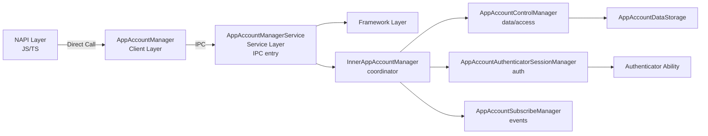
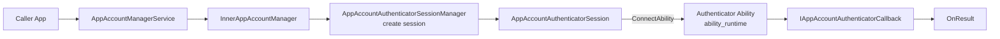
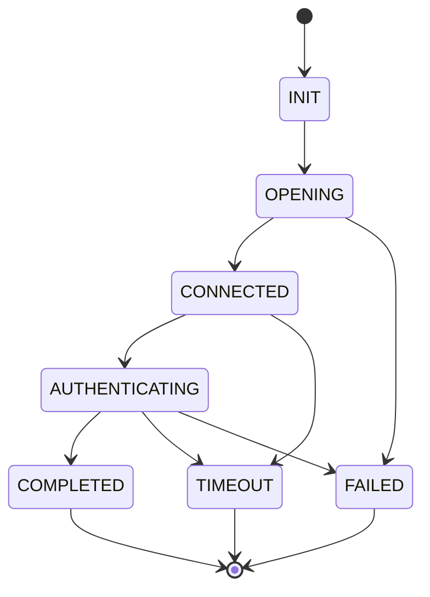

# App Account Service - Agent Instruction Guide

> Scope: **directory** `services/accountmgr/src/appaccount/` — App Account service logic.
> Parent: [../../../../AGENTS.md](../../../../AGENTS.md) (root, §1–8 framework applies here too).
> Target: any coding agent editing this module.
> Storage path: `/data/service/el2/{userId}/account/app_account/database/`

---

## 1. Code Map

### 1.1 Responsibility

App Account provides application-level account management: apps create/manage
accounts, share data with authorized apps, support OAuth via pluggable
authenticators, and enable cross-device sync.

### 1.2 Architecture



### 1.3 Core Components

| Component | File | Responsibility | Thread Safety |
|-----------|------|----------------|---------------|
| **AppAccountManagerService** | [app_account_manager_service.cpp](app_account_manager_service.cpp) | IPC entry; param validation; permission checks; UID-based locking; clears sensitive data with `memset_s()` | `AppAccountLock` (UID-specific) |
| **InnerAppAccountManager** | [inner_app_account_manager.cpp](inner_app_account_manager.cpp) | Business logic coordinator; delegates to control/session/subscribe managers | — |
| **AppAccountControlManager** | [app_account_control_manager.cpp](app_account_control_manager.cpp) | Singleton (`GetInstance()`); account CRUD, access control, OAuth tokens, credentials, associated data; per-UID `AppAccountDataStorage` cache | `mutex_`, `storePtrMutex_`, `associatedDataMutex_` |
| **AppAccountAuthenticatorSessionManager** | [app_account_authenticator_session_manager.cpp](app_account_authenticator_session_manager.cpp) | Auth sessions with authenticator abilities; max 256 concurrent; lifecycle: Create→Open→Connect→Auth→Close | `recursive_mutex mutex_` |
| **AppAccountSubscribeManager** | [app_account_subscribe_manager.cpp](app_account_subscribe_manager.cpp) | Event subscription/notification via CommonEventService; death recipient handles subscriber death | `recursive_mutex mutex_` |
| **AppAccountDataStorage** | [app_account_data_storage.cpp](app_account_data_storage.cpp) | Extends `AccountDataStorage`; backends: SQLite or KV Store (depends on `SQLITE_DLCLOSE_ENABLE` flag) | — |

Key macros in service: `RETURN_IF_STRING_IS_EMPTY_OR_OVERSIZE`, `RETURN_IF_STRING_CONTAINS_SPECIAL_CHAR`

### 1.4 Where to Look (task → path)

| Task | Start here |
|------|------------|
| Add/change an app account IPC method | `app_account_manager_service.cpp` → `inner_app_account_manager.cpp` |
| Account CRUD / access control / credentials | `app_account_control_manager.cpp` |
| OAuth token management | `app_account_control_manager.cpp` (token methods) |
| Authenticator discovery / session lifecycle | `app_account_authenticator_session_manager.cpp` |
| Event subscription / notification | `app_account_subscribe_manager.cpp` |
| Data persistence backend (SQLite/KV) | `app_account_data_storage.cpp` |
| Constants / limits (name size, session max, etc.) | `frameworks/appaccount/native/include/app_account_constants.h` |
| `AppAccountInfo` struct | `frameworks/appaccount/native/include/app_account_info.h` |

---

## 2. Knowledge Routing

### 2.1 Task-based routing

| If the task involves… | Read this first |
|----------------------|-----------------|
| Authenticator discovery / OAuth flow | §3 Authenticator Architecture below |
| Locking / deadlock prevention | §4.2 Lock Hierarchy below |
| Sensitive data (credentials/tokens) | §4.3 Security Considerations below |
| Data persistence / storage backend | §1.3 AppAccountDataStorage row; Root AGENTS.md §4 |
| Event publishing | §1.3 AppAccountSubscribeManager row |
| Parameter validation | `RETURN_IF_*` macros in `app_account_manager_service.cpp` |
| Permission checks | Root AGENTS.md §3.1 (Do-not: permission checks) |
| Error codes | §4.4 Error Codes below; `interfaces/innerkits/common/include/account_error_no.h` |
| Constants / size limits | §4.5 Constants and Limits below |

### 2.2 Vocabulary routing

| Term | Meaning | Read |
|------|---------|------|
| `AppAccountInfo` | Core struct: owner, name, alias, extraInfo, authorizedApps, oauthTokens | §4.6 Key Data Structures |
| Authenticator | App extension providing authentication (OAuth); discovered via `ohos.appAccount.action.auth` / `ohos.account.appAccount.action.oauth` | §3 Authenticator Architecture |
| `AppAccountLock` | UID-based mutex; each UID has its own mutex shared via `weak_ptr` | §4.2 Lock Hierarchy |
| `memset_s` | Secure-clear sensitive data (credentials/tokens) after use | §4.3 Security Considerations |
| `SESSION_MAX_NUM` | Max concurrent authenticator sessions (256) | §4.5 Constants |
| Asset storage | Optional secure storage for credentials/tokens (`HAS_ASSET_PART` flag) | §4.3 Security Considerations |
| `SQLITE_DLCLOSE_ENABLE` | Flag selecting SQLite vs KV Store backend | §1.3 AppAccountDataStorage |

### 2.3 Pre-edit protocol

See root [AGENTS.md](../../../../AGENTS.md) §2.4. Before writing code, state:
1. **Task category** (service logic / authenticator / persistence / security / test / other).
2. **Documents read** (per §2.1–2.2 above).
3. **Constraints found** (§4 Do-not / Ask-before rules that apply).

---

## 3. Authenticator Architecture

### 3.1 Discovery

**File**: [app_account_authenticator_manager.cpp](app_account_authenticator_manager.cpp)

**Actions**:
- `ohos.appAccount.action.auth` — standard authenticator
- `ohos.account.appAccount.action.oauth` — OAuth authenticator

**Process**: `QueryAbilityInfos()` → if not found, `QueryExtensionAbilityInfos()` → try both actions in sequence → return `AuthenticatorInfo` (owner, abilityName, iconId, labelId).

### 3.2 Communication Flow



### 3.3 Session States



---

## 4. Constraints & Boundaries

### 4.1 Do not (without explicit user escalation)

- **Do not change `AppAccountInfo` serialization format** — the JSON schema is
  persisted on disk; changing field names breaks upgrade compatibility (Root
  AGENTS.md §3.1).
- **Do not change authenticator action strings**
  (`ohos.appAccount.action.auth`, `ohos.account.appAccount.action.oauth`) —
  existing authenticator apps depend on them.
- **Do not change size-limit constants** (`NAME_MAX_SIZE`, `EXTRA_INFO_MAX_SIZE`,
  `BUNDLE_NAME_MAX_SIZE`, `CREDENTIAL_MAX_SIZE`, `TOKEN_MAX_SIZE`,
  `SESSION_MAX_NUM`, `APP_ACCOUNT_SUBSCRIBER_MAX_SIZE`) without compatibility
  review — applications depend on these limits.
- **Do not change lock hierarchy order** (§4.2) — wrong order causes deadlock.
- **Do not remove `memset_s()` calls** on credentials/tokens — these are a
  security boundary; IPC marshalling may copy buffers.
- **Do not remove or weaken permission checks** in `AppAccountManagerService`.
- **Do not change API version constants** (`API_VERSION7`, `API_VERSION8`,
  `API_VERSION9`) — they gate public API behavior.

### 4.2 Ask before

- Changing the max concurrent session limit (256) — affects authenticator capacity.
- Switching storage backend (SQLite ↔ KV Store) via `SQLITE_DLCLOSE_ENABLE`.
- Changing the UID-based locking mechanism (`AppAccountLock`).

### 4.3 Lock Hierarchy (follow this order to avoid deadlocks)

1. `AppAccountLock` (UID-specific)
2. `AppAccountControlManager::mutex_`
3. `AppAccountControlManager::storePtrMutex_`
4. `AppAccountControlManager::associatedDataMutex_`
5. `AppAccountSubscribeManager::mutex_`
6. `AppAccountAuthenticatorSessionManager::mutex_`

`AppAccountLock` global state: `std::map<int32_t, std::weak_ptr<std::mutex>> g_uidMutexMap`
— each UID has its own mutex; mutexes shared via `weak_ptr` for cleanup.

### 4.4 Security Considerations

**Always clear sensitive data immediately after use**:
```cpp
auto credStr = const_cast<std::string *>(&credential);
(void)memset_s(credStr->data(), credStr->size(), 0, credStr->size());
```
Locations: [app_account_manager_service.cpp:476, 484, 576, 586, 614, 641](app_account_manager_service.cpp#L476)

**Asset storage** (optional, `HAS_ASSET_PART`):
- `SaveDataToAsset()` / `GetDataFromAsset()` / `RemoveDataFromAsset()` in
  [app_account_control_manager.cpp:58-174](app_account_control_manager.cpp#L58)

**Required permissions**:
- `ohos.permission.DISTRIBUTED_DATASYNC` — cross-device data sync
- `ohos.permission.GET_ALL_APP_ACCOUNTS` — query all accounts

### 4.5 Error Codes

**File**: [account_error_no.h](../../../../interfaces/innerkits/common/include/account_error_no.h)

| Error Code | Description |
|------------|-------------|
| `ERR_OK` | Success |
| `ERR_ACCOUNT_COMMON_INVALID_PARAMETER` | Invalid parameter |
| `ERR_ACCOUNT_COMMON_PERMISSION_DENIED` | Permission denied |
| `ERR_ACCOUNT_COMMON_NULL_PTR_ERROR` | Null pointer |
| `ERR_ACCOUNT_COMMON_ACCOUNT_NOT_EXIST_ERROR` | Account not found |
| `ERR_APPACCOUNT_SERVICE_ACCOUNT_NOT_EXIST` | Account not exist |
| `ERR_APPACCOUNT_SERVICE_ACCOUNT_MAX_SIZE` | Max accounts reached |
| `ERR_APPACCOUNT_SERVICE_OAUTH_TOKEN_NOT_EXIST` | OAuth token not exist |
| `ERR_APPACCOUNT_SERVICE_OAUTH_AUTHENTICATOR_NOT_EXIST` | Authenticator not found |
| `ERR_APPACCOUNT_SERVICE_OAUTH_SESSION_NOT_EXIST` | Session not exist |
| `ERR_APPACCOUNT_SERVICE_OAUTH_BUSY` | Service busy |

### 4.6 Constants and Limits

**File**: [app_account_constants.h](../../../../frameworks/appaccount/native/include/app_account_constants.h)

| Constant | Value | Description |
|-----------|-------|-------------|
| `NAME_MAX_SIZE` | 512 | Account name max length |
| `EXTRA_INFO_MAX_SIZE` | 1024 | Extra info max length |
| `BUNDLE_NAME_MAX_SIZE` | 512 | Bundle name max length |
| `CREDENTIAL_MAX_SIZE` | 1024 | Credential max length |
| `TOKEN_MAX_SIZE` | 1024 | Token max length |
| `SESSION_MAX_NUM` | 256 | Max concurrent sessions |
| `APP_ACCOUNT_SUBSCRIBER_MAX_SIZE` | 200 | Max subscribers |

**API Versions**: `API_VERSION7`, `API_VERSION8` (OAuth), `API_VERSION9` (Enhanced OAuth)

### 4.7 Key Data Structures

**AppAccountInfo** — [app_account_info.h](../../../../frameworks/appaccount/native/include/app_account_info.h):
```cpp
std::string owner_;                           // Bundle name of account owner
std::string name_;                            // Account name
std::string alias_;                           // Account alias
uint32_t appIndex_;                          // Application index
std::string extraInfo_;                       // Extra information
std::set<std::string> authorizedApps_;        // Authorized applications
bool syncEnable_;                              // Cross-device sync enabled
std::string associatedData_;                   // JSON string of associated data
std::string accountCredential_;                // JSON string of credentials
std::map<std::string, OAuthTokenInfo> oauthTokens_; // OAuth tokens by auth type
```

**AuthenticatorSessionRequest** — [app_account_common.h](../../../../frameworks/appaccount/native/include/app_account_common.h):
```cpp
std::string action, sessionId, name, owner, authType, token;
std::string bundleName, callerBundleName;
uint32_t appIndex;
bool isTokenVisible;
pid_t callerPid, callerUid;
AAFwk::Want options;
std::vector<std::string> labels;
VerifyCredentialOptions verifyCredOptions;
SetPropertiesOptions setPropOptions;
CreateAccountImplicitlyOptions createOptions;
sptr<IAppAccountAuthenticatorCallback> callback;
```

### 4.8 Common Pitfalls

**Pitfall 1 — Sensitive Data Leakage.** Credentials/tokens contain sensitive
data. Always clear with `memset_s()` immediately after use. See
[app_account_manager_service.cpp:476, 484, 576, 586](app_account_manager_service.cpp#L476).

**Pitfall 2 — Deadlock from Lock Ordering.** Acquiring locks in different order
causes deadlocks. Always follow §4.2 lock hierarchy.

**Pitfall 3 — Race Conditions in UID-based Locking.** Concurrent access to same
account data. Use `AppAccountLock` for UID-based locking:
`std::unique_ptr<AppAccountLock> lock = std::make_unique<AppAccountLock>(callingUid);`

**Pitfall 4 — Authenticator Session Leaks.** Authenticator ability may die
during authentication. Handle death notifications via `OnSessionServerDied()`
and `OnSessionAbilityDisconnectDone()`. See
[app_account_authenticator_session_manager.cpp:186-217](app_account_authenticator_session_manager.cpp).

**Pitfall 5 — Parameter Validation Bypass.** Invalid input causes security
issues or crashes. Always validate with `RETURN_IF_STRING_IS_EMPTY_OR_OVERSIZE`
and `RETURN_IF_STRING_CONTAINS_SPECIAL_CHAR`.

**Pitfall 6 — Unauthorized Data Access.** Apps may access account data without
authorization. Verify caller is owner/authorized app and check permissions.

**Pitfall 7 — Event Publishing Failures.** Failed event publishing should not
block main operations. Log errors but continue operation.

---

## 5. Verification

### 5.1 Minimum checks

See root [AGENTS.md](../../../../AGENTS.md) §5.1 for build commands. For this module:

```bash
# Build
./build.sh --product-name rk3568 --build-target os_account account_build_unittest account_build_moduletest

# Run app account test suites
cd {OpenHarmonyRootFolder}/test/testfwk/developer_test
./start.sh run -p rk3568 -t UT MST -tp os_account -ts AppAccountManagerServiceModuleTest
```

### 5.2 Task-specific validation

| If you changed… | Also check |
|----------------|------------|
| `app_account_manager_service.cpp` (IPC/permission) | Verify permission checks present; verify `memset_s` calls intact; run service module tests |
| `app_account_control_manager.cpp` (CRUD/tokens) | Run control manager tests; verify lock hierarchy followed |
| `app_account_authenticator_session_manager.cpp` | Run authenticator tests; verify session cleanup on death |
| `app_account_data_storage.cpp` (persistence) | Verify schema unchanged; test SQLite + KV backends |
| Constants / size limits | Verify no existing public constant value changed (§4.1) |
| Authenticator action strings | Grep for usages across `frameworks/` and `services/` |

### 5.3 Done definition

A change is **done** when:
1. Build succeeds: `./build.sh --product-name rk3568 --build-target os_account` (no errors).
2. Relevant test suite passes — report suite name + pass/fail counts.
3. No new compiler warnings in changed files.
4. If `AppAccountInfo` serialization, constants, or authenticator action strings
   changed: **escalate to user** (compatibility risk, §4.1).
5. If `memset_s` calls or permission checks removed/changed: **escalate to user**
   (security boundary, §4.1).

### 5.4 Fallback

If build/tests cannot run locally, state "I could not run the build/tests because
\<reason\>" and ask the user to run §5.1 commands. Do not claim the change is verified.

---

## 6. Diagnostics

### 6.1 HiSysEvent
```bash
hdc shell "hisysevent -l -o ACCOUNT | grep APP_ACCOUNT_FAILED"
```

### 6.2 Log Domain
- **Domain**: `0xD001B00` · **Tag**: `AppAccountService`
```bash
hdc shell "hilog | grep -i C01B00"
```

---

## 7. Dependencies

| Dependency | Purpose |
|------------|---------|
| `bundle_manager` | Query authenticator abilities and bundle info |
| `ability_runtime` | Connect to authenticator abilities |
| `distributeddata_inner` | KV store for account data |
| `common_event_service` | Publish account change events |
| `access_token` | Permission verification |
| `asset` (optional) | Secure storage for sensitive data |
| `hilog` | Logging |
| `hisysevent` | Event reporting |

---

## Version History

| Version | Date | Changes | Maintainer |
|---------|------|---------|------------|
| v1.0 | 2026-02-24 | Initial AGENTS.md creation | AI Assistant |
| v1.1 | 2026-02-24 | Optimized for AI knowledge base (condensed) | AI Assistant |
| v2.0 | 2026-07-09 | Rewritten per agent-instruction quality review: added code map, knowledge routing, constraints, verification | AI Assistant |
