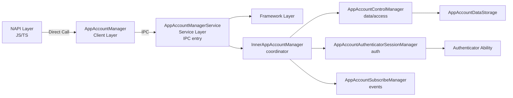
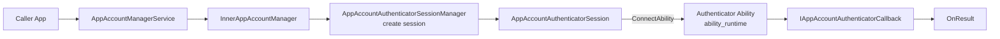
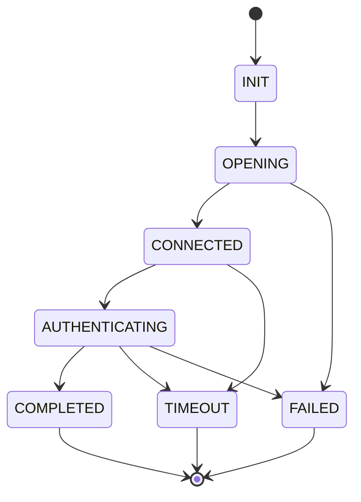

# App Account Service - AI Knowledge Base

---

## Basic Information

| Property | Value |
|----------|-------|
| **Module Name** | App Account |
| **Parent Subsystem** | account (os_account) |
| **Primary Language** | C++ (C++17) |
| **System Parent Ability** | 200 (accountmgr) |
| **Storage Path** | `/data/service/el2/{userId}/account/app_account/database/` |

---

## Architecture Overview

### Module Purpose

App Account provides application-level account management, enabling apps to create/manage accounts, share data with authorized apps, support OAuth via pluggable authenticators, and enable cross-device sync.

### Layered Architecture



---

## Core Components

### AppAccountManagerService
**File**: [app_account_manager_service.cpp](app_account_manager_service.cpp)
- IPC entry point, implements `IAppAccountManager`
- Parameter validation, permission checks, UID-based locking
- Clears sensitive data (credentials/tokens) with `memset_s()`
- **Key Macros**: `RETURN_IF_STRING_IS_EMPTY_OR_OVERSIZE`, `RETURN_IF_STRING_CONTAINS_SPECIAL_CHAR`

### InnerAppAccountManager
**File**: [inner_app_account_manager.cpp](inner_app_account_manager.cpp)
- Business logic coordinator, delegates to specialized managers
- Members: `controlManager_`, `subscribeManager_`, `sessionManager_`
- Pattern: validate → delegate → publish events

### AppAccountControlManager
**File**: [app_account_control_manager.cpp](app_account_control_manager.cpp)
- Singleton: `GetInstance()`
- Account CRUD, access control, OAuth tokens, credentials, associated data
- Maintains `AppAccountDataStorage` cache per UID
- **Thread Safety**: `mutex_`, `storePtrMutex_`, `associatedDataMutex_`

### AppAccountAuthenticatorSessionManager
**File**: [app_account_authenticator_session_manager.cpp](app_account_authenticator_session_manager.cpp)
- Manages auth sessions with authenticator abilities
- Max concurrent sessions: 256
- Session lifecycle: Create → Open → Connect → Auth → Close
- **Thread Safety**: `recursive_mutex mutex_`

### AppAccountSubscribeManager
**File**: [app_account_subscribe_manager.cpp](app_account_subscribe_manager.cpp)
- Event subscription and notification via CommonEventService
- Death recipient handles subscriber process death
- **Thread Safety**: `recursive_mutex mutex_`

### AppAccountDataStorage
**File**: [app_account_data_storage.cpp](app_account_data_storage.cpp)
- Extends `AccountDataStorage` for persistence
- Backends: SQLite database or KV Store (depends on `SQLITE_DLCLOSE_ENABLE` flag)

---

## Authenticator Architecture

### Authenticator Overview

Authenticator is an extension module in applications providing authentication capabilities. Service communicates via `AppAccountAuthenticatorManager`.

### Authenticator Discovery

**File**: [app_account_authenticator_manager.cpp](app_account_authenticator_manager.cpp)

**Actions**:
- `ohos.appAccount.action.auth`: Standard authenticator
- `ohos.account.appAccount.action.oauth`: OAuth authenticator

**Discovery Process**:
1. `QueryAbilityInfos()` with action
2. If not found, `QueryExtensionAbilityInfos()`
3. Try both actions in sequence
4. Return `AuthenticatorInfo` (owner, abilityName, iconId, labelId)

### Authenticator Communication Flow



### Session States



---

## Key Data Structures

### AppAccountInfo
**File**: [app_account_info.h](../../../../frameworks/appaccount/native/include/app_account_info.h)

```cpp
std::string owner_;                           // Bundle name of account owner
std::string name_;                            // Account name
std::string alias_;                           // Account alias
uint32_t appIndex_;                          // Application index
std::string extraInfo_;                       // Extra information
std::set<std::string> authorizedApps_;          // Authorized applications
bool syncEnable_;                              // Cross-device sync enabled
std::string associatedData_;                   // JSON string of associated data
std::string accountCredential_;                // JSON string of credentials
std::map<std::string, OAuthTokenInfo> oauthTokens_; // OAuth tokens by auth type
```

### AuthenticatorSessionRequest
**File**: [app_account_common.h](../../../../frameworks/appaccount/native/include/app_account_common.h)

```cpp
std::string action, sessionId, name, owner, authType, token;
std::string bundleName, callerBundleName;
uint32_t appIndex;
bool isTokenVisible;
pid_t callerPid, callerUid;
AAFwk::Want options;
std::vector<std::string> labels;
VerifyCredentialOptions verifyCredOptions;
SetPropertiesOptions setPropOptions;
CreateAccountImplicitlyOptions createOptions;
sptr<IAppAccountAuthenticatorCallback> callback;
```

---

## Constants and Limits

**File**: [app_account_constants.h](../../../../frameworks/appaccount/native/include/app_account_constants.h)

| Constant | Value | Description |
|-----------|-------|-------------|
| `NAME_MAX_SIZE` | 512 | Account name max length |
| `EXTRA_INFO_MAX_SIZE` | 1024 | Extra info max length |
| `BUNDLE_NAME_MAX_SIZE` | 512 | Bundle name max length |
| `CREDENTIAL_MAX_SIZE` | 1024 | Credential max length |
| `TOKEN_MAX_SIZE` | 1024 | Token max length |
| `SESSION_MAX_NUM` | 256 | Max concurrent sessions |
| `APP_ACCOUNT_SUBSCRIBER_MAX_SIZE` | 200 | Max subscribers |

**API Versions**: `API_VERSION7`, `API_VERSION8` (OAuth), `API_VERSION9` (Enhanced OAuth)

---

## Thread Safety and Locking

### AppAccountLock

**File**: [app_account_manager_service.cpp:71-95](app_account_manager_service.cpp#L71-L95)

UID-based locking mechanism:
```cpp
class AppAccountLock {
    AppAccountLock(int32_t uid);  // Acquires lock for UID
    ~AppAccountLock();              // Releases lock
};
```

**Global State**: `std::map<int32_t, std::weak_ptr<std::mutex>> g_uidMutexMap`

**Behavior**: Each UID has its own mutex; mutexes are shared via weak_ptr for cleanup.

### Lock Hierarchy (Follow this order to avoid deadlocks)

1. `AppAccountLock` (UID-specific)
2. `AppAccountControlManager::mutex_`
3. `AppAccountControlManager::storePtrMutex_`
4. `AppAccountControlManager::associatedDataMutex_`
5. `AppAccountSubscribeManager::mutex_`
6. `AppAccountAuthenticatorSessionManager::mutex_`

---

## Security Considerations

### Sensitive Data Handling

**Always clear sensitive data immediately after use**:
```cpp
auto credStr = const_cast<std::string *>(&credential);
(void)memset_s(credStr->data(), credStr->size(), 0, credStr->size());
```

**Locations**: [app_account_manager_service.cpp:476, 484, 576, 586, 614, 641](app_account_manager_service.cpp#L476)

### Asset Storage (Optional, HAS_ASSET_PART)

**File**: [app_account_control_manager.cpp:58-174](app_account_control_manager.cpp#L58)

- `SaveDataToAsset()`: Store credential/token securely
- `GetDataFromAsset()`: Retrieve credential/token
- `RemoveDataFromAsset()`: Delete credential/token

### Required Permissions

- `ohos.permission.DISTRIBUTED_DATASYNC`: Cross-device data sync
- `ohos.permission.GET_ALL_APP_ACCOUNTS`: Query all accounts

---

## Error Codes

**File**: [account_error_no.h](../../../../interfaces/innerkits/common/include/account_error_no.h)

### Common Errors

| Error Code | Description |
|------------|-------------|
| `ERR_OK` | Success |
| `ERR_ACCOUNT_COMMON_INVALID_PARAMETER` | Invalid parameter |
| `ERR_ACCOUNT_COMMON_PERMISSION_DENIED` | Permission denied |
| `ERR_ACCOUNT_COMMON_NULL_PTR_ERROR` | Null pointer |
| `ERR_ACCOUNT_COMMON_ACCOUNT_NOT_EXIST_ERROR` | Account not found |

### App Account Service Errors

| Error Code | Description |
|------------|-------------|
| `ERR_APPACCOUNT_SERVICE_ACCOUNT_NOT_EXIST` | Account not exist |
| `ERR_APPACCOUNT_SERVICE_ACCOUNT_MAX_SIZE` | Max accounts reached |
| `ERR_APPACCOUNT_SERVICE_OAUTH_TOKEN_NOT_EXIST` | OAuth token not exist |
| `ERR_APPACCOUNT_SERVICE_OAUTH_AUTHENTICATOR_NOT_EXIST` | Authenticator not found |
| `ERR_APPACCOUNT_SERVICE_OAUTH_SESSION_NOT_EXIST` | Session not exist |
| `ERR_APPACCOUNT_SERVICE_OAUTH_BUSY` | Service busy |

---

## Common Pitfalls

### Pitfall 1: Sensitive Data Leakage

**Issue**: Credentials/tokens contain sensitive data
**Solution**: Always clear with `memset_s()` immediately after use
**Example**: See [app_account_manager_service.cpp:476, 484, 576, 586](app_account_manager_service.cpp#L476)

### Pitfall 2: Deadlock from Lock Ordering

**Issue**: Acquiring locks in different order causes deadlocks
**Solution**: Always follow lock hierarchy order listed above

### Pitfall 3: Race Conditions in UID-based Locking

**Issue**: Concurrent access to same account data
**Solution**: Use `AppAccountLock` for UID-based locking
**Example**: `std::unique_ptr<AppAccountLock> lock = std::make_unique<AppAccountLock>(callingUid);`

### Pitfall 4: Authenticator Session Leaks

**Issue**: Authenticator ability may die during authentication
**Solution**: Handle death notifications via `OnSessionServerDied()` and `OnSessionAbilityDisconnectDone()`
**Location**: [app_account_authenticator_session_manager.cpp:186-217](app_account_authenticator_session_manager.cpp#L186)

### Pitfall 5: Parameter Validation Bypass

**Issue**: Invalid input causes security issues or crashes
**Solution**: Always validate with `RETURN_IF_STRING_IS_EMPTY_OR_OVERSIZE` and `RETURN_IF_STRING_CONTAINS_SPECIAL_CHAR`

### Pitfall 6: Unauthorized Data Access

**Issue**: Apps may access account data without authorization
**Solution**: Verify caller is owner/authorized app and check permissions

### Pitfall 7: Event Publishing Failures

**Issue**: Failed event publishing should not block main operations
**Solution**: Log errors but continue operation (don't fail the main operation)

---

## Dependencies

| Dependency | Purpose |
|------------|---------|
| `bundle_manager` | Query authenticator abilities and bundle info |
| `ability_runtime` | Connect to authenticator abilities |
| `distributeddata_inner` | KV store for account data |
| `common_event_service` | Publish account change events |
| `access_token` | Permission verification |
| `asset` (optional) | Secure storage for sensitive data |
| `hilog` | Logging |
| `hisysevent` | Event reporting |

---

## Diagnostics

### HiSysEvent
```bash
hdc shell "hisysevent -l -o ACCOUNT | grep APP_ACCOUNT_FAILED"
```

### Log Domain
- **Log Domain**: `0xD001B00`
- **Log Tag**: `AppAccountService`
```bash
hdc shell "hilog | grep -i C01B00"
```

---

## Service Testing

- **Unit Tests**: [test/unittest/appaccount/](../../test/unittest/app_account/) - Account CRUD, access control, tokens
- **Module Tests**: [test/moduletest/appaccount/](../../test/moduletest/app_account/) - Integration with BundleManager/AbilityManager
- **Fuzz Tests**: [test/fuzztest/appaccount/](../../../../test/fuzztest/appaccount/) - Input validation fuzzing

---

## Additional Resources

- [App Account JS API Declaration](https://gitcode.com/openharmony/interface_sdk-js/blob/master/api/@ohos.account.appAccount.d.ts)
- [App Account NAPI Docs](https://gitcode.com/openharmony/docs/blob/master/en/application-dev/reference/apis-basic-services-kit/js-apis-appAccount.md)
- [Parent AGENTS.md](../../../../AGENTS.md)

---

## Version History

| Version | Date | Changes | Maintainer |
|---------|------|---------|------------|
| v1.0 | 2026-02-24 | Initial AGENTS.md creation | AI Assistant |
| v1.1 | 2026-02-24 | Optimized for AI knowledge base (condensed) | AI Assistant |

**End of Document**
