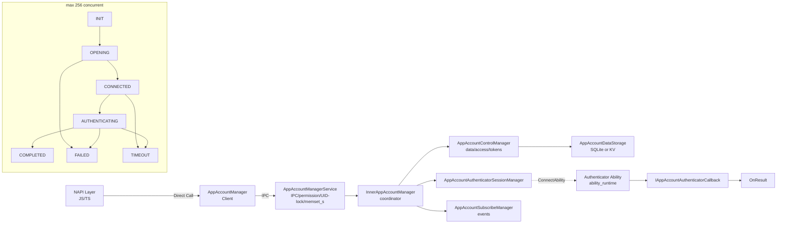

# App Account Service - Agent Instruction Guide

> Scope: **directory** `services/accountmgr/src/appaccount/` — App Account service logic.
> Parent: [../../../../AGENTS.md](../../../../AGENTS.md) (root, §1–8 framework applies here too).
> Target: any coding agent editing this module.
> Storage path: `/data/service/el2/{userId}/account/app_account/database/`

---

## 1. Code Map

### 1.1 Responsibility

App Account provides application-level account management: apps create/manage
accounts, share data with authorized apps, support OAuth via pluggable
authenticators, and enable cross-device sync.

### 1.2 Architecture & Auth Flow


```mermaid
graph LR
    A[NAPI Layer<br/>JS/TS] -->|Direct Call| B[AppAccountManager<br/>Client]
    B -->|IPC| C[AppAccountManagerService<br/>IPC/permission/UID-lock/memset_s]
    C --> C1[InnerAppAccountManager<br/>coordinator]
    C1 --> C2[AppAccountControlManager<br/>data/access/tokens]
    C1 --> C3[AppAccountAuthenticatorSessionManager]
    C1 --> C4[AppAccountSubscribeManager<br/>events]
    C2 --> C21[AppAccountDataStorage<br/>SQLite or KV]
    C3 -.->|ConnectAbility| F[Authenticator Ability<br/>ability_runtime]
    F --> G[IAppAccountAuthenticatorCallback] --> H[OnResult]

    subgraph Session States [max 256 concurrent]
        INIT --> OPENING --> CONNECTED --> AUTHENTICATING --> COMPLETED
        OPENING --> FAILED
        CONNECTED --> TIMEOUT
        AUTHENTICATING --> FAILED
        AUTHENTICATING --> TIMEOUT
    end
```

**Authenticator discovery** (`app_account_authenticator_manager.cpp`):
actions `ohos.appAccount.action.auth` (standard) and
`ohos.account.appAccount.action.oauth` (OAuth); `QueryAbilityInfos()` →
fallback `QueryExtensionAbilityInfos()` → returns `AuthenticatorInfo`
(owner, abilityName, iconId, labelId).

### Code details that must be verified
- OAuth token storage key format: alias = SHA256(owner#appIndex#name#) + SHA256(authType); the JSON `oauthTokens_` stores only the alias, not the real token.
- The real token goes through `SaveDataToAsset` → `AssetAdd` into the asset backend (`SEC_ASSET_TAG_SECRET`).
- hapLabel batch deletion uses `SEC_ASSET_TAG_DATA_LABEL_NORMAL_1`; accountLabel uses `NORMAL_2`.
- localId = callerUid / 200000 (`UID_TRANSFORM_DIVISOR`).
- Visibility (`IsAppIndexVisibleWithFg`) and authorization (`authorizedApps_`) are two independent boundaries; do not conflate them.

### 1.3 Core Components

| Component | File | Responsibility | Thread Safety |
|-----------|------|----------------|---------------|
| **AppAccountManagerService** | [app_account_manager_service.cpp](app_account_manager_service.cpp) | IPC entry; param validation; permission checks; UID-based locking; clears sensitive data with `memset_s()` | `AppAccountLock` (UID-specific) |
| **InnerAppAccountManager** | [inner_app_account_manager.cpp](inner_app_account_manager.cpp) | Business logic coordinator; delegates to control/session/subscribe managers | — |
| **AppAccountControlManager** | [app_account_control_manager.cpp](app_account_control_manager.cpp) | Singleton (`GetInstance()`); account CRUD, access control, OAuth tokens, credentials, associated data; per-UID `AppAccountDataStorage` cache | `mutex_`, `storePtrMutex_`, `associatedDataMutex_` |
| **AppAccountAuthenticatorSessionManager** | [app_account_authenticator_session_manager.cpp](app_account_authenticator_session_manager.cpp) | Auth sessions with authenticator abilities; max 256 concurrent; lifecycle: Create→Open→Connect→Auth→Close | `recursive_mutex mutex_` |
| **AppAccountSubscribeManager** | [app_account_subscribe_manager.cpp](app_account_subscribe_manager.cpp) | Event subscription/notification via CommonEventService; death recipient handles subscriber death | `recursive_mutex mutex_` |
| **AppAccountDataStorage** | [app_account_data_storage.cpp](app_account_data_storage.cpp) | Extends `AccountDataStorage`; backends: SQLite or KV Store (depends on `SQLITE_DLCLOSE_ENABLE` flag) | — |

Key macros in service: `RETURN_IF_STRING_IS_EMPTY_OR_OVERSIZE`, `RETURN_IF_STRING_CONTAINS_SPECIAL_CHAR`

### 1.4 Where to Look (task → path)

| Task | Start here |
|------|------------|
| Add/change an app account IPC method | `app_account_manager_service.cpp` → `inner_app_account_manager.cpp` |
| Account CRUD / access control / credentials | `app_account_control_manager.cpp` |
| OAuth token management | `app_account_control_manager.cpp` (token methods) |
| Authenticator discovery / session lifecycle | `app_account_authenticator_session_manager.cpp` |
| Event subscription / notification | `app_account_subscribe_manager.cpp` |
| Data persistence backend (SQLite/KV) | `app_account_data_storage.cpp` |
| Constants / limits (name size, session max, etc.) | `frameworks/appaccount/native/include/app_account_constants.h` |
| `AppAccountInfo` struct | `frameworks/appaccount/native/include/app_account_info.h` |

---

## 2. Knowledge Routing

### 2.1 Task-based routing

| If the task involves… | Read this first |
|----------------------|-----------------|
| Authenticator discovery / OAuth flow | §1.2 Architecture & Auth Flow above |
| Locking / deadlock prevention | §4.3 Lock Hierarchy below |
| Sensitive data (credentials/tokens) | §4.4 Security Considerations below |
| Data persistence / storage backend | §1.3 AppAccountDataStorage row; Root AGENTS.md §4 |
| Event publishing | §1.3 AppAccountSubscribeManager row |
| Parameter validation | `RETURN_IF_*` macros in `app_account_manager_service.cpp` |
| Permission checks | Root AGENTS.md §3.1 (Do-not: permission checks) |
| Error codes | §4.5 below; `interfaces/innerkits/common/include/account_error_no.h` |
| Constants / size limits | §4.6 below |

### 2.2 Vocabulary routing

| Term | Meaning | Read |
|------|---------|------|
| `AppAccountInfo` | Core struct: owner, name, alias, extraInfo, authorizedApps, oauthTokens | §4.7 Key Data Structures |
| Authenticator | App extension providing authentication (OAuth); discovered via `ohos.appAccount.action.auth` / `ohos.account.appAccount.action.oauth` | §1.2 Architecture & Auth Flow |
| `AppAccountLock` | UID-based mutex; each UID has its own mutex shared via `weak_ptr` | §4.3 Lock Hierarchy |
| `memset_s` | Secure-clear sensitive data (credentials/tokens) after use | §4.4 Security Considerations |
| `SESSION_MAX_NUM` | Max concurrent authenticator sessions (256) | §4.6 Constants |
| Asset storage | Optional secure storage for credentials/tokens (`HAS_ASSET_PART` flag) | §4.4 Security Considerations |
| `SQLITE_DLCLOSE_ENABLE` | Flag selecting SQLite vs KV Store backend | §1.3 AppAccountDataStorage |

### 2.3 Pre-edit protocol

See root [AGENTS.md](../../../../AGENTS.md) §2.3. Task categories for this
module: service logic / authenticator / persistence / security / test.

---

## 3. Authenticator Architecture

Discovery, communication flow, and session state diagram have been merged into
[§1.2 Architecture & Auth Flow](#12-architecture--auth-flow); not repeated here.

---

## 4. Constraints & Boundaries

### 4.1 Do not (without explicit user escalation)

- **Do not change `AppAccountInfo` serialization format** — the JSON schema is
  persisted on disk; changing field names breaks upgrade compatibility (Root
  AGENTS.md §3.1).
- **Do not change authenticator action strings**
  (`ohos.appAccount.action.auth`, `ohos.account.appAccount.action.oauth`) —
  existing authenticator apps depend on them.
- **Do not change size-limit constants** (`NAME_MAX_SIZE`, `EXTRA_INFO_MAX_SIZE`,
  `BUNDLE_NAME_MAX_SIZE`, `CREDENTIAL_MAX_SIZE`, `TOKEN_MAX_SIZE`,
  `SESSION_MAX_NUM`, `APP_ACCOUNT_SUBSCRIBER_MAX_SIZE`) without compatibility
  review — applications depend on these limits.
- **Do not change lock hierarchy order** (§4.3) — wrong order causes deadlock.
- **Do not remove `memset_s()` calls** on credentials/tokens — these are a
  security boundary; IPC marshalling may copy buffers.
- **Do not remove or weaken permission checks** in `AppAccountManagerService`.
- **Do not change API version constants** (`API_VERSION7`, `API_VERSION8`,
  `API_VERSION9`) — they gate public API behavior.

### 4.2 Ask before

- Changing the max concurrent session limit (256) — affects authenticator capacity.
- Switching storage backend (SQLite ↔ KV Store) via `SQLITE_DLCLOSE_ENABLE`.
- Changing the UID-based locking mechanism (`AppAccountLock`).

### 4.3 Lock Hierarchy (follow this order to avoid deadlocks)

1. `AppAccountLock` (UID-specific)
2. `AppAccountControlManager::mutex_`
3. `AppAccountControlManager::storePtrMutex_`
4. `AppAccountControlManager::associatedDataMutex_`
5. `AppAccountSubscribeManager::mutex_`
6. `AppAccountAuthenticatorSessionManager::mutex_`

`AppAccountLock` global state: `std::map<int32_t, std::weak_ptr<std::mutex>> g_uidMutexMap`
— each UID has its own mutex; mutexes shared via `weak_ptr` for cleanup.

### 4.4 Security Considerations

**Always clear sensitive data immediately after use**:
```cpp
auto credStr = const_cast<std::string *>(&credential);
(void)memset_s(credStr->data(), credStr->size(), 0, credStr->size());
```
Location: all `memset_s` call sites in [app_account_manager_service.cpp](app_account_manager_service.cpp) (grep `memset_s` to locate).

**Asset storage** (optional, `HAS_ASSET_PART`):
- `SaveDataToAsset()` / `GetDataFromAsset()` / `RemoveDataFromAsset()` in
  [app_account_control_manager.cpp](app_account_control_manager.cpp) (the three functions above).

**Required permissions**:
- `ohos.permission.DISTRIBUTED_DATASYNC` — cross-device data sync
- `ohos.permission.GET_ALL_APP_ACCOUNTS` — query all accounts

### 4.5 Error Codes

Error-code definitions are in [account_error_no.h](../../../../interfaces/innerkits/common/include/account_error_no.h); the `ERR_APPACCOUNT_*` prefix is module-specific.

### 4.6 Constants and Limits

Constant definitions are in [app_account_constants.h](../../../../frameworks/appaccount/native/include/app_account_constants.h); values must not change (see §4.1). API version constants: `API_VERSION7`, `API_VERSION8` (OAuth), `API_VERSION9` (enhanced OAuth).

### 4.7 Key Data Structures

Struct definitions are in the corresponding headers; key semantic fields:

- **AppAccountInfo** ([app_account_info.h](../../../../frameworks/appaccount/native/include/app_account_info.h)): `owner_` (account owner bundle name), `name_` (account name), `alias_` (alias), `authorizedApps_` (authorized app set), `oauthTokens_` (OAuth tokens indexed by authType), `accountCredential_` (credential JSON), `associatedData_` (associated data JSON), `syncEnable_` (cross-device sync toggle).
- **AuthenticatorSessionRequest** ([app_account_common.h](../../../../frameworks/appaccount/native/include/app_account_common.h)): `action`/`sessionId`/`name`/`owner`/`authType`/`token`, `callerPid`/`callerUid`, `callback`.

### 4.8 Common Pitfalls

**Pitfall 1 — Sensitive Data Leakage.** Credentials/tokens contain sensitive
data. Always clear with `memset_s()` immediately after use. Location: all
`memset_s` call sites in [app_account_manager_service.cpp](app_account_manager_service.cpp)
(grep to locate).

**Pitfall 2 — Deadlock from Lock Ordering.** Acquiring locks in different order
causes deadlocks. Always follow §4.3 lock hierarchy.

**Pitfall 3 — Race Conditions in UID-based Locking.** Concurrent access to same
account data. Use `AppAccountLock` for UID-based locking:
`std::unique_ptr<AppAccountLock> lock = std::make_unique<AppAccountLock>(callingUid);`

**Pitfall 4 — Authenticator Session Leaks.** Authenticator ability may die
during authentication. Handle death notifications via `OnSessionServerDied()`
and `OnSessionAbilityDisconnectDone()` in
[app_account_authenticator_session_manager.cpp](app_account_authenticator_session_manager.cpp).

**Pitfall 5 — Parameter Validation Bypass.** Invalid input causes security
issues or crashes. Always validate with `RETURN_IF_STRING_IS_EMPTY_OR_OVERSIZE`
and `RETURN_IF_STRING_CONTAINS_SPECIAL_CHAR`.

**Pitfall 6 — Unauthorized Data Access.** Apps may access account data without
authorization. Verify caller is owner/authorized app and check permissions.

**Pitfall 7 — Event Publishing Failures.** Failed event publishing should not
block main operations. Log errors but continue operation.

---

## 5. Verification

### 5.1 Minimum checks

See root [AGENTS.md](../../../../AGENTS.md) §5.1 for the full build commands.
Module test suite:

```bash
cd {OpenHarmonyRootFolder}/test/testfwk/developer_test
./start.sh run -p rk3568 -t UT MST -tp os_account -ts AppAccountManagerServiceModuleTest
```

### 5.2 Task-specific validation

| If you changed… | Also check |
|----------------|------------|
| `app_account_manager_service.cpp` (IPC/permission) | Verify permission checks present; verify `memset_s` calls intact; run service module tests |
| `app_account_control_manager.cpp` (CRUD/tokens) | Run control manager tests; verify lock hierarchy followed |
| `app_account_authenticator_session_manager.cpp` | Run authenticator tests; verify session cleanup on death |
| `app_account_data_storage.cpp` (persistence) | Verify schema unchanged; test SQLite + KV backends |
| Constants / size limits | Verify no existing public constant value changed (§4.1) |
| Authenticator action strings | Grep for usages across `frameworks/` and `services/` |

### 5.3 Done definition

See root [AGENTS.md](../../../../AGENTS.md) §5.5. Additional module requirements:
- If `AppAccountInfo` serialization format, constant values, or authenticator action strings change: **user approval required** (compatibility risk, §4.1).
- If `memset_s` calls or permission checks are changed: **user approval required** (security boundary, §4.1).

### 5.4 Fallback

See root [AGENTS.md](../../../../AGENTS.md) §5.5. If build/tests cannot run
locally, state the reason and ask the user to run §5.1 commands. Do not claim
the change is verified.
