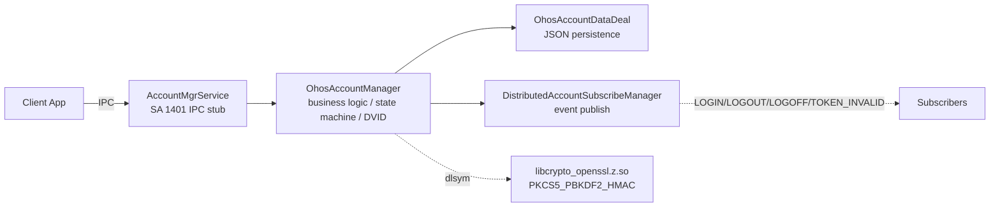

# Distributed Account Module - Agent Instruction Guide

> Scope: **directory** `services/accountmgr/src/distributed_account/` — Distributed Account (OHOS Account) service logic.
> Parent: [../../../../AGENTS.md](../../../../AGENTS.md) (root, §1–8 framework applies here too).
> Target: any coding agent editing this module.
> Data location: `/data/service/el1/public/account/{userId}/account.json`
> SA ID: 1401

---

## 1. Code Map

### 1.1 Responsibility

Distributed Account (OHOS Account) provides account management for OpenHarmony
distributed scenarios: login/logout, state management, event subscription, data
persistence, and account anonymization for privacy.

### 1.2 Architecture



- **Call chain**: Client App → `AccountMgrService` (IPC stub, SA 1401) →
  `OhosAccountManager` (business logic, state machine, DVID) →
  `OhosAccountDataDeal` (JSON persistence).
- **Event path**: `OhosAccountManager` also publishes events (LOGIN/LOGOUT/LOGOFF/
  TOKEN_INVALID) via `DistributedAccountSubscribeManager` to subscribers.
- **Crypto**: DVID generation dynamically loads OpenSSL symbols via `dlsym` from
  `libcrypto_openssl.z.so` (`PKCS5_PBKDF2_HMAC`).
- **Two-segment ID**: the Login path stores `open_id = SHA256(raw_uid)`; the
  Query path overwrites the in-memory `uid_` with the per-app DVID. Do not
  conflate them (see §3.2 "Code details that must be verified").

### 1.3 Entry Points

| Component | File |
|-----------|------|
| AccountMgrService (SA 1401) | [../account_mgr_service.cpp](../account_mgr_service.cpp) |
| OhosAccountManager | [../ohos_account_manager.cpp](../ohos_account_manager.cpp) |

### 1.4 Where to Look (task → path)

| Task | Start here |
|------|------------|
| Login/logout/token-invalid logic | `../ohos_account_manager.cpp` → `LoginOhosAccount` / `LogoutOhosAccount` / `HandleOhosAccountTokenInvalidEvent` |
| DVID generation | `QueryDistributedVirtualDeviceId()` → `GenerateDVID()` in `../ohos_account_manager.cpp` |
| Account anonymization | `GetOhosAccountDistributedData()` anonymization branch in `../ohos_account_manager.cpp` |
| JSON persistence (read/write/schema) | `../ohos_account_data_deal.cpp` |
| Event subscription / publishing | `distributed_account_subscribe_manager.cpp` |
| State machine transitions | state-machine transition functions in `../ohos_account_manager.cpp` |
| SA interactions (StorageManager, BundleManager, etc.) | `AccountMgrService` SA-interaction aggregation in `../account_mgr_service.cpp` |

---

## 2. Knowledge Routing

### 2.1 Task-based routing

| If the task involves… | Read this first |
|----------------------|-----------------|
| Login / logout / token invalid flow | §3.2 Key flows; §4.5 State Machine |
| DVID / cross-device ID | §4.1 DVID Generation |
| Anonymization / privacy | §4.2 Account Anonymization |
| JSON schema / persistence | §4.3 JSON Schema; §4.4 OhosAccountDataDeal |
| Event subscription | §1.4 DistributedAccountSubscribeManager row |
| File watcher / tamper detection | §4.4 (ENABLE_FILE_WATCHER) |
| Thread safety / locking | §4.6 Thread Safety |
| Permission checks | Root AGENTS.md §3.1 (Do-not: permission checks); §4.7 Permissions |
| State machine | §4.5 State Machine |
| Debugging / troubleshooting | §5 Troubleshooting |

### 2.2 Vocabulary routing

| Term | Meaning | Read |
|------|---------|------|
| DVID | Distributed Virtual Device ID = `PBKDF2_HMAC-SHA256(raw_uid, bundleName, 1000, 32)`; per-app unique ID for privacy | §4.1 DVID Generation |
| OHOS_UID | `SHA256(uid)` — the device-level account identifier (stored as `open_id` in JSON) | §3.2 Key flows |
| `bind_status` | Account state field in JSON: 0=UNBOUND, 1=LOGIN, 2=NOTLOGIN, 3=LOGOFF, 4=TOKEN_EXPIRED | §4.5 State Machine |
| Anonymization | Non-system apps get DVID + masked names instead of raw data | §4.2 Account Anonymization |
| File watcher | inotify + SHA256 digest comparison to detect JSON tampering (`ENABLE_FILE_WATCHER` flag) | §4.4 OhosAccountDataDeal |
| NOTLOGIN vs LOGOFF | NOTLOGIN = unbind (can re-login); LOGOFF = removed from device | §4.5 State Machine |

### 2.3 Pre-edit protocol

See root [AGENTS.md](../../../../AGENTS.md) §2.3. Before writing code, state:
1. **Task category** (login/state machine / DVID / anonymization / persistence / events / other).
2. **Documents read** (per §2.1–2.2 above).
3. **Constraints found** (§4.8 Do-not / Ask-before rules that apply).

---

## 3. Core Components

### 3.1 AccountMgrService — distributed account methods

| Method | Description |
|---------|-------------|
| `SetOhosAccountInfo()` | Login with event string |
| `GetOhosAccountInfo()` | Query current account |
| `GetOsAccountDistributedInfo()` | Query by userId |
| `QueryDistributedVirtualDeviceId()` | Get DVID |
| `SubscribeDistributedAccountEvent()` | Subscribe events |
| `UnsubscribeDistributedAccountEvent()` | Unsubscribe events |

### 3.2 OhosAccountManager — key methods

| Method | Description |
|---------|-------------|
| `OnInitialize()` | Load account data |
| `LoginOhosAccount()` | Process login, save to JSON |
| `LogoutOhosAccount()` | Process logout |
| `HandleOhosAccountTokenInvalidEvent()` | Handle token invalid |
| `GetOhosAccountDistributedData()` | Get with anonymization |
| `QueryDistributedVirtualDeviceId()` | Generate DVID |

**Key flows** (two-segment ID generation chain):
1. **Login path**: `LoginOhosAccount` → `GenerateOhosUdidWithSha256` (sets `open_id = SHA256(raw_uid)`, `uid_` stores `open_id`) → update state → save JSON → publish event.
2. **Query path**: `QueryDistributedVirtualDeviceId` → `GenerateDVID` (`PBKDF2_HMAC-SHA256(raw_uid, bundleName)`) → `uid_` overwritten with DVID for the caller.
3. **Query with anonymization**: `CheckSystemApp` → return full data (system app) or DVID + masked names (normal app).

### Code details that must be verified
- `LoginOhosAccount` generates `open_id` (SHA256), not DVID — `uid_` stores `open_id`, `rawUid_` stores the original uid.
- DVID is generated on the `QueryDistributedVirtualDeviceId` path (PBKDF2), not the Login path.
- `AnonymizeOhosAccountInfo` overwrites `uid_` with DVID (non-system apps only).
- Ordering of `SetRawUid` vs `uid_` overwrite (`SetRawUid@951` → `uid_=open_id@952`).
- `dlsym` dynamic loading of OpenSSL (`PKCS5_PBKDF2_HMAC` resolved via `dlsym` from `libcrypto_openssl.z.so`).

### 3.3 OhosAccountDataDeal

| Method | Description |
|---------|-------------|
| `Init()` | Load/create JSON files |
| `AccountInfoFromJson()` | Deserialize from JSON |
| `AccountInfoToJson()` | Serialize to JSON |
| `SaveAccountInfo()` | Persist to file |
| `BuildJsonFileFromScratch()` | Create default file |

### 3.4 DistributedAccountSubscribeManager

| Method | Description |
|---------|-------------|
| `SubscribeDistributedAccountEvent()` | Add listener |
| `UnsubscribeDistributedAccountEvent()` | Remove listener |
| `Publish()` | Notify all subscribers (async with retry) |

Events: LOGIN, LOGOUT, LOGOFF, TOKEN_INVALID

---

## 4. Constraints & Boundaries

### 4.1 DVID Generation

`GenerateDVID()` in `../ohos_account_manager.cpp` (called from `QueryDistributedVirtualDeviceId()`).

```cpp
DVID = PBKDF2_HMAC-SHA256(raw_uid, bundleName, 1000, 32)
```
- Per-app unique ID for privacy — prevents cross-app tracking.
- **Do not change** the algorithm, iteration count, or salt — existing DVIDs
  across devices and apps depend on this exact computation.

### 4.2 Account Anonymization

`GetOhosAccountDistributedData()` anonymization branch in `../ohos_account_manager.cpp`.

| Caller type | Raw UID | Name | Nickname | Avatar | ScalableData |
|-------------|---------|------|----------|--------|--------------|
| System app | Full | Full | Full | Full | Full |
| Normal app | DVID | FirstChar + `**********` | FirstChar + `**********` | `**********` | Empty |

**Do not change** anonymization rules — privacy guarantees depend on them.

### 4.3 JSON Schema (on-disk, compatibility-sensitive)

[../ohos_account_data_deal.cpp](../ohos_account_data_deal.cpp)

```json
{
  "version": int,
  "bind_time": int,
  "user_id": int,
  "account_name": string,
  "raw_uid": string,
  "open_id": string,        // SHA256(raw_uid)
  "bind_status": int,        // State: 0-4 (see §4.5)
  "calling_uid": int,
  "account_nickname": string,
  "account_scalableData": string
}
```

**Do not change** field names, types, or the `version` field semantics — breaks
upgrade compatibility (Root AGENTS.md §3.1). Version migration: check `version`
field on load and upgrade format accordingly (`OhosAccountDataDeal`).

### 4.4 File Watcher (ENABLE_FILE_WATCHER)

Detects tampering via inotify + SHA256 digest comparison. Do not disable without
escalation — security boundary.

### 4.5 State Machine

```
UNBOUND --[LOGIN]--> LOGIN --[LOGOUT/LOGOFF/TOKEN_INVALID]--> NOTLOGIN / LOGOFF / TOKEN_EXPIRED
```

| State | Value | Description |
|--------|---------|-------------|
| UNBOUND | 0 | Not logged in |
| LOGIN | 1 | Logged in/bound |
| NOTLOGIN | 2 | Logged out (can re-login) |
| LOGOFF | 3 | Removed from device |
| TOKEN_EXPIRED | 4 | Token expired |

State values align with `account_info.h` `AccountStates` enum. State transition
logic: state-machine transition functions in `../ohos_account_manager.cpp`
(`LoginOhosAccount` / `LogoutOhosAccount` / `HandleOhosAccountTokenInvalidEvent`).

### 4.6 Thread Safety

| Mutex | Protects |
|-------|----------|
| `OhosAccountManager::mgrMutex_` | State changes |
| `OhosAccountDataDeal::mutex_` / `accountInfoFileLock_` | File I/O |
| `DistributedAccountSubscribeManager::subscribeRecordMutex_` | Subscription list |

Do not hold `mgrMutex_` during IPC or disk I/O (Root AGENTS.md §3.4 Pitfall 6).

### 4.7 Permissions

- `MANAGE_DISTRIBUTED_ACCOUNTS` — manage distributed accounts
- `GET_DISTRIBUTED_ACCOUNTS` — query distributed accounts
- `DISTRIBUTED_DATASYNC` — cross-device data sync
- `MANAGE_USERS` — query other users

Do not remove or weaken permission checks (Root AGENTS.md §3.1).

### 4.8 Do not (without explicit user escalation)

- **Do not change the JSON schema** (field names, types, `version` semantics) —
  breaks upgrade compatibility (§4.3).
- **Do not change the DVID algorithm** (PBKDF2, iterations=1000, keylen=32,
  salt=bundleName) — existing cross-device sync depends on it (§4.1).
- **Do not change anonymization rules** — privacy boundary (§4.2).
- **Do not change event names** (LOGIN, LOGOUT, LOGOFF, TOKEN_INVALID) —
  subscribers depend on them.
- **Do not change state values** (0=UNBOUND, 1=LOGIN, 2=NOTLOGIN, 3=LOGOFF,
  4=TOKEN_EXPIRED) — persisted in JSON `bind_status` field, align with
  `account_info.h`.
- **Do not disable file watcher** without escalation — tamper detection boundary.

### 4.9 Ask before

- Changing state machine transitions (§4.5) — affects login/logout flows.
- Changing retry count (`MAX_RETRY_TIMES`) for event publishing.
- Changing `ENABLE_FILE_WATCHER` / `HAS_CES_PART` / `HAS_HUKS_PART` flags.

### 4.10 Error Codes

| Code | Description |
|------|-------------|
| `ERR_OK` | Success |
| `ERR_ACCOUNT_COMMON_PERMISSION_DENIED` | Permission check failed |
| `ERR_ACCOUNT_COMMON_INVALID_PARAMETER` | Invalid parameters |
| `ERR_ACCOUNT_COMMON_ACCOUNT_NOT_EXIST_ERROR` | Account not found |
| `ERR_ACCOUNT_ZIDL_ACCOUNT_SERVICE_ERROR` | Internal error |
| `ERR_ACCOUNT_DATADEAL_JSON_FILE_CORRUPTION` | JSON corrupted (auto-retry) |
| `ERR_OHOSACCOUNT_KIT_NO_SPECIFIED_CALLBACK_HAS_BEEN_REGISTERED` | Subscription not found |

---

## 5. Troubleshooting

| Issue | Check |
|-------|--------|
| Login fails "already bound" | Check `bind_status` in JSON, verify not stuck in LOGIN state |
| JSON corrupted | Auto-retry enabled (`MAX_RETRY_TIMES=2`), check file integrity |
| No events received | Verify system app, death recipient registered, correct event type |
| DVID empty | Check OpenSSL loaded, UID length < 512 |

**Debug commands:**
```bash
cat /data/service/el1/public/account/{userId}/account.json | jq
hidumper -s accountmgr -a
grep "ohos_account" /var/log/hisysevent/*.log
```

---

## 6. FAQ

**Q1: Same OHOS account on multiple users?** Blocked by `CheckOhosAccountCanBind()` in `../ohos_account_manager.cpp`.

**Q2: Account sync across devices?** Not by this service. DistributedKV uses DVID as sync key.

**Q3: Query other users?** Only with `MANAGE_USERS` or `INTERACT_ACROSS_LOCAL_ACCOUNTS` permission.

---

## 7. Verification

### 7.1 Minimum checks

See root [AGENTS.md](../../../../AGENTS.md) §5.1 for build commands. For this module:

```bash
# Build
./build.sh --product-name rk3568 --build-target os_account account_build_unittest account_build_moduletest

# Run distributed account test suites
cd {OpenHarmonyRootFolder}/test/testfwk/developer_test
./start.sh run -p rk3568 -t UT MST -tp os_account -ts OhosAccountManagerModuleTest
```

### 7.2 Task-specific validation

| If you changed… | Also check |
|----------------|------------|
| `ohos_account_manager.cpp` (login/logout) | Verify state machine transitions intact; run manager module tests |
| DVID generation (`GenerateDVID`) | Verify algorithm unchanged (§4.1); test cross-device sync |
| Anonymization (`GetOhosAccountDistributedData`) | Verify rules unchanged (§4.2); test system vs normal app paths |
| `ohos_account_data_deal.cpp` (JSON) | Verify schema unchanged (§4.3); test reboot-restore; test version migration |
| `distributed_account_subscribe_manager.cpp` | Verify event names unchanged; test subscriber death handling |
| File watcher flag | Test tamper detection path |

### 7.3 Done definition

A change is **done** when:
1. Build succeeds: `./build.sh --product-name rk3568 --build-target os_account` (no errors).
2. Relevant test suite passes — report suite name + pass/fail counts.
3. No new compiler warnings in changed files.
4. If JSON schema, DVID algorithm, anonymization rules, event names, or state
   values changed: **escalate to user** (compatibility/privacy boundary, §4.8).
5. If file watcher or permission checks changed: **escalate to user** (§4.8).

### 7.4 Fallback

If build/tests cannot run locally, state "I could not run the build/tests because
\<reason\>" and ask the user to run §7.1 commands. Do not claim the change is verified.

---

## 8. Configuration

Module-specific build flags (root-level flags in [../../../../AGENTS.md](../../../../AGENTS.md) §1.6):

| Flag | Purpose |
|--------|-----------|
| `HAS_CES_PART` | Enable common events |
| `ENABLE_FILE_WATCHER` | Enable tampering detection |
| `HAS_HUKS_PART` | Enable HUKS digest |
| `ACCOUNT_TEST` | Use test directory |
