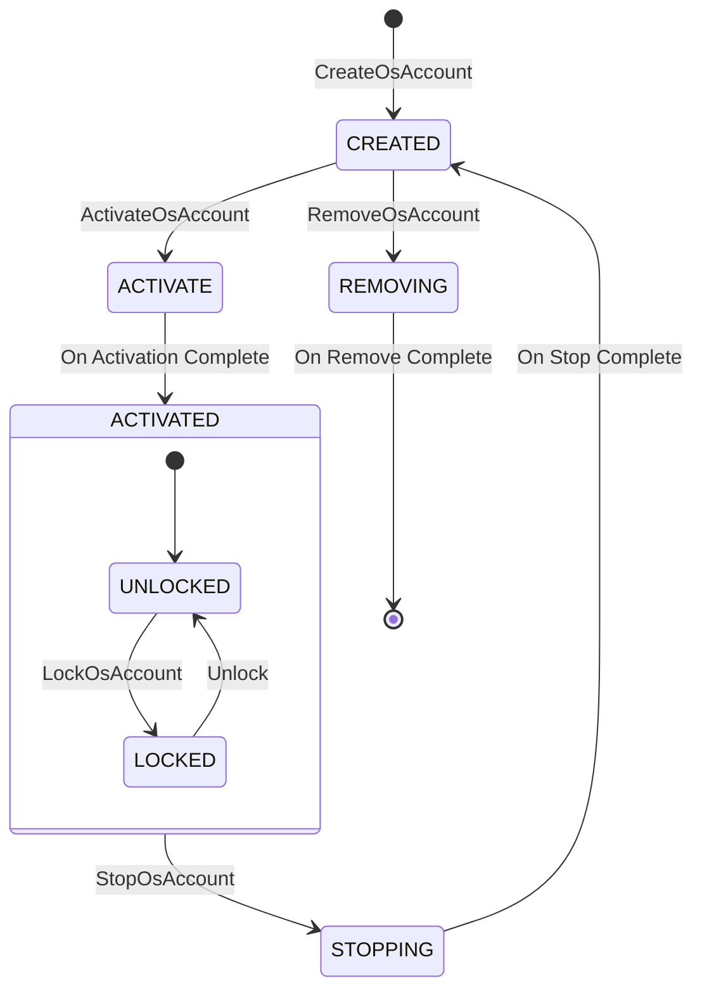

# OsAccount Service - Agent Instruction Guide

> Scope: **directory** `services/accountmgr/src/osaccount/` — OS Account Manager service logic.
> Parent: [../../../../AGENTS.md](../../../../AGENTS.md) (root, §1–8 framework applies here too).
> Target: any coding agent editing this module.

---

## 1. Code Map

### 1.1 Responsibility

This directory implements the OS Account Manager service: multi-user account
lifecycle (Create, Remove, Activate, Stop), constraints, subscription events,
and plugin-based extensions. Runs inside SA 200 (`accountmgr`).

### 1.2 Architectural Patterns

- **Manager-Delegate**: `OsAccountManagerService` (IPC stub) delegates to `IInnerOsAccountManager` (business logic).
- **Singleton**: `IInnerOsAccountManager` — single source of truth for account states.
- **Observer**: `OsAccountSubscribeManager` — publishes `OS_ACCOUNT_ON_ACTIVE`, `OS_ACCOUNT_ON_STOPPING`.
- **Strategy/Plugin**: `OsAccountPluginManager` — loads dynamic behaviors for activation/locking.

### 1.3 Core Components

| Component | Header | Source | Responsibility |
|-----------|--------|--------|----------------|
| **OsAccountManagerService** | `include/osaccount/os_account_manager_service.h` | `os_account_manager_service.cpp` | IPC stub (SA ID 3500); permission checks via `AccountPermissionManager`; param validation; forwards to inner manager |
| **IInnerOsAccountManager** | `include/osaccount/iinner_os_account_manager.h` | `inner_os_account_manager.cpp` | Central orchestrator; account lifecycle (Create/Remove/Activate/Stop); in-memory state; coordinates sub-managers |
| **OsAccountDataStorage** | — | `os_account_data_storage.cpp` | Serialize/deserialize `OsAccountInfo` to KV Store or JSON; data integrity across reboots |
| **OsAccountConstraintManager** | `include/osaccount/os_account_constraint_manager.h` | `os_account_constraint_manager.cpp` | Check per-account constraints (e.g. `constraint.wifi.set`); load defaults from system config |
| **OsAccountSubscribeManager** | — | `os_account_subscribe_manager.cpp` | Manage dynamic subscribers; publish account status events |
| **OsAccountPluginManager** | — | `os_account_plugin_manager.cpp` | Load/execute feature-specific logic during activation or locking |

### 1.4 Where to Look (task → path)

| Task | Start here |
|------|------------|
| Add/change an OS account IPC method | `os_account_manager_service.cpp` → `iinner_os_account_manager.cpp` |
| Change account lifecycle (create/remove/activate/stop) | `inner_os_account_manager.cpp` |
| Add/modify a constraint | `os_account_constraint_manager.cpp` + `include/osaccount/os_account_constraint_manager.h` |
| Change account event publishing | `os_account_subscribe_manager.cpp` |
| Change activation/locking plugin behavior | `os_account_plugin_manager.cpp` |
| Change persistence format (KV/JSON) | `os_account_data_storage.cpp` |
| Change `OsAccountInfo` struct | `interfaces/innerkits/osaccount/native/include/os_account_info.h` |
| Debug first-user creation during boot | `inner_os_account_manager.cpp` → `CreateBaseStandardAccount` / `ActivateDefaultOsAccount` |

---

## 2. Knowledge Routing

### 2.1 Task-based routing

| If the task involves… | Read this first |
|----------------------|-----------------|
| Account lifecycle / state transitions | §3.4 Lifecycle State Machine below |
| Permission check changes | Root AGENTS.md §3.1 (Do-not: permission checks); `AccountPermissionManager` |
| Constraints (what they are, how loaded) | §1.3 OsAccountConstraintManager row |
| Account creation flow (end-to-end) | §3.1 Create OS Account flow below |
| Activation flow | §3.2 Activate OS Account flow below |
| Data persistence / serialization | §1.3 OsAccountDataStorage row; Root AGENTS.md §4 (Data Storage) |
| Concurrency / locking | §4.2 Concurrency below; Root AGENTS.md §3.4 Pitfall 6 |
| Error codes | §4.3 Error Handling below; `interfaces/innerkits/common/include/account_error_no.h` |
| First-user boot path | Root AGENTS.md §3.4 Pitfall 5; `.refdocs/frequent_asked_questions.md` Q1 |

### 2.2 Vocabulary routing

| Term | Meaning | Read |
|------|---------|------|
| `localId` | Unique integer ID of an OS account (e.g. 100) | §4.4 OsAccountInfo |
| `OsAccountType` | Account type: Admin, Normal, Guest | §4.4 OsAccountInfo |
| `constraints` | Per-account capability restrictions (e.g. `constraint.wifi.set`) | §1.3 OsAccountConstraintManager |
| `isActived` / `isVerified` | Runtime account state flags | §4.4 OsAccountInfo |
| `osAccountLock_` | Mutex protecting the in-memory account list `osAccountList_` | §4.2 Concurrency |
| SA ID 3500 | The IPC service ID for OsAccountManagerService | §1.3 OsAccountManagerService |

### 2.3 Pre-edit protocol

See root [AGENTS.md](../../../../AGENTS.md) §2.4. Before writing code, state:
1. **Task category** (service logic / inner API / persistence / constraint / test / other).
2. **Documents read** (per §2.1–2.2 above).
3. **Constraints found** (§3 Do-not / Ask-before rules that apply).

---

## 3. Key Interaction Flows

### 3.1 Create OS Account

1. **Client** calls `OsAccountManager::CreateOsAccount`.
2. **IPC** to `OsAccountManagerService::CreateOsAccount`.
3. Service checks `ohos.permission.MANAGE_LOCAL_ACCOUNTS`.
4. Calls `IInnerOsAccountManager::CreateOsAccount`.
5. Inner Manager: allocate Local ID → create `OsAccountInfo` → save to disk via `OsAccountDataStorage` → create user dirs via `OsAccountFileOperator` → publish "Created" event.

### 3.2 Activate OS Account

1. **Client** calls `ActivateOsAccount`.
2. `IInnerOsAccountManager` checks constraints.
3. Calls plugin manager to run activation plugins.
4. Updates status to `ACTIVATE`.
5. Triggers `OsAccountSubscribeManager` to notify listeners.

---

## 4. Constraints & Boundaries

### 4.1 Do not (without explicit user escalation)

- **Do not change `OsAccountInfo` serialization format** — the JSON/KV schema is
  persisted on disk; changing field names or structure breaks upgrade
  compatibility (Root AGENTS.md §3.1).
- **Do not remove or weaken permission checks** in `OsAccountManagerService` —
  `ohos.permission.MANAGE_LOCAL_ACCOUNTS` and related checks are a security
  boundary.
- **Do not change SA ID 3500** — other system abilities depend on this ID.
- **Do not hold `osAccountLock_` during IPC or disk I/O** — risk of deadlock or
  IPC thread exhaustion (Root AGENTS.md §3.4 Pitfall 6).
- **Do not change the first-user creation/activation path**
  (`CreateBaseStandardAccount` / `ActivateDefaultOsAccount`) — affects device
  boot (Root AGENTS.md §3.4 Pitfall 5).
- **Do not change event names** (`OS_ACCOUNT_ON_ACTIVE`, `OS_ACCOUNT_ON_STOPPING`)
  — subscribers depend on them.
- **Do not hand-edit IDL-generated IPC stubs/proxies** (`*_proxy.cpp`, `*_stub.cpp`)
  — change the `.idl` file and regenerate (Root AGENTS.md §3.1).
- **Do not change `OsAccountType` enum values** (Admin, Normal, Guest) — persisted
  and used across IPC; changing values breaks compatibility.
- **Do not change HiSysEvent definitions** for OS account events — existing
  consumers and fault attribution depend on event names/params/domains.

### 4.2 Architecture & Layering Invariants

- **Dependency direction**: `OsAccountManagerService` (IPC stub) →
  `IInnerOsAccountManager` (business logic) → sub-managers (constraints, plugins,
  storage, subscribe). Never call upward or skip the inner manager.
- **Business logic belongs in `IInnerOsAccountManager`, not in the service class**:
  `OsAccountManagerService` does only permission check + param validation + IPC
  forwarding.
- **Singleton**: `IInnerOsAccountManager` is a singleton — do not create
  additional instances.
- **Observer decoupling**: `OsAccountSubscribeManager` must not block the caller
  — event publishing failures are logged but do not fail the main operation.

### 4.3 Ask before

- Changing the account lifecycle state machine (§4.6 below) — affects boot and
  activation flows.
- Changing default constraint values — affects user capabilities system-wide.
- Adding new `OsAccountType` enum values — affects callers across the subsystem.

### 4.4 Concurrency & Threading

- **Thread Safety**: `IInnerOsAccountManager` uses `std::mutex` (`osAccountLock_`)
  to protect the internal account list `osAccountList_`.
- **IPC Threads**: Requests from `OsAccountManagerService` arrive on binder
  threads. Operations that modify state are serialized using locks.
- **Async Operations**: Lengthy operations (disk writes) should not block the
  service thread under a lock — release the lock before I/O or move to async.

### 4.5 Error Handling

- **Mechanism**: `ErrCode` (integer) return values.
- **Definitions**: `interfaces/innerkits/common/include/account_error_no.h`
- **Permission errors**: `AccountPermissionManager` returns
  `ERR_ACCOUNT_COMMON_PERMISSION_DENIED`.
- **Common errors**:
  - `ERR_OSACCOUNT_SERVICE_INNER_ACCOUNT_ALREADY_ACTIVE_ERROR` — account already active.
  - `ERR_ACCOUNT_COMMON_ACCOUNT_NOT_EXIST_ERROR` — account ID not found.
- **HILOG + errno**: HILOG may modify `errno` during flow control — capture
  `errno` into a local variable before logging (Root AGENTS.md §3.4 Pitfall 4).

### 4.6 Account Lifecycle State Machine



### 4.7 Key Data Structure: OsAccountInfo

- **File**: `interfaces/innerkits/osaccount/native/include/os_account_info.h`
- **Key Fields**:
  - `int localId_` — unique integer ID (e.g. 100)
  - `std::string localName_` — display name
  - `OsAccountType type_` — Admin, Normal, Guest
  - `std::vector<std::string> constraints_` — applied constraints
  - `bool isActived_` — runtime active state
  - `bool isVerified_` — whether the account is verified
- **Persistence**: Serialized to JSON string for `OsAccountDataStorage`.
- **OsAccountDomainAccountCallback** (`os_account_domain_account_callback.cpp`):
  Handles domain account callbacks for enterprise scenarios.

---

## 5. Verification

### 5.1 Minimum checks

See root [AGENTS.md](../../../../AGENTS.md) §5.1 for build commands. For this module:

```bash
# Build
./build.sh --product-name rk3568 --build-target os_account account_build_unittest account_build_moduletest

# Run OS account test suites
cd {OpenHarmonyRootFolder}/test/testfwk/developer_test
./start.sh run -p rk3568 -t UT MST -tp os_account -ts OsAccountControlFileManagerModuleTest
./start.sh run -p rk3568 -t UT MST -tp os_account -ts OsAccountManagerServiceModuleTest
```

### 5.2 Task-specific validation

| If you changed… | Also check |
|----------------|------------|
| `inner_os_account_manager.cpp` (lifecycle) | Run lifecycle tests; verify first-user boot path unchanged |
| `os_account_manager_service.cpp` (IPC/permission) | Verify permission checks still present; run service module tests |
| `os_account_data_storage.cpp` (persistence) | Verify JSON/KV schema unchanged; test reboot-restore path |
| `os_account_constraint_manager.cpp` | Run constraint tests; verify defaults unchanged |
| State machine | Trace all transitions; verify no orphan states |

### 5.3 Done definition

A change is **done** when:
1. Build succeeds: `./build.sh --product-name rk3568 --build-target os_account` (no errors).
2. Relevant test suite passes — report suite name + pass/fail counts.
3. No new compiler warnings in changed files.
4. If `OsAccountInfo` or persistence format changed: **escalate to user** (compatibility risk, §4.1).
5. If SA startup / first-user path touched: **user approved** (Root AGENTS.md §3.4 Pitfall 5).

### 5.4 Fallback

If build/tests cannot run locally, state "I could not run the build/tests because
\<reason\>" and ask the user to run §5.1 commands. Do not claim the change is verified.

---

## Version History

| Version | Date | Changes | Maintainer |
|---------|------|---------|------------|
| v1.0 | 2026-01-31 | Initial AGENTS.md creation | AI Assistant |
| v2.0 | 2026-07-09 | Rewritten per agent-instruction quality review: added code map, knowledge routing, constraints, verification | AI Assistant |
