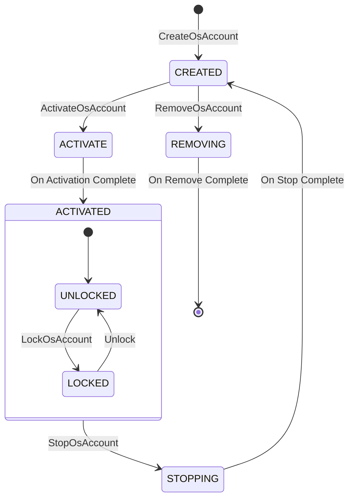

# OsAccount Service - Agent Instruction Guide

> Scope: **directory** `services/accountmgr/src/osaccount/` — OS Account Manager service logic.
> Parent: [../../../../AGENTS.md](../../../../AGENTS.md) (root, §1–8 framework applies here too).
> Target: any coding agent editing this module.

---

## 1. Code Map

### 1.1 Responsibility

This directory implements the OS Account Manager service: multi-user account
lifecycle (Create, Remove, Activate, Stop), constraints, subscription events,
and plugin-based extensions. Runs inside SA 200 (`accountmgr`).

### 1.2 Architectural Patterns

- **Manager-Delegate**: `OsAccountManagerService` (IPC stub) delegates to `IInnerOsAccountManager` (business logic).
- **Singleton**: `IInnerOsAccountManager` — single source of truth for account states.
- **Observer**: `OsAccountSubscribeManager` — publishes `OS_ACCOUNT_ON_ACTIVE`, `OS_ACCOUNT_ON_STOPPING`.
- **Strategy/Plugin**: `OsAccountPluginManager` — loads dynamic behaviors for activation/locking.

### 1.3 Core Components

| Component | Header | Source | Responsibility | Thread Safety |
|-----------|--------|--------|----------------|---------------|
| **OsAccountManagerService** | `include/osaccount/os_account_manager_service.h` | `os_account_manager_service.cpp` | IPC stub (SA 200); permission checks via `AccountPermissionManager`; param validation; forwards to inner manager | IPC binder threads |
| **IInnerOsAccountManager** | `include/osaccount/iinner_os_account_manager.h` | `inner_os_account_manager.cpp` | Central orchestrator; account lifecycle (Create/Remove/Activate/Stop); in-memory state; coordinates sub-managers | `osAccountLock_`, `createOsAccountMutex_`, `operatingMutex_` |
| **OsAccountDataStorage** | — | `os_account_data_storage.cpp` | Serialize/deserialize `OsAccountInfo` to KV Store or JSON; data integrity across reboots | — |
| **OsAccountConstraintManager** | `include/osaccount/os_account_constraint_manager.h` | `os_account_constraint_manager.cpp` | Check per-account constraints (e.g. `constraint.wifi.set`); load defaults from system config | own mutex |
| **OsAccountSubscribeManager** | — | `os_account_subscribe_manager.cpp` | Manage dynamic subscribers; publish account status events | `recursive_mutex` |
| **OsAccountPluginManager** | — | `os_account_plugin_manager.cpp` | Load/execute feature-specific logic during activation or locking | — |

### 1.4 Where to Look (task → path)

Component-to-file mapping is in §1.3; below are additional location hints:

| Task | Start here |
|------|------------|
| Change account lifecycle (create/remove/activate/stop) | `inner_os_account_manager.cpp` |
| Add/modify a constraint | `os_account_constraint_manager.cpp` + `include/osaccount/os_account_constraint_manager.h` |
| Change `OsAccountInfo` struct | `interfaces/innerkits/osaccount/native/include/os_account_info.h` |
| Debug first-user creation during boot | `inner_os_account_manager.cpp` → `CreateBaseStandardAccount` / `ActivateDefaultOsAccount` |
| Add/modify a plugin behavior for activation/locking | `os_account_plugin_manager.cpp` |
| Change the lifecycle state machine (§4.6) | `inner_os_account_manager.cpp` — state transition functions |

---

## 2. Knowledge Routing

### 2.1 Task-based routing

| If the task involves… | Read this first |
|----------------------|-----------------|
| Account lifecycle / state transitions | §4.6 Lifecycle State Machine below |
| Permission check changes | Root AGENTS.md §3.1 (Do-not: permission checks); `AccountPermissionManager` |
| Constraints (what they are, how loaded) | §1.3 OsAccountConstraintManager row |
| Account creation flow (end-to-end) | §3.1 Create OS Account flow below |
| Activation flow | §3.2 Activate OS Account flow below |
| Data persistence / serialization | §1.3 OsAccountDataStorage row; Root AGENTS.md §4 (Data Storage) |
| Concurrency / locking | §4.4 Concurrency below; Root AGENTS.md §3.4 Pitfall 6 |
| Error codes | §4.5 Error Handling below; `interfaces/innerkits/common/include/account_error_no.h` |
| First-user boot path | Root AGENTS.md §3.4 Pitfall 5; `.refdocs/frequent_asked_questions.md` Q1 |

### 2.2 Vocabulary routing

| Term | Meaning | Read |
|------|---------|------|
| `localId` | Unique integer ID of an OS account (e.g. 100) | §4.7 OsAccountInfo |
| `OsAccountType` | Account type: Admin, Normal, Guest | §4.7 OsAccountInfo |
| `constraints` | Per-account capability restrictions (e.g. `constraint.wifi.set`) | §1.3 OsAccountConstraintManager |
| `isActived` / `isVerified` | Runtime account state flags | §4.7 OsAccountInfo |
| `osAccountLock_` | Mutex protecting the in-memory account list `osAccountList_` | §4.4 Concurrency |
| SA 200 | System Ability ID of the accountmgr process; `OsAccountManagerService` is its IPC stub | §1.3 OsAccountManagerService |

### 2.3 Pre-edit protocol

See root [AGENTS.md](../../../../AGENTS.md) §2.3. Task categories for this
module: service logic / inner API / persistence / constraint / test.

---

## 3. Key Interaction Flows

### 3.1 Create OS Account

1. **Client** calls `OsAccountManager::CreateOsAccount`.
2. **IPC** to `OsAccountManagerService::CreateOsAccount`.
3. Service checks `ohos.permission.MANAGE_LOCAL_ACCOUNTS`.
4. Calls `IInnerOsAccountManager::CreateOsAccount`.
5. Inner Manager: allocate Local ID → create `OsAccountInfo` → save to disk via `OsAccountDataStorage` → create user dirs via `OsAccountFileOperator` → publish "Created" event.

### 3.2 Activate OS Account

1. **Client** calls `ActivateOsAccount`.
2. `IInnerOsAccountManager` checks constraints.
3. Calls plugin manager to run activation plugins.
4. Updates status to `ACTIVATE`.
5. Triggers `OsAccountSubscribeManager` to notify listeners.

---

## 4. Constraints & Boundaries

### 4.1 Do not (without explicit user escalation)

General rules (`OsAccountInfo` serialization format, permission checks, holding
`osAccountLock_` during IPC/disk I/O, first-user create/activate path,
IDL-generated code, HiSysEvent definitions) — see root
[AGENTS.md](../../../../AGENTS.md) §3.1 and §3.4 Pitfall 5/6. Module-specific:

- **Do not change SA 200** — other system abilities depend on this ID (the sole
  SA of the accountmgr process).
- **Do not change event names** (`OS_ACCOUNT_ON_ACTIVE`, `OS_ACCOUNT_ON_STOPPING`)
  — subscribers depend on them.
- **Do not change `OsAccountType` enum values** (Admin, Normal, Guest) —
  persisted and used across IPC; changing values breaks compatibility.
- **Do not change `OsAccountInfo` serialization format** — the JSON schema is
  persisted on disk and crosses IPC; changing field names breaks upgrade
  compatibility (Root AGENTS.md §3.1).
- **Do not hold `osAccountLock_` during IPC or disk I/O** — risk of deadlock or
  IPC thread exhaustion (Root AGENTS.md §3.4 Pitfall 6). Release the lock before
  I/O or move work to an async path.
- **Do not change the first-user create/activate path**
  (`CreateBaseStandardAccount` / `ActivateDefaultOsAccount`) — device boot
  depends on it (Root AGENTS.md §3.4 Pitfall 5).
- **Do not call `GetOsAccountInfoById()` inside `GetOsAccountType()` or any of
  its callees** — self-referencing circular call (Root AGENTS.md §3.4 Pitfall
  10). Read the type from `teeAdapter_` / `osAccountCacheManager_` / a direct DB
  read instead.

### 4.2 Architecture & Layering Invariants

See root [AGENTS.md](../../../../AGENTS.md) §3.3 (Manager-Delegate, dependency
direction, Singleton, and Observer decoupling all follow the root invariants).

### 4.3 Ask before

- Changing the account lifecycle state machine (§4.6 below) — affects boot and activation flows.
- Changing default constraint values — affects user capabilities system-wide.
- Adding new `OsAccountType` enum values — affects callers across the subsystem.

### 4.4 Concurrency & Threading

- **Thread Safety**: `IInnerOsAccountManager` uses `std::mutex` (`osAccountLock_`)
  to protect the internal account list `osAccountList_`.
- **IPC Threads**: Requests from `OsAccountManagerService` arrive on binder
  threads. Operations that modify state are serialized using locks.
- **Async Operations**: Lengthy operations (disk writes) should not block the
  service thread under a lock — release the lock before I/O or move to async.

### 4.5 Error Handling

- **Mechanism**: `ErrCode` (integer) return values.
- **Definitions**: `interfaces/innerkits/common/include/account_error_no.h`
- **Permission errors**: `AccountPermissionManager` returns
  `ERR_ACCOUNT_COMMON_PERMISSION_DENIED`.
- **Common errors**:
  - `ERR_OSACCOUNT_SERVICE_INNER_ACCOUNT_ALREADY_ACTIVE_ERROR` — account already active.
  - `ERR_ACCOUNT_COMMON_ACCOUNT_NOT_EXIST_ERROR` — account ID not found.

### 4.6 Account Lifecycle State Machine


```mermaid
stateDiagram-v2
    [*] --> CREATED : CreateOsAccount
    CREATED --> ACTIVATE : ActivateOsAccount
    ACTIVATE --> ACTIVATED : On Activation Complete
    ACTIVATED --> STOPPING : StopOsAccount
    STOPPING --> CREATED : On Stop Complete
    CREATED --> REMOVING : RemoveOsAccount
    REMOVING --> [*] : On Remove Complete

    state ACTIVATED {
        [*] --> UNLOCKED
        UNLOCKED --> LOCKED : LockOsAccount
        LOCKED --> UNLOCKED : Unlock
    }
```

### 4.7 Key Data Structure: OsAccountInfo

- **File**: `interfaces/innerkits/osaccount/native/include/os_account_info.h`
- **Key Fields**:
  - `int localId_` — unique integer ID (e.g. 100)
  - `std::string localName_` — display name
  - `OsAccountType type_` — Admin, Normal, Guest
  - `std::vector<std::string> constraints_` — applied constraints
  - `bool isActived_` — runtime active state
  - `bool isVerified_` — whether the account is verified
- **Persistence**: Serialized to JSON string for `OsAccountDataStorage`.
- **OsAccountDomainAccountCallback** (`os_account_domain_account_callback.cpp`):
  Handles domain account callbacks for enterprise scenarios.

### 4.8 Common Pitfalls

**Pitfall 1 — Lock-held IPC/disk I/O in `CreateOsAccount`.**
`CreateOsAccount` holds `createOsAccountMutex_` while doing storage writes plus
Bundle Manager Service / Common Event Service IPC. This is a Pitfall 6 counterexample. When editing this path, trace
that persistence (`WriteOsAccountFile`) and IPC occur only after the lock is
released.

**Pitfall 2 — Double-lock in `SetOsAccountType`.**
`SetOsAccountType` holds a double lock while doing TEE IPC + disk read/write
(another Pitfall 6 counterexample). Verify no reverse lock acquisition happens.

**Pitfall 3 — `GetOsAccountType` circular call.**
Calling `IInnerOsAccountManager::GetOsAccountInfoById()` inside `GetOsAccountType`
forms a loop back to itself via `QueryOsAccountById`. See root Pitfall 10. Use
`OsAccountControlFileManager::GetOsAccountInfoById()` (direct file read, safe) or
`teeAdapter_` / `osAccountCacheManager_` instead.

**Pitfall 4 — OTA dirty-data circular query.**
After OTA, empty `domainServerConfigId` can make `QueryOsAccountById` →
`GetDomainAccountStatus` → `GetDomainAccountInfo` fall back to querying
`account_info` again, forming a loop. See root Pitfall 9. Guard with
`accountName_.empty()` / `domainServerConfigId.empty()` checks at the
`GetDomainAccountInfo()` entry.

**Pitfall 5 — Verify state not propagated on no-password unlock.**
When adding any unlock path, trace that `SetOsAccountIsVerified(true)` is
eventually reached — especially the no-password / already-verified branch where
`needActivateKey` stays false. See root Pitfall 7.

**Pitfall 6 — `OsAccountState` enum vs boolean persistence flags.**
`OsAccountState` has 12 states plus the boolean persistence flags
(`isActivated_` / `isVerified_` / `isCreated_`). Do not conflate the enum
value with the persisted boolean when reading/writing state.

**Pitfall 7 — Three constraint file classes.**
`base` / `global` / `specific` constraint files have distinct paths, JSON
structures, and query entry points. Do not mix them when reading or writing
constraints.

**Pitfall 8 — Permission checks must not filter data values by caller.**
In `OsAccountManagerService` and `IInnerOsAccountManager`, permission checks
(`AccountPermissionManager::VerifyPermission`) must only gate access (deny →
error code, allow → standard data). Never use the permission result to return
different type values to different callers (e.g., the removed
`RESTRICTED_ADMIN` pattern: returning -1 to callers with
`MANAGE_LOCAL_ACCOUNTS` but 0 to those without). This causes data
inconsistency and dirty-data persistence. See root Pitfall 11. Key functions
to check: `GetRealOsAccountInfoById`, `GetOsAccountType`,
`RefreshAccountTypeInCache`.

**Pitfall 9 — Data consistency across callers and persistence.**
When modifying `OsAccountInfo.type_` or cache entries in
`osAccountCacheManager_`, trace the full data flow: in-memory value → cache →
persistence (`OsAccountDataStorage` / `os_account_control_file_manager.cpp`)
→ IPC marshalling. A temporary value (e.g., `restricted` flag) must not leak
to disk as a non-standard enum value. The file manager's `#ifdef
SUPPORT_AUTHORIZATION` correction (converting -1 to `ADMIN` on read) is the
last line of defense — do not remove it. See root Pitfall 12.

---

## 5. Verification

### 5.1 Minimum checks

See root [AGENTS.md](../../../../AGENTS.md) §5.1 for the full build commands.
Module test suites:

```bash
cd {OpenHarmonyRootFolder}/test/testfwk/developer_test
./start.sh run -p rk3568 -t UT MST -tp os_account -ts OsAccountControlFileManagerModuleTest
./start.sh run -p rk3568 -t UT MST -tp os_account -ts OsAccountManagerServiceModuleTest
```

### 5.2 Task-specific validation

| If you changed… | Also check |
|----------------|------------|
| `inner_os_account_manager.cpp` (lifecycle) | Run lifecycle tests; verify first-user boot path unchanged |
| `os_account_manager_service.cpp` (IPC/permission) | Verify permission checks still present; run service module tests |
| `os_account_data_storage.cpp` (persistence) | Verify JSON/KV schema unchanged; test reboot-restore path |
| `os_account_constraint_manager.cpp` | Run constraint tests; verify defaults unchanged |
| `os_account_plugin_manager.cpp` | Run activation tests; verify plugin contract unchanged |
| State machine | Trace all transitions; verify no orphan states |

### 5.3 Done definition

See root [AGENTS.md](../../../../AGENTS.md) §5.5. Additional module requirements:
- If `OsAccountInfo` or persistence format changes: **user approval required** (compatibility risk, §4.1).
- If the SA startup / first-user path is touched: **user approval required** (root §3.4 Pitfall 5).

### 5.4 Fallback

See root [AGENTS.md](../../../../AGENTS.md) §5.5.
