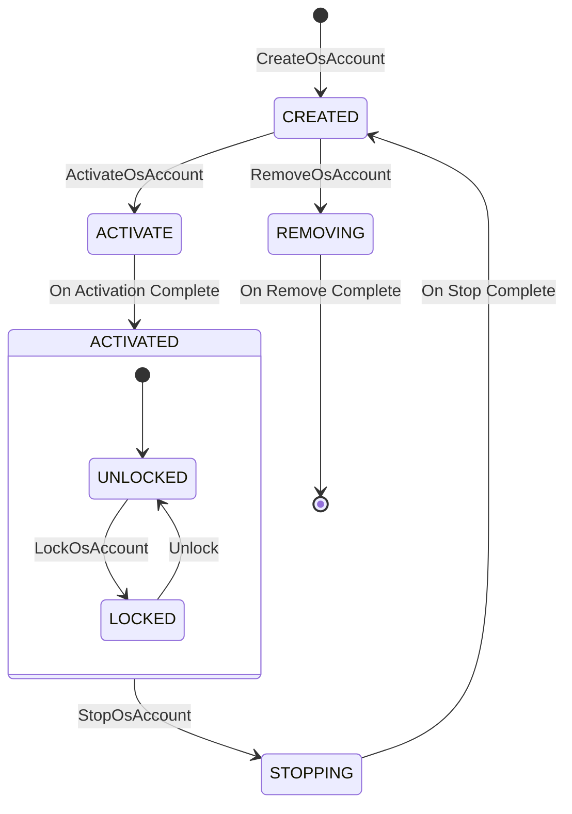

# OsAccount Agents Knowledge Base

## Overview
This directory `base/account/os_account/services/accountmgr/src/osaccount` contains the implementation of the OS Account Manager service in OpenHarmony. It is responsible for managing multiple user accounts (OS Accounts) on the device.

## Architectural Patterns
- **Manager-Delegate Pattern**: `OsAccountManagerService` delegates business logic to `IInnerOsAccountManager`.
- **Singleton**: `IInnerOsAccountManager` is a singleton ensuring a single source of truth for account states.
- **Observer Pattern**: `OsAccountSubscribeManager` implements the observer pattern for account status changes.
- **Strategy/Plugin Pattern**: `OsAccountPluginManager` loads dynamic behaviors.

## Core Agents and Components

### 1. Service Entry Point & IPC
- **Agent**: `OsAccountManagerService`
- **Files**:
  - Header: `services/accountmgr/include/osaccount/os_account_manager_service.h`
  - Source: `services/accountmgr/src/osaccount/os_account_manager_service.cpp`
- **Responsibility**:
  - Serves as the IPC Stub (SA ID: 3500).
  - Performs permission checks (using `AccountPermissionManager`).
  - Validates input parameters.
  - Forwards requests to `IInnerOsAccountManager`.

### 2. Core Business Logic (The Brain)
- **Agent**: `IInnerOsAccountManager`
- **Files**:
  - Header: `services/accountmgr/include/osaccount/iinner_os_account_manager.h`
  - Source: `services/accountmgr/src/osaccount/inner_os_account_manager.cpp`
- **Responsibility**:
  - Central orchestrator of the OS Account subsystem.
  - Manages the lifecycle of accounts (Create, Remove, Activate, Stop).
  - Maintains in-memory state of active accounts.
  - Coordinates all sub-managers (Constraints, Plugins, Storage).

### 3. Data Persistence & Storage
- **Agent**: `OsAccountDataStorage` & `OsAccountDatabaseOperator`
- **Files**:
  - Source: `services/accountmgr/src/osaccount/os_account_data_storage.cpp`
- **Responsibility**:
  - Serializes/Deserializes `OsAccountInfo` to/from persistent storage (KV Store or JSON).
  - Ensures data integrity across reboots.

### 4. Constraints & Restrictions
- **Agent**: `OsAccountConstraintManager`
- **Files**:
  - Header: `services/accountmgr/include/osaccount/os_account_constraint_manager.h`
  - Source: `services/accountmgr/src/osaccount/os_account_constraint_manager.cpp`
- **Responsibility**:
  - Checks if specific actions are allowed for an account (e.g., `constraint.wifi.set`).
  - Loads default constraints from system configuration.

### 5. Subscription & Notification
- **Agent**: `OsAccountSubscribeManager`
- **Files**:
  - Source: `services/accountmgr/src/osaccount/os_account_subscribe_manager.cpp`
- **Responsibility**:
  - Manages dynamic subscribers from other apps/services.
  - Publishes `OS_ACCOUNT_ON_ACTIVE`, `OS_ACCOUNT_ON_STOPPING` events.

### 6. Plugin & Extension
- **Agent**: `OsAccountPluginManager`
- **Responsibility**:
  - Loads and executes specific logic during account activation or locking.
  - Allows decoupling of feature-specific logic from the main manager.

## Key Interaction Flows

### Create OS Account
1. **Client** calls `OsAccountManager::CreateOsAccount`.
2. **IPC** to `OsAccountManagerService::CreateOsAccount`.
3. Service checks `ohos.permission.MANAGE_LOCAL_ACCOUNTS`.
4. Calls `IInnerOsAccountManager::CreateOsAccount`.
5. Inner Manager:
   - Allocates a new Local ID.
   - Creates `OsAccountInfo`.
   - Calls `OsAccountDataStorage` to save to disk.
   - Calls `OsAccountFileOperator` to create user directories.
   - Publishes "Created" event.

### Activate OS Account
1. **Client** calls `ActivateOsAccount`.
2. `IInnerOsAccountManager` checks constraints.
3. Calls plugin manager to run activation plugins.
4. Updates status to `ACTIVATE`.
5. Triggers `OsAccountSubscribeManager` to notify listeners.

## Concurrency & Threading
- **Thread Safety**: `IInnerOsAccountManager` uses `std::mutex` (e.g., `osAccountLock_`) to protect the internal account list `osAccountList_`.
- **IPC Threads**: Requests from `OsAccountManagerService` arrive on binder threads. Operations that modify state are serialized using locks.
- **Async Operations**: lengthy operations (like writing to disk) should be handled carefully to avoid blocking the main service thread, though most current implementations are synchronous protected by locks.

## Error Handling
- **Mechanism**: The subsystem uses `ErrCode` (integer) for return values.
- **Definitions**:
  - mapping logic: `base/account/os_account/frameworks/common/account_error/src/account_error_no.cpp`
  - checks: `AccountPermissionManager` returns specific permission errors (e.g., `ERR_ACCOUNT_COMMON_PERMISSION_DENIED`).
- **Common Errors**:
  - `ERR_OSACCOUNT_SERVICE_INNER_ACCOUNT_ALREADY_ACTIVE_ERROR`: Account already active.
  - `ERR_ACCOUNT_COMMON_ACCOUNT_NOT_EXIST_ERROR`: Account ID not found.

## Account Lifecycle State Machine
The following diagram illustrates the lifecycle states of an OS Account:

## Key Data Structures

### OsAccountInfo
- **File**: `interfaces/innerkits/osaccount/native/include/os_account_info.h` (typically)
- **Key Fields**:
  - `int localId_`: The unique integer ID of the account (e.g., 100).
  - `std::string localName_`: Display name.
  - `OsAccountType type_`: Type (Admin, Normal, Guest).
  - `std::vector<std::string> constraints_`: List of applied constraints.
  - `bool isActived_`: Runtime active state.
  - `bool isVerified_`: Whether the account is verified.
- **Persistence**: Serialized to JSON string for storage in `OsAccountDataStorage`.
- **OsAccountDomainAccountCallback** (`os_account_domain_account_callback.cpp`)
  - **Responsibility**: Handles domain account specific callbacks used in enterprise scenarios.
